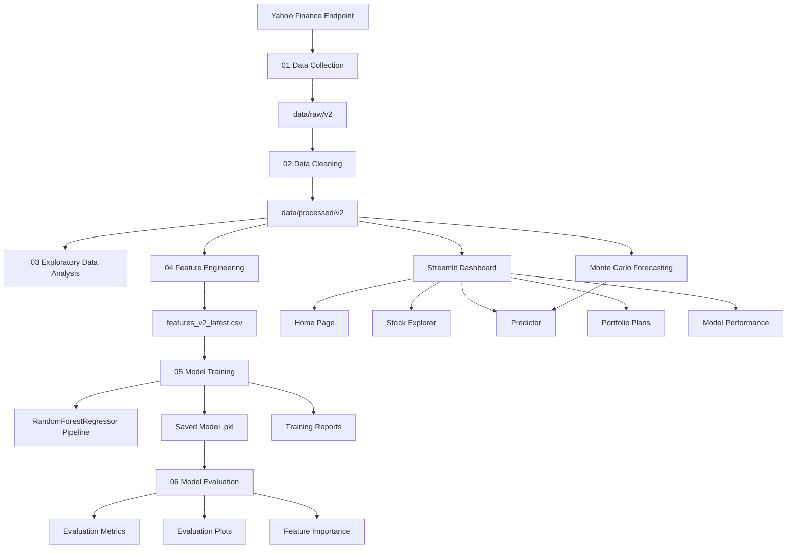
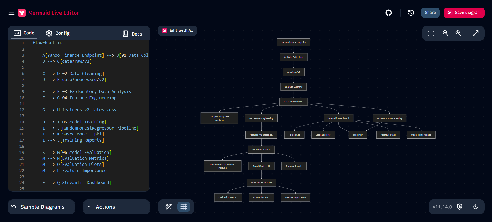
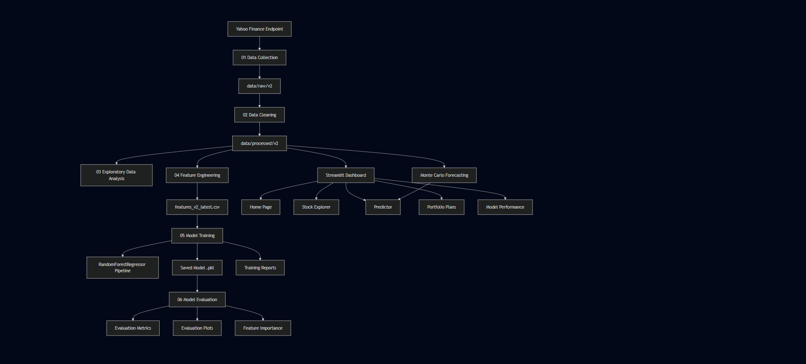

# [StockMetrics](https://stockmetrics-emhu.onrender.com)

Developer: Louis Cowell-English ([LouisCE](https://www.github.com/LouisCE))

StockMetrics is a predictive analytics dashboard designed to help beginners understand stock market risk and returns using historical price data, machine learning (ML) evaluation, and scenario-based forecasting.

[](https://www.github.com/LouisCE/stockmetrics/commits/main)
[](https://www.github.com/LouisCE/stockmetrics/commits/main)
[](https://www.github.com/LouisCE/stockmetrics)
[](https://stockmetrics-emhu.onrender.com)

---

## Live Dashboard

The StockMetrics dashboard is deployed on Render and available at:

https://stockmetrics-emhu.onrender.com

---

## Table of Contents

- [Live Dashboard](#live-dashboard)

- [Project Overview](#project-overview)
  - [Core Investing Principles](#core-investing-principles)
  - [Four Risk-Based Plans](#four-risk-based-plans)
  - [Forecasts Over Time](#forecasts-over-time)

- [Business Requirements](#business-requirements)
  - [Target Audience](#target-audience)
  - [Core Business Goals](#core-business-goals)
  - [Business Requirement 1 - Historical Market Exploration](#business-requirement-1---historical-market-exploration)
  - [Business Requirement 2 - Portfolio Risk Comparison](#business-requirement-2---portfolio-risk-comparison)
  - [Business Requirement 3 - Predictive Analytics Feature](#business-requirement-3---predictive-analytics-feature)
  - [Business Requirement 4 - Scenario-Based Forecasting](#business-requirement-4---scenario-based-forecasting)
  - [Business Requirement 5 - Clear Communication of ML Model Results](#business-requirement-5---clear-communication-of-ml-model-results)

- [Dataset Content](#dataset-content)
  - [Dataset Scope](#dataset-scope)
  - [ETFs Included](#etfs-included)
  - [Technology Stocks Included](#technology-stocks-included)
  - [Data Collection Window](#data-collection-window)
  - [Raw Dataset Variables](#raw-dataset-variables)
  - [Dataset Versioning](#dataset-versioning)
  - [Data Processing Workflow](#data-processing-workflow)
  - [Data Limitations](#data-limitations)

- [Epics and User Stories](#epics-and-user-stories)
  - [Epic - Data Science Pipeline Development](#epic---data-science-pipeline-development)
  - [Epic - Core Application Architecture](#epic---core-application-architecture)
  - [Epic - Dashboard Structure and Navigation System](#epic---dashboard-structure-and-navigation-system)
  - [Epic - Home Page and User Onboarding](#epic---home-page-and-user-onboarding)
  - [Epic - Stock Explorer and Asset Education](#epic---stock-explorer-and-asset-education)
  - [Epic - Predictor and Scenario Guidance](#epic---predictor-and-scenario-guidance)
  - [Epic - Portfolio Plans and Risk Comparison](#epic---portfolio-plans-and-risk-comparison)
  - [Epic - Model Performance and Transparency](#epic---model-performance-and-transparency)
  - [Epic - Deployment and Application Availability](#epic---deployment-and-application-availability)
  - [Epic - Dashboard Polish and README Documentation](#epic---dashboard-polish-and-readme-documentation)
  - [Epic - TESTING Documentation and Validation](#epic---testing-documentation-and-validation)

- [Project Hypotheses](#project-hypotheses)
  - [Hypothesis 1: Concentrated portfolio plans are riskier than diversified ones but also have greater potential rewards](#hypothesis-1-concentrated-portfolio-plans-are-riskier-than-diversified-ones-but-also-have-greater-potential-rewards)
  - [Hypothesis 2: Technology stocks exhibit higher volatility than diversified ETFs](#hypothesis-2-technology-stocks-exhibit-higher-volatility-than-diversified-etfs)
  - [Hypothesis 3: Diversified portfolios experience smaller drawdowns than concentrated portfolios](#hypothesis-3-diversified-portfolios-experience-smaller-drawdowns-than-concentrated-portfolios)
  - [Hypothesis 4: Short-horizon return prediction is inherently difficult](#hypothesis-4-short-horizon-return-prediction-is-inherently-difficult)
  - [Hypothesis Validation Summary](#hypothesis-validation-summary)

- [CRISP-DM Process](#crisp-dm-process)
  - [Pipeline Architecture](#pipeline-architecture)
  - [CRISP-DM Pipeline Flowchart](#crisp-dm-pipeline-flowchart)
  - [CRISP-DM Stage Mapping](#crisp-dm-stage-mapping)

- [Rationale to map the business requirements to the Data Visualisations and ML tasks](#rationale-to-map-the-business-requirements-to-the-data-visualisations-and-ml-tasks)

- [ML Business Case](#ml-business-case)
  - [Predictive Task](#predictive-task)
  - [Learning Method](#learning-method)
  - [Feature Engineering](#feature-engineering)
  - [Hyperparameter Optimisation](#hyperparameter-optimisation)
  - [Success Criteria, Model Results and Interpretation](#success-criteria-model-results-and-interpretation)
  - [Model Output and User Relevance](#model-output-and-user-relevance)

- [Model Development and Iteration](#model-development-and-iteration)
  - [Model Selection and Parameter Tuning Iterations](#model-selection-and-parameter-tuning-iterations)
  - [Initial Approach](#initial-approach)
  - [Feature Engineering Improvements](#feature-engineering-improvements)
  - [Hyperparameter Optimisation Strategy](#hyperparameter-optimisation-strategy)
  - [Final Model Outcome](#final-model-outcome)
  - [Conclusion](#conclusion)

- [Dashboard Design](#dashboard-design)
  - [Sidebar Navigation Menu](#sidebar-navigation-menu)
  - [Home Page](#home-page)
  - [Stock Explorer](#stock-explorer)
  - [Predictor](#predictor)
  - [Portfolio Plans](#portfolio-plans)
  - [Model Performance](#model-performance)
  - [UX Design and Accessibility Rationale](#ux-design-and-accessibility-rationale)

- [Plots](#plots)
  - [Market Behaviour Evidence](#market-behaviour-evidence)
  - [Machine Learning Evaluation Evidence](#machine-learning-evaluation-evidence)
  - [Plot Relevance to the Business Case](#plot-relevance-to-the-business-case)

- [Tools and Technologies](#tools-and-technologies)

- [Project Structure](#project-structure)
  - [Structure Overview](#structure-overview)

- [Agile Development Process](#agile-development-process)
  - [Agile Structure and Workflow](#agile-structure-and-workflow)
  - [Mapping to CRISP-DM](#mapping-to-crisp-dm)
  - [Issue Structure](#issue-structure)
  - [GitHub Issues](#github-issues)
  - [GitHub Milestones](#github-milestones)
  - [GitHub Projects](#github-projects)
  - [MoSCoW Prioritisation](#moscow-prioritisation)
  - [Version Control and Incremental Development](#version-control-and-incremental-development)
  - [Summary](#summary)

- [Testing](#testing)

- [Deployment](#deployment)
  - [Render Deployment](#render-deployment)
  - [Required Deployment Files](#required-deployment-files)
  - [Local Development](#local-development)
  - [Cloning](#cloning)
  - [Forking](#forking)
  - [Why Render Instead of Heroku](#why-render-instead-of-heroku)

- [Project Limitations](#project-limitations)
  - [Market Noise](#market-noise)
  - [Non-Stationary Market Behaviour](#non-stationary-market-behaviour)
  - [Limited Asset Universe](#limited-asset-universe)
  - [Concentration in Technology Stocks](#concentration-in-technology-stocks)
  - [Educational Scope](#educational-scope)
  - [Time Sensitivity of Short-Horizon Estimates](#time-sensitivity-of-short-horizon-estimates)
  - [Third-Party Endpoint Dependency](#third-party-endpoint-dependency)

- [Future Features](#future-features)
  - [Expanded Asset Universe and Sector Coverage](#expanded-asset-universe-and-sector-coverage)
  - [Dividend and Income Modelling](#dividend-and-income-modelling)
  - [Longer-Horizon and Alternative Machine Learning Models](#longer-horizon-and-alternative-machine-learning-models)
  - [Recommendation and Robo-Advisor Features](#recommendation-and-robo-advisor-features)
  - [Macroeconomic and Multi-Factor Integration](#macroeconomic-and-multi-factor-integration)
  - [Portfolio-Level Simulation and Optimisation](#portfolio-level-simulation-and-optimisation)

- [Project Conclusion](#project-conclusion)

- [Credits](#credits)
  - [General Guidance](#general-guidance)
  - [Code / Technical References](#code--technical-references)
  - [Data Source](#data-source)
  - [Acknowledgements](#acknowledgements)

---

## Project Overview

StockMetrics is a predictive analytics dashboard designed to make investing easier for beginners.

Learning how to invest can feel overwhelming. New investors are hit with unfamiliar terms (e.g., *concentration*, *diversification*, *volatility*), countless strategies, conflicting opinions, and overcomplication, which often leads to **analysis paralysis** and ultimately deciding not to invest at all.

StockMetrics exists to cut through the noise and help users start investing earlier with greater clarity and confidence.

The goal is to **help beginner investors become more confident in one hour or less** by providing:

- a clear explanation of the purpose of the app.
- simple investing principles to anchor decision-making.
- a small, carefully-chosen set of stocks/funds to keep the experience focused.
- risk-based portfolio “plans” and forecast ranges to help users understand uncertainty.

---

### Core Investing Principles

StockMetrics reinforces three beginner-friendly principles:

- **Start early:** to benefit from compound growth over time.
- **Think long-term:** time in the market beats timing the market.
- **Diversify:** spread exposure across companies and sectors to help mitigate risk.

---

### Four Risk-Based Plans

The portfolio plans are intentionally simplified and progressively structured to help beginner investors compare diversification, concentration, volatility, and long-term uncertainty without requiring advanced financial knowledge.

To keep the learning curve low, StockMetrics focuses on well-known index funds and large blue-chip companies. Users can explore four portfolio plans based on risk tolerance:

- **Diversified (Low Risk):** 100% All-World fund
- **Targeted (Moderate Risk):** 100% S&P 500 fund
- **Concentrated (High Risk):** 75% S&P 500 fund + 25% Magnificent Seven
- **Aggressive (Higher Risk):** 50% S&P 500 fund + 25% Magnificent Six + 25% Tesla

Risk levels in StockMetrics refer to how concentrated a portfolio is within the stock market. All plans are equity-based and may experience significant short-term volatility.

StockMetrics includes brief explanations of the funds/companies and (where applicable) a short description of the “Magnificent Seven”, so users understand what they are looking at.

---

### Forecasts Over Time

StockMetrics provides predicted price outcomes over multiple time horizons:

- 1 year
- 2 years
- 5 years
- 10 years

To reflect uncertainty and volatility, predictions are presented as a range of scenarios:

- **Optimistic**
- **Realistic**
- **Pessimistic**

Long-term scenarios are produced using a Monte Carlo simulation approach based on each asset’s historical log-return drift and volatility. Future price paths are simulated using GBM-style log-return compounding, and the 25th, 50th, and 75th percentile end prices are presented as pessimistic, realistic, and optimistic scenarios.

The four plans are calibrated to be **comparable and easy to switch between**. Users can move from a lower-risk plan to a higher-risk plan as their confidence grows, or from a higher-risk plan to a lower-risk plan if their risk-aversion grows, without completely changing the overall structure of the portfolio.

This separation ensures that long-horizon outcomes remain statistically grounded and interpretable, while the ML model is reserved for short-horizon educational estimation where predictive uncertainty is intentionally highlighted.

> [!IMPORTANT]
> All forecasts and model outputs in StockMetrics are educational estimates only and should not be interpreted as financial advice or guaranteed future market performance.

Ultimately, StockMetrics is designed to be a stepping stone: users can later customise their portfolio or explore other companies and sectors, but StockMetrics helps them start sooner - with clarity and confidence.


[AmiResponsive preview](https://fireship.dev/amiresponsive?url=https://stockmetrics-emhu.onrender.com/)

---

## Business Requirements

StockMetrics is designed to help **beginner investors understand risk, volatility, and long-term investing behaviour** without requiring advanced financial knowledge.

Many new investors experience **analysis paralysis** due to information overload, unfamiliar terminology, and uncertainty about how markets behave.  
The goal of StockMetrics is to reduce this barrier by presenting financial data in a simplified, visual, and educational format.

This section corresponds to the **Business Understanding stage of CRISP-DM** and defines the problems the project aims to address.

---

### Target Audience

The primary audience for StockMetrics is:

- beginner investors.
- individuals learning basic investing principles.
- users who want to understand market behaviour before investing.

The dashboard focuses on **clarity and simplicity**, using a curated set of widely recognised stocks and index funds rather than overwhelming users with thousands of assets.

---

### Core Business Goals

StockMetrics aims to solve two key problems for beginner investors.

**Problem 1: Understanding historical market behaviour**

New investors often struggle to interpret stock price charts or understand key concepts such as volatility and drawdowns.

StockMetrics addresses this by providing:

- interactive price charts
- daily return analysis
- volatility comparisons
- drawdown calculations

These visualisations help users understand how different assets behave historically.

---

**Problem 2: Understanding uncertainty in future outcomes**

Financial markets are inherently uncertain.  
Many beginner tools present a single predicted outcome, which can be misleading.

StockMetrics instead focuses on **scenario ranges** to demonstrate uncertainty.

The application generates:

- optimistic scenarios
- realistic scenarios
- pessimistic scenarios

This approach helps users understand how volatility affects potential outcomes over time.

---

### Business Requirement 1 - Historical Market Exploration

Users must be able to explore historical price behaviour for a curated set of assets.

The dashboard must allow users to:

- select a ticker
- select a date range
- view price history
- view daily returns
- view return distributions

These features help users understand **how volatile different assets are** and how performance changes over time.

Implemented in:

```
app_pages/stock_explorer.py
src/viz.py
```

---

### Business Requirement 2 - Portfolio Risk Comparison

Users must be able to compare several portfolio structures representing different levels of diversification and concentration.

The dashboard provides four portfolio plans:

- Diversified (Low Risk)
- Targeted (Moderate Risk)
- Concentrated (High Risk)
- Aggressive (Higher Risk)

Each plan demonstrates how portfolio concentration affects:

- returns
- volatility
- drawdowns

This comparison helps users understand the relationship between **risk and diversification**.

Implemented in:

```
app_pages/portfolio_plans.py
src/portfolio.py
```

---

### Business Requirement 3 - Predictive Analytics Feature

The application must include at least one **machine learning task** to support predictive analytics.

StockMetrics implements a supervised machine learning regression model that predicts:

- next-day return (`target_next_day_return`)

This target is defined as the forward-shifted daily return:

```python
return_1d.shift(-1)
```

This model is not used to produce trading signals. Instead, it demonstrates how machine learning can attempt to detect patterns in financial time-series data.

The model output is used as an educational indicator of short-term market uncertainty, and the final evaluation showed a small positive test-set R². This meant the model met the project business case while still highlighting how weak short-term predictive signal can be in finance.

Implemented in:

```
jupyter_notebooks/05_model_training.ipynb
jupyter_notebooks/06_model_evaluation.ipynb
src/modelling.py
app_pages/model_performance.py
```

---

### Business Requirement 4 - Scenario-Based Forecasting

Users must be able to explore potential future outcomes over multiple time horizons.

StockMetrics generates scenario ranges using historical log-return drift and volatility.

Future price paths are simulated using a geometric Brownian motion style approach,
and percentile outcomes are used to produce optimistic, realistic, and pessimistic scenarios.

Supported horizons include:

- 1 year
- 2 years
- 5 years
- 10 years

Forecasts are presented as:

- optimistic scenario
- realistic scenario
- pessimistic scenario

This approach helps communicate uncertainty and reinforces the importance of **long-term investing**.

This forecasting component is intentionally separate from the machine learning model. The ML pipeline is used only for short-horizon next-day return estimation, while long-horizon outcomes are modelled using Monte Carlo simulation with GBM-style log-return compounding based on historical drift and volatility.

Implemented in:

```
app_pages/predictor.py
src/forecast.py
```

---

### Business Requirement 5 - Clear Communication of ML Model Results

The dashboard must clearly communicate whether the machine learning model successfully met its business case criteria and how strong that result actually was.

The Model Performance page displays:

- R² score
- MAE
- RMSE
- evaluation plots
- feature importance

This ensures transparency regarding both the model’s success against the business case and the weakness of the predictive signal.

Implemented in:

```
app_pages/model_performance.py
jupyter_notebooks/06_model_evaluation.ipynb
```

---

## Dataset Content

StockMetrics uses **historical financial market data** collected programmatically from Yahoo Finance using the `yfinance` Python library.

The dataset contains **daily time-series price data** for a curated set of global index funds and large technology companies.

Each row represents a single trading day for a specific asset.

Data collection is performed in:

```
jupyter_notebooks/01_data_collection.ipynb
```

This satisfies **CRISP-DM Data Collection** by retrieving data directly from an external endpoint.

---

### Dataset Scope

The project focuses on a small set of widely recognised assets to keep the experience beginner-friendly.

The dataset includes:

- two global index funds
- the Magnificent Seven technology companies

The tickers are defined centrally in:

```
src/config.py
```

This ensures that both the notebooks and the Streamlit dashboard use the same dataset configuration.

---

### ETFs Included

| Ticker | Description |
|------|------|
| VWRL.L | Vanguard FTSE All-World UCITS ETF |
| VUSA.L | Vanguard S&P 500 UCITS ETF |

These funds provide broad exposure to global and US equity markets.

---

### Technology Stocks Included

| Ticker | Company |
|------|------|
| AAPL | Apple |
| AMZN | Amazon |
| GOOGL | Alphabet |
| META | Meta Platforms |
| MSFT | Microsoft |
| NVDA | Nvidia |
| TSLA | Tesla |

These companies are commonly referred to as the **Magnificent Seven**, a group of large technology firms that have significantly influenced recent US market performance.

---

### Data Collection Window

To ensure consistent historical coverage across all assets, the dataset uses a unified start date.

```
Start date: 2012-05-22
End date: Current date (UTC)
```

This date corresponds to the earliest available trading history shared by both ETFs.

The configuration is defined in:

```
src/config.py
```

---

### Raw Dataset Variables

The dataset retrieved from Yahoo Finance contains standard **OHLCV market data**.

| Variable | Description |
|------|------|
| Date | Trading day |
| Open | Opening price |
| High | Highest price during the trading session |
| Low | Lowest price during the trading session |
| Close | Closing price |
| Adj_Close | Adjusted closing price accounting for splits and dividends |
| Volume | Number of shares traded |
| Ticker | Asset identifier |

The **Adjusted Close** price is used for most analysis because it reflects corporate actions such as stock splits and dividend adjustments.

---

### Dataset Versioning

To ensure reproducibility, StockMetrics stores datasets and artefacts in **versioned folders**.

```
data/raw/<version>/
data/processed/<version>/
outputs/<version>/
```

This versioned folder structure ensures reproducibility, traceability, and clear separation between experimental artefacts and the current deployed dashboard assets.

Each processing stage saves both:

- timestamped archive files
- stable "latest" files used by the dashboard

Example:

```
data/processed/v2/clean_prices_v2_latest.csv
```

This design allows experiments to be repeated while keeping a clear audit trail.

> [!NOTE]  
> StockMetrics retains both **v1** and **v2** as part of the project’s development history, but **v2 is the current production version used by the deployed dashboard**.
>
> - **v1** was an earlier iteration that used the accumulating ETF share classes (`VWRP.L` and `VUAG.L`).
> - **v2** replaced these with the distributing ETF share classes (`VWRL.L` and `VUSA.L`) to provide a longer shared historical window and improve comparability across the included assets.
>
> Retaining `v1` provides evidence of iteration and experimentation during development, while `v2` is the current version used for the submitted dashboard, model artefacts, and reproducible evaluation outputs.

---

### Data Processing Workflow

The dataset is prepared through a structured CRISP-DM pipeline implemented across multiple Jupyter notebooks.

| Notebook | Purpose | CRISP-DM Stage |
|------|------|------|
| 01_data_collection.ipynb | Collect raw price data | Data Collection |
| 02_data_cleaning.ipynb | Clean and standardise raw data | Data Preparation |
| 03_eda.ipynb | Explore trends, volatility and correlations | Data Understanding |
| 04_feature_engineering.ipynb | Generate model features | Data Preparation |
| 05_model_training.ipynb | Train and tune the ML model | Modelling |
| 06_model_evaluation.ipynb | Evaluate model performance | Evaluation |

Each notebook begins with clearly defined:

- Objective
- Inputs
- Outputs

to document the workflow and ensure reproducibility.

---

### Data Limitations

Financial market data contains several inherent limitations.

- Markets are closed on weekends and holidays.
- Assets have different listing dates.
- Daily returns contain significant noise.

These limitations are explicitly acknowledged in the project documentation and dashboard explanations to ensure responsible interpretation of results.

Financial markets are also influenced by unpredictable macroeconomic events, policy decisions, geopolitical developments, and investor sentiment, meaning historical performance cannot reliably guarantee future outcomes.

---

## Epics and User Stories

The project was structured using Agile methodology, where an Epic is a large body of work that represents a major goal or initiative.

Each Epic comprises a set of User Stories, with each User Story representing a small, specific requirement focused on a single piece of value for the end user.

All Epics and User Stories are tracked as GitHub Issues with defined acceptance criteria and tasks within each User Story.

> [!NOTE]
> Acceptance criteria and task breakdowns can be viewed directly within the GitHub Issues and Project board, providing full traceability from requirement → implementation → validation.

---

### Epic - Data Science Pipeline Development

This Epic is linked to **Milestone 1**.

These stories are implemented across the six `jupyter_notebooks` and support the full CRISP-DM data science workflow.

| Target | Expectation | Outcome | Implemented In |
|---|---|---|---|
| As a data scientist | I want to collect historical stock data | so the dataset can be used for analysis and modelling. | `jupyter_notebooks/01_data_collection.ipynb` |
| As a data analyst | I want to clean and prepare the dataset | so the data is suitable for analysis and modelling. | `jupyter_notebooks/02_data_cleaning.ipynb` |
| As a data analyst | I want to explore the dataset visually | so I can understand patterns and relationships in the data. | `jupyter_notebooks/03_eda.ipynb` |
| As a data scientist | I want to engineer predictive features | so the machine learning model has meaningful inputs. | `jupyter_notebooks/04_feature_engineering.ipynb` |
| As a data scientist | I want to train a machine learning model | so the application can assess short-term market uncertainty and support model evaluation. | `jupyter_notebooks/05_model_training.ipynb` |
| As a data scientist | I want to evaluate the machine learning model | so I can determine whether it meets the business case requirements. | `jupyter_notebooks/06_model_evaluation.ipynb` |

---

### Epic - Core Application Architecture

This Epic is linked to **Milestone 2**.

This Epic covers the reusable modules in `src/`, which separate project logic from the notebooks and Streamlit dashboard pages.

| Target | Expectation | Outcome | Implemented In |
|---|---|---|---|
| As a developer | I want a central configuration module | so paths, tickers, versions, display labels, and plan descriptions remain consistent across the project. | `src/config.py` |
| As a data scientist | I want reusable data collection helpers | so historical Yahoo Finance data can be downloaded and saved consistently from the endpoint. | `src/data_collection.py` |
| As a data analyst | I want reusable data processing helpers | so raw data can be cleaned, standardised, saved, and reloaded reliably. | `src/data_processing.py` |
| As a data scientist | I want reusable evaluation helpers | so model metrics and actual-vs-predicted plots can be generated consistently. | `src/evaluation.py` |
| As a data scientist | I want reusable feature engineering helpers | so machine learning inputs and the next-day target can be reproduced consistently. | `src/features.py` |
| As a developer | I want reusable forecasting helpers | so long-horizon scenario ranges can be generated consistently in the dashboard. | `src/forecast.py` |
| As a developer | I want reusable modelling helpers | so the ML pipeline can be built, tuned, evaluated, and saved consistently. | `src/modelling.py` |
| As a developer | I want reusable portfolio calculation helpers | so risk-based portfolio plans can be calculated consistently. | `src/portfolio.py` |
| As a developer | I want reusable visualisation helpers | so dashboard charts are consistent, labelled, and maintainable. | `src/viz.py` |

---

### Epic - Dashboard Structure and Navigation System

This Epic is linked to **Milestone 3**.

This Epic covers the main Streamlit entry point in `app.py`, including branding, navigation, disclaimer messaging, routing, and the persistent footer.

| Target | Expectation | Outcome | Implemented In |
|---|---|---|---|
| As a beginner investor | I want the browser tab to show the StockMetrics name and chart icon | so the dashboard feels branded, professional, and easy to identify. | `app.py` |
| As a beginner investor | I want to see the StockMetrics title and tagline | so I immediately understand the dashboard purpose. | `app.py` |
| As a beginner investor | I want a clear sidebar navigation menu | so I can move easily between all dashboard pages. | `app.py` |
| As a beginner investor | I want each navigation option to load the correct page | so the app feels reliable and consistent. | `app.py` |
| As a beginner investor | I want a visible educational disclaimer | so I understand the dashboard is not financial advice. | `app.py` |
| As a beginner investor | I want a persistent footer with attribution and GitHub access | so I can identify the project source and repository. | `app.py` |

---

### Epic - Home Page and User Onboarding

This Epic is linked to **Milestone 3**.

This Epic covers the `app_pages/home.py` page, which introduces StockMetrics and provides beginner-friendly investing guidance.

| Target | Expectation | Outcome | Implemented In |
|---|---|---|---|
| As a beginner investor | I want a welcoming title and inspirational quote | so I feel motivated to begin my investing journey. | `app_pages/home.py` |
| As a beginner investor | I want a clear Home page introduction and hero image | so I understand that StockMetrics helps explain risk, returns, and uncertainty without overwhelming me. | `app_pages/home.py` |
| As a beginner investor | I want the app purpose and audience explained | so I understand how StockMetrics helps beginners in more detail. | `app_pages/home.py` |
| As a beginner investor | I want a clear dataset summary on the Home page | so I understand which ETFs and technology stocks are used before exploring the dashboard. | `app_pages/home.py` |
| As an assessor | I want a project validation summary on the dashboard | so I can quickly see how business requirements and hypotheses are supported by dashboard evidence. | `app_pages/home.py` |
| As a beginner investor | I want core investing principles displayed | so I can learn the basic ideas of starting early, thinking long-term, and diversifying. | `app_pages/home.py` |
| As a beginner investor | I want a plain-English glossary | so I can understand key investing terms. | `app_pages/home.py` |
| As a beginner investor | I want expandable FAQs | so I can learn answers to common beginner investing questions. | `app_pages/home.py` |
| As a beginner investor | I want a preview of the four risk-based plans | so I understand the available portfolio styles before comparing them. | `app_pages/home.py` |

---

### Epic - Stock Explorer and Asset Education

This Epic is linked to **Milestone 4**.

This Epic covers the `app_pages/stock_explorer.py` page, which allows users to explore selected assets using historical price and return data.

| Target | Expectation | Outcome | Implemented In |
|---|---|---|---|
| As a beginner investor | I want a clear Stock Explorer introduction and hero image | so I understand the purpose of the page. | `app_pages/stock_explorer.py` |
| As a beginner investor | I want to select an asset from a curated dropdown | so I can explore a specific stock or ETF without being overwhelmed. | `app_pages/stock_explorer.py` |
| As a beginner investor | I want to select a date range | so I can focus on a specific time period. | `app_pages/stock_explorer.py` |
| As a beginner investor | I want key metrics for my selected asset and period | so I understand the data scope being shown. | `app_pages/stock_explorer.py` |
| As a beginner investor | I want an interactive price chart | so I can visualise historical price movement. | `app_pages/stock_explorer.py`, `src/viz.py` |
| As a beginner investor | I want an interactive daily returns chart | so I can understand short-term movement and volatility. | `app_pages/stock_explorer.py`, `src/viz.py` |
| As a beginner investor | I want an interactive return distribution chart | so I can see common and extreme daily return outcomes. | `app_pages/stock_explorer.py`, `src/viz.py` |
| As a beginner investor | I want educational chart captions and messages | so I understand that historical data is for learning, not trading signals. | `app_pages/stock_explorer.py` |
| As a beginner investor | I want expandable asset explanations | so I understand what each included company or ETF represents. | `app_pages/stock_explorer.py` |

---

### Epic - Predictor and Scenario Guidance

This Epic is linked to **Milestone 4**.

This Epic covers the `app_pages/predictor.py` page, which separates short-term machine learning output from long-term historical scenario ranges.

| Target | Expectation | Outcome | Implemented In |
|---|---|---|---|
| As a beginner investor | I want a clear Predictor introduction and hero image | so I understand the purpose of the forecasting page. | `app_pages/predictor.py` |
| As a beginner investor | I want the page to explain short-term ML and long-term scenarios separately | so I understand that they are different types of outputs. | `app_pages/predictor.py` |
| As a beginner investor | I want to select an asset | so I can generate outputs for the investment I am interested in. | `app_pages/predictor.py` |
| As a beginner investor | I want to select a forecast horizon | so I can compare different long-term timeframes. | `app_pages/predictor.py` |
| As a beginner investor | I want to select a trend window | so I can control how much historical data informs the scenario ranges. | `app_pages/predictor.py` |
| As a beginner investor | I want scenario assumption metrics for the selected asset | so I understand the latest price, date, trend window, and drift used in the scenario calculation. | `app_pages/predictor.py`, `src/forecast.py` |
| As a beginner investor | I want a separate next-day ML estimate with reproducibility context and plain-English interpretation | so I can understand the short-term model output without confusing it with the long-term scenarios. | `app_pages/predictor.py`, `src/modelling.py` |
| As a beginner investor | I want a clear ML risk warning | so I understand the next-day estimate is educational and not a trading instruction. | `app_pages/predictor.py` |
| As a beginner investor | I want a beginner-friendly explanation of short-term prediction uncertainty | so I understand why long-term thinking and scenario planning are more useful than day-to-day prediction. | `app_pages/predictor.py` |
| As a beginner investor | I want pessimistic, realistic, and optimistic scenario end prices | so I understand uncertainty instead of relying on one fixed prediction. | `app_pages/predictor.py`, `src/forecast.py` |
| As a beginner investor | I want clear scenario explanations and warnings | so I understand the outputs are educational estimates, not guaranteed outcomes. | `app_pages/predictor.py` |

---

### Epic - Portfolio Plans and Risk Comparison

This Epic is linked to **Milestone 5**.

This Epic covers the `app_pages/portfolio_plans.py` page, which helps users compare risk-based portfolio plans using historical metrics and visualisations.

| Target | Expectation | Outcome | Implemented In |
|---|---|---|---|
| As a beginner investor | I want a clear Portfolio Plans introduction and hero image | so I understand the purpose of the page. | `app_pages/portfolio_plans.py` |
| As a beginner investor | I want the relative risk labels explained | so I understand that the plans differ by concentration and volatility. | `app_pages/portfolio_plans.py` |
| As a beginner investor | I want to select a portfolio plan | so I can explore a specific risk style. | `app_pages/portfolio_plans.py` |
| As a beginner investor | I want the selected plan highlighted | so I know which plan I am currently viewing. | `app_pages/portfolio_plans.py` |
| As a beginner investor | I want the four plans displayed visually | so I can compare the plan styles quickly. | `app_pages/portfolio_plans.py`, `src/portfolio.py` |
| As a beginner investor | I want historical performance and risk metrics | so I can compare return, volatility, and drawdown. | `app_pages/portfolio_plans.py`, `src/portfolio.py` |
| As a beginner investor | I want an explanation linking the chart to investing principles | so I understand compounding, staying invested, and diversification. | `app_pages/portfolio_plans.py` |
| As a beginner investor | I want a growth of £1 chart | so I can visualise how the selected plan performed historically. | `app_pages/portfolio_plans.py` |
| As a beginner investor | I want a selected plan allocation table with weight explanations and educational guidance | so I can understand the assets, percentages, and non-recommendation context for the selected plan. | `app_pages/portfolio_plans.py`, `src/portfolio.py` |
| As a beginner investor | I want simple decision guidance if I still feel unsure | so I have a beginner-friendly fallback explanation without receiving personal financial advice. | `app_pages/portfolio_plans.py` |
| As a beginner investor | I want an encouraging final message | so I feel confident that I have taken a positive first step in understanding investing. | `app_pages/portfolio_plans.py` |

---

### Epic - Model Performance and Transparency

This Epic is linked to **Milestone 5**.

This Epic covers the `app_pages/model_performance.py` page, which presents model performance, evaluation evidence, hyperparameters, plots, feature importance, and educational interpretation.

| Target | Expectation | Outcome | Implemented In |
|---|---|---|---|
| As a technical reviewer | I want a clear Model Performance introduction and hero image | so I understand the purpose of the page. | `app_pages/model_performance.py` |
| As a technical reviewer | I want the next-day prediction task explained | so I understand what the model is trying to predict. | `app_pages/model_performance.py` |
| As a technical reviewer | I want the business case result displayed clearly | so I can see whether the model met its success rule. | `app_pages/model_performance.py` |
| As a technical reviewer | I want a clear ML pipeline overview | so I can understand how the project moves from data collection through training, evaluation, and dashboard deployment. | `app_pages/model_performance.py` |
| As a technical reviewer | I want model reproducibility explained | so I understand the displayed result reflects the saved dataset and model artefacts for this project version. | `app_pages/model_performance.py` |
| As a technical reviewer | I want train and test evaluation metrics displayed | so I can assess model performance. | `app_pages/model_performance.py`, `src/evaluation.py` |
| As a technical reviewer | I want plain-English explanations of R², MAE, and RMSE | so the metrics are understandable in context. | `app_pages/model_performance.py` |
| As a technical reviewer | I want the R² success rule explained | so I understand why a small positive signal can still support the business case. | `app_pages/model_performance.py` |
| As a technical reviewer | I want the model limitations explained | so I understand why short-term prediction is difficult. | `app_pages/model_performance.py` |
| As a technical reviewer | I want the best hyperparameters displayed | so I can inspect the tuned model settings. | `app_pages/model_performance.py`, `src/modelling.py` |
| As a technical reviewer | I want the full hyperparameter search space displayed | so I can verify that the final model tuning used six hyperparameters with three values each. | `app_pages/model_performance.py`, `src/modelling.py` |
| As a technical reviewer | I want a model evaluation and data foundation evidence section | so I can see how CRISP-DM evaluation outputs and EDA evidence are brought together in the dashboard. | `app_pages/model_performance.py` |
| As a technical reviewer | I want ML evaluation plots grouped in their own tab | so I can inspect actual-vs-predicted plots, residual plots, and prediction time-series evidence. | `app_pages/model_performance.py`, `outputs/v2/figures/` |
| As a technical reviewer | I want EDA plots grouped in their own tab | so I can connect volatility, diversification, correlation, and concentration-risk evidence to the project hypotheses. | `app_pages/model_performance.py`, `outputs/v2/figures/` |
| As a technical reviewer | I want feature importance displayed | so I can see which features influenced the model most. | `app_pages/model_performance.py` |
| As a technical reviewer | I want a final ML model summary | so I can understand the overall model conclusion. | `app_pages/model_performance.py` |
| As a technical reviewer | I want a project conclusion on the Model Performance page | so I can understand the overall findings from the model evaluation, EDA evidence, hypotheses, and business requirements. | `app_pages/model_performance.py` |

---

### Epic - Deployment and Application Availability

This Epic is linked to **Milestone 6**.

This Epic covers deployment configuration, hosted availability, and the steps required to make the finished dashboard publicly accessible on **Render**.

| Target | Expectation | Outcome |
|---|---|---|
| As a user | I want the StockMetrics dashboard deployed online | so I can access the application from a live public URL. |
| As a developer | I want the application deployed using Render | so the dashboard can be reliably hosted and accessed by users. |

---

### Epic - Dashboard Polish and README Documentation

This Epic is linked to **Milestone 7**.

This Epic covers presentation of the live dashboard and `README.md` documentation, including the dataset description, hypothesis validation, CRISP-DM documentation, project rationale, machine learning business case, dashboard design explanation, and Agile traceability, ensuring the submission is clear, structured, and aligned with assessment requirements.

| Target | Expectation | Outcome |
|---|---|---|
| As a user | I want the dashboard to be polished, accessible, and beginner-friendly | so the deployed application feels professional and easy to use. |
| As an assessor | I want the dataset source, structure, and variables clearly documented | so I can verify the data used is appropriate and well understood. |
| As an assessor | I want clear validation evidence for at least three hypotheses | so I can verify that the project conclusions are statistically justified. |
| As an assessor | I want the CRISP-DM process to be clearly documented | so I can verify that the project follows a structured data science workflow. |
| As an assessor | I want a clear rationale mapping between business requirements, visualisations, and ML tasks | so I can verify how the solution delivers value. |
| As an assessor | I want the ML business case to be clearly explained | so I can understand the predictive task, success criteria, and model relevance. |
| As an assessor | I want the dashboard design and page structure explained | so I can understand how each page supports the business requirements. |
| As an assessor | I want Agile evidence to be fully aligned with implementation | so I can trace development from business requirements to final features. |

---

### Epic - TESTING Documentation and Validation

This Epic is linked to **Milestone 8**.

This Epic covers `TESTING.md` documentation, including code validation, automated testing covered in `tests/`, manual functional testing, widget interaction testing and evidence of bug tracking.

| Target | Expectation | Outcome |
|---|---|---|
| As an assessor | I want **PEP 8** validation evidence | so I can assess technical quality. |
| As a developer | I want automated tests carried out with **Pytest** | so the core project logic is reliable. |
| As an assessor | I want user story testing | so I can verify functionality. |
| As an assessor | I want widget interaction testing | so I can verify correct behaviour of all dashboard inputs and outputs. |
| As an assessor | I want clear bug tracking evidence | so I can verify debugging and problem-solving process. |

---

## Project Hypotheses

The hypotheses in this project were validated using a combination of descriptive statistics, comparative portfolio metrics, volatility measures, drawdown calculations, and machine learning evaluation metrics.

For this project, **“statistical means”** primarily refers to quantitative comparison of summary statistics, simulated portfolio metrics, volatility distributions, and model evaluation outputs rather than relying on visual judgement alone.

StockMetrics investigates several hypotheses related to stock market behaviour, diversification, and predictive modelling.

These hypotheses help frame the exploratory analysis and modelling tasks within the project and guide the interpretation of results.

---

### Hypothesis 1: Concentrated portfolio plans are riskier than diversified ones but also have greater potential rewards

Large technology companies are often associated with higher growth potential but also greater volatility compared with broadly diversified index funds.

Portfolio plans that concentrate capital in a smaller number of high-growth companies may therefore experience larger gains during strong market periods but also larger losses during downturns.

This hypothesis tests whether portfolio plans that allocate more weight to individual technology stocks exhibit higher volatility and potentially higher returns than broadly diversified ETF-based plans.

---

#### Validation approach

To test this hypothesis:

- Portfolio plans were constructed using predefined allocation weights.
- Historical daily returns were calculated for each asset.
- Portfolio return series were simulated using weighted daily returns.
- Portfolio volatility and cumulative performance were compared across the four plans.

---

#### Validation metrics

This hypothesis was assessed using:

- annualised return comparisons across plans
- annualised volatility comparisons across plans
- maximum drawdown comparisons across plans
- historical growth-of-£1 comparison

The hypothesis was considered supported if the more concentrated plans showed higher volatility and deeper drawdowns than the diversified plans, while also showing stronger upside during favourable market periods.

---

#### Evidence generated in

```
app_pages/portfolio_plans.py
src/portfolio.py
jupyter_notebooks/03_eda.ipynb
```

---

#### Conclusion

**Status:** Supported by the analysis.

The historical portfolio simulations show that more concentrated plans generally exhibit higher volatility and larger drawdowns compared with diversified plans.

However, these plans may also achieve higher cumulative returns during strong market periods.

This supports the hypothesis that increased concentration can amplify both potential gains and potential losses.

---

#### Business Implications

The findings suggest that diversified portfolio structures may reduce downside risk for beginner investors, as increased concentration leads to higher volatility and deeper drawdowns.

This insight directly informs the design of the portfolio plans in the dashboard, where users can visually compare how increasing concentration impacts both potential returns and downside risk.

These findings support the use of diversification-focused portfolio structures for beginner investors who may be less comfortable with large short-term drawdowns.

---

### Hypothesis 2: Technology stocks exhibit higher volatility than diversified ETFs

Large technology companies are often perceived as more volatile than diversified index funds because they are exposed to company-specific risks and investor sentiment.

---

#### Validation approach

To test this hypothesis:

- Daily returns were calculated for each ticker.
- Return distributions were visualised using histograms and boxplots.
- Rolling volatility (30-day standard deviation of returns) was analysed.
- Volatility statistics were compared across ETFs and technology stocks.

---

#### Validation metrics

This hypothesis was assessed using:

- daily return standard deviation
- rolling 30-day volatility
- return distribution spread observed in histograms and boxplots

The hypothesis was considered supported if the individual technology stocks showed consistently wider return distributions and higher volatility statistics than VWRL.L and VUSA.L.

---

#### Evidence generated in

```
jupyter_notebooks/03_eda.ipynb
```

Key plots produced include:

- Daily return distributions
- Boxplots comparing volatility across tickers
- Rolling volatility time-series

---

#### Conclusion

**Status:** Supported by the analysis.

The EDA results show that individual technology stocks generally exhibit higher volatility and wider return distributions than diversified ETFs such as VWRL.L and VUSA.L.

As expected, a greater proportion of Tesla in particular correlated with greater volatility and deeper drawdowns.

This supports the hypothesis that concentration in individual equities leads to more volatile price behaviour.

---

#### Business Implications

Beginner investors should expect individual technology stocks to experience larger short-term price swings compared to diversified ETFs.

This reinforces the importance of diversification when managing risk and helps users interpret volatility observed in the Stock Explorer dashboard.

These findings reinforce the importance of volatility awareness when investing in concentrated technology-focused assets.

---

### Hypothesis 3: Diversified portfolios experience smaller drawdowns than concentrated portfolios

Diversification across many companies is widely considered a mechanism for reducing portfolio risk.

This hypothesis tests whether portfolios with broader diversification demonstrate smaller historical drawdowns than more concentrated portfolios.

---

#### Validation approach

To test this hypothesis:

- Historical daily returns were calculated for each asset.
- Portfolio plans were constructed using predefined allocation weights.
- Portfolio equity curves were simulated using cumulative returns.
- Maximum drawdowns were computed for each portfolio plan.

---

#### Validation metrics

This hypothesis was assessed using:

- maximum drawdown for each portfolio plan
- comparative annualised volatility
- visual comparison of portfolio growth curves during weaker market periods

The hypothesis was considered supported if the diversified plans showed smaller peak-to-trough declines than the more concentrated plans.

---

#### Evidence generated in

```
jupyter_notebooks/03_eda.ipynb
app_pages/portfolio_plans.py
src/portfolio.py
```

---

#### Conclusion

**Status:** Supported by the analysis.

The diversified portfolio plans generally show smaller historical drawdowns compared with more concentrated plans that include higher allocations to individual technology stocks.

This supports the hypothesis that diversification can reduce downside risk, although it may also reduce potential upside.

---

#### Business Implications

Diversification reduces downside risk and should be considered by beginner investors seeking more stable long-term outcomes.

This insight supports the inclusion of low-risk portfolio plans in the dashboard and helps users understand why diversified funds are often recommended as a starting point.

These findings support the use of diversified index-based investing approaches for users prioritising long-term stability and reduced downside risk.

---

### Hypothesis 4: Short-horizon return prediction is inherently difficult

Financial markets are known to be noisy and difficult to predict over short time horizons.

This hypothesis evaluates whether a machine learning model can predict **next-day stock returns** using engineered historical features, while recognising that any predictive signal is likely to be weak.

---

#### Validation approach

To test this hypothesis:

- A supervised regression model was trained to predict `target_next_day_return`, defined as the next-day return (`return_1d.shift(-1)`).
- A chronological train/test split was used to prevent data leakage.
- Model performance was evaluated using R², MAE, and RMSE.
- Actual vs predicted plots and residual analysis were generated.

---

#### Validation metrics

This hypothesis was assessed using:

- Test R²
- Test MAE
- Test RMSE
- actual vs predicted plots
- residual analysis

The hypothesis was considered supported if the model either failed to generalise or achieved only a very weak positive Test R², indicating that short-horizon prediction remains highly difficult even when some signal is present.

---

#### Evidence generated in

```
jupyter_notebooks/05_model_training.ipynb
jupyter_notebooks/06_model_evaluation.ipynb
```

---

#### Conclusion

**Status:** Supported with caution, as the final model achieved a very weak positive Test R².

The final model did achieve the business case success criterion of **Test R² > 0** on unseen data, but only by a very small margin.

- Test R²: 0.000740  
- Train R²: 0.035236  
- Test MAE: 0.013721  
- Test RMSE: 0.021400  

This result suggests that the model captured **some generalisable predictive signal**, but that the signal is **very weak** relative to the noise in daily stock returns.

This supports the hypothesis that **short-horizon return prediction remains inherently difficult**, even when a model is technically successful against the business case.

For this reason, StockMetrics does not use the machine learning model to generate long-horizon forecasts. Instead, it uses historical trend and volatility to produce scenario ranges, reinforcing uncertainty awareness and long-term investing principles.

---

#### Business Implications

Short-term market prediction should not be relied upon for investment decision-making due to the extremely weak predictive signal.

This reinforces the educational positioning of the dashboard, where the ML model is used to demonstrate uncertainty rather than provide actionable trading signals, and supports the use of scenario-based forecasting for long-term planning.

**Current model result**

- **Predictive task:** next-day return regression
- **Success criterion:** Test R² > 0
- **Current Test R²:** 0.000740
- **Outcome:** successful against the business case, but with a very weak predictive signal
- **How the dashboard uses it:** as an educational short-horizon signal only, not as trading advice and not as the driver of long-horizon scenario ranges

These findings reinforce why StockMetrics presents long-term outcomes as probabilistic scenario ranges rather than precise short-term predictions.

---

### Hypothesis Validation Summary

The project hypotheses were validated using quantitative analysis from EDA, portfolio metrics, drawdown analysis, volatility statistics, correlation analysis, and machine learning evaluation metrics.

The statistical and quantitative evidence included:

- annualised return comparisons
- annualised volatility comparisons
- rolling volatility analysis
- maximum drawdown calculations
- daily return distributions
- correlation analysis
- chronological train/test ML evaluation metrics, including R², MAE, and RMSE
- actual-vs-predicted plots and residual analysis

These measures were used to evaluate concentration risk, volatility behaviour, diversification effects, drawdown severity, and predictive model performance.

| Hypothesis | Validation Method | Statistical / Quantitative Evidence | Conclusion |
|---|---|---|---|
| Hypothesis 1: Concentrated portfolios are riskier but may offer greater rewards. | Compared portfolio-level returns, volatility, and drawdown across the four risk-based plans. | Portfolio metrics, annualised volatility, and drawdown comparisons showed that concentrated technology-heavy assets exhibited substantially higher risk. For example, TSLA showed annualised volatility of approximately 56.6% compared with 14.0% for VWRL.L, while TSLA experienced a maximum drawdown of approximately -73.6% compared with -25.0% for VWRL.L. | Validated. Concentration increased risk exposure and supported the educational message that higher potential reward usually comes with higher volatility and drawdown risk. |
| Hypothesis 2: Technology stocks have higher volatility than diversified ETFs. | Compared daily return distributions, box plots, and annualised volatility across individual tickers. | Annualised volatility statistics showed materially higher volatility for technology stocks than diversified ETFs. For example, TSLA exhibited annualised volatility of approximately 56.6%, NVDA 44.6%, and META 39.1%, compared with 15.1% for VUSA.L and 14.0% for VWRL.L. | Validated. The selected technology stocks generally showed higher volatility than the diversified ETF options. |
| Hypothesis 3: Diversified portfolios have smaller drawdowns than concentrated portfolios. | Compared maximum drawdown across assets and portfolio plans. | Maximum drawdown analysis showed substantially deeper historical declines for concentrated technology exposure. For example, META reached a maximum drawdown of approximately -76.7% and TSLA approximately -73.6%, compared with approximately -25.5% for VUSA.L and -25.0% for VWRL.L. | Validated. Diversification helped reduce the severity of portfolio declines. |
| Hypothesis 4: Short-horizon return prediction is inherently difficult. | Evaluated the supervised regression model using chronological train/test split, R², MAE, RMSE, residual plots, and actual-vs-predicted plots. | The final model achieved a very small positive Test R² of approximately 0.000740, with Test MAE of 0.013721 and Test RMSE of 0.021400. This met the business case threshold of Test R² > 0, but showed that predictive signal was extremely weak. | Validated. The model captured limited generalisable signal, but the weak result supports the conclusion that next-day market prediction is highly uncertain. |

Overall, the hypotheses were successfully validated because each conclusion is supported by quantitative evidence rather than visual judgement alone. The results also support the dashboard's educational purpose: helping beginner investors understand volatility, diversification, drawdowns, uncertainty, and the limitations of short-term prediction.

---

## CRISP-DM Process

StockMetrics follows the CRISP-DM (Cross Industry Standard Process for Data Mining) methodology to structure the full data science workflow, covering Business Understanding, Data Understanding, Data Preparation, Modelling, Evaluation, and Dashboard Communication through a reproducible notebook pipeline and Streamlit application.

---

### Pipeline Architecture

```text
Yahoo Finance Endpoint
        ↓
01_data_collection.ipynb
        ↓
02_data_cleaning.ipynb
        ↓
03_eda.ipynb
        ↓
04_feature_engineering.ipynb
        ↓
05_model_training.ipynb
        ↓
06_model_evaluation.ipynb
        ↓
Versioned Outputs + Saved Model
        ↓
Streamlit Dashboard
```

---

### CRISP-DM Pipeline Flowchart

The following Mermaid flowchart visualises the end-to-end CRISP-DM pipeline used in StockMetrics, from Yahoo Finance endpoint collection through data preparation, exploratory analysis, feature engineering, machine learning evaluation, and final dashboard deployment.






**Interactive Mermaid source:**
[View in Mermaid Live Editor](http://mermaid.live/edit#pako:eNptk9ty2jAQhl9Fo2tCHHOKfdGZhEOgKa0DaTOtYDJbezGayJJHkkkok3evsIHgTn1jS__37653pR2NVYI0pCuhXuM1aEseBwu5kMQ9N-wnrJUiIy5BxkiGMskVl3ZJLi4-kVvmXZEBWCB9JQTGliu5rIy3JdBniVMvNbxebvzlMWi_1AbM8w9mgSC5TA_WQSkPK2uuVYzGYHIeYFgSI-a1yPAtF0qDVXpbBbuRILaGm-U5ese8Nhkh2ELv_yHlElFXGSvsrsTGbFUx5nnjPwuwaGwzNpsTNi6xCfM6ZOqaJsijBn5W-qTUP7MZyERlI-Ui2Rmm7mWUJhHPUbjUNfiezWGDySFeM38RNfkLO6YgM8yVtuZUzH0JTJnXPZiHGxAFnA1hWhJf2YdApmg1j00N-HYORELZuhyxY-cm2b6C_UH4ZxQPbG41Qia4dVMw698KdHJiHkpmxsYqQxJBemxAtT93XhW_HCaJuiY-skhjwmM339r-dxa5SlZKcOUqBmlq6g9WNSRCvVI6-0_BT46QFkkftHCn2-WNwdiPQT5V2WmDpponNLS6wAbN0AXbL-lujy2oXWOGCxq6zwT0y4Iu5Lvz5CB_KZUdbVoV6ZqGKxDGrYrcHWwccEg1nBAorJpvZXyyoExQ91UhLQ2DMiINd_SNhlftoNnx_HbQ7QV-qxt02w26pWGr2wxavXZwfe33vFbP8zvvDfqnLMJrXvc6Dera6Lo4re56eeXf_wLd3Tw5)

---

### CRISP-DM Stage Mapping

This pipeline separates data collection, preparation, exploratory analysis, modelling, evaluation, and deployment into clearly reproducible CRISP-DM stages.

| CRISP-DM Stage | Implementation |
|---|---|
| Business Understanding | Defined business requirements and project hypotheses |
| Data Collection | `01_data_collection.ipynb` retrieves historical price data from the Yahoo Finance API using `yfinance` |
| Data Preparation | `02_data_cleaning.ipynb` cleans the dataset and `04_feature_engineering.ipynb` generates model features |
| Data Understanding | `03_eda.ipynb` explores trends, volatility, correlations and drawdowns |
| Modelling | `05_model_training.ipynb` trains and tunes the machine learning pipeline |
| Evaluation | `06_model_evaluation.ipynb` evaluates model performance and validates the ML business case |
| Deployment | Streamlit dashboard deployed online via Render |

Each stage produces reproducible outputs that are saved in **versioned project folders** such as:

- `data/raw/<version>/`
- `data/processed/<version>/`
- `outputs/<version>/`

This structure helps ensure that datasets, models, and evaluation artefacts remain reproducible across project iterations.

---

## Rationale to map the business requirements to the Data Visualisations and ML tasks

This section maps each business requirement to the corresponding analysis, visualisation, or machine learning task used to address it.

| Business Requirement | Dashboard Evidence / Data Visualisation | ML Task |
|---|---|---|
| Historical Market Exploration | Stock Explorer price chart, daily returns chart, return distribution histogram, key metrics, and asset education expanders | — |
| Portfolio Risk Comparison | Portfolio Plans metrics, max drawdown, allocation table, plan comparison boxes, and growth of £1 chart | — |
| Predictive Analytics Feature | Predictor next-day ML estimate and Model Performance evaluation evidence | Regression model predicting next-day returns |
| Scenario-Based Forecasting | Predictor optimistic, realistic, and pessimistic scenario table based on historical drift and volatility | — |
| Clear Communication of Model Results | Model Performance business case result, R²/MAE/RMSE metrics, actual vs predicted plots, residual plots, feature importance, and hyperparameter search space | Evaluation of regression model performance |

This mapping ensures that each dashboard component directly supports the project’s business objectives.

---

## ML Business Case

This section outlines the machine learning business case for StockMetrics. It explains the predictive analytics task, the target variable, the learning method, the feature engineering and hyperparameter optimisation strategy, the intended outcome, the success criteria, and the relevance of the model output to the project’s business requirements and educational purpose.

---

### Predictive Task

The machine learning task in StockMetrics is supervised regression.

The model predicts:

- `target_next_day_return`

This target is defined as the forward-shifted next-day return:

```python
return_1d.shift(-1)
```

This task is intentionally framed as a predictive analytics demonstration rather than a trading signal generator, allowing the project to evaluate whether a small but real short-term signal can be detected without presenting the model as financial advice.

---

### Learning Method

The model uses a `RandomForestRegressor` ensemble model, a tree-based ensemble learning method well suited to tabular datasets.

Random Forest models:

- capture nonlinear relationships
- are robust to noisy data
- provide feature importance estimates

---

### Feature Engineering

Features used in the model include:

- rolling volatility measures (`vol_30d`, `vol_90d`)
- momentum indicators (`mom_30d`, `mom_90d`)
- mean reversion signals (`zscore_30d`, `mean_reversion_5d`)
- drawdown metrics (`drawdown`)
- lagged returns (`lag_return_1`, `lag_return_5`, `lag_return_21`)

These features are engineered in:

```
jupyter_notebooks/04_feature_engineering.ipynb
src/features.py
```

They were chosen because they are lightweight, interpretable, and suitable for a beginner-focused educational project while still demonstrating realistic financial time-series feature engineering.

---

### Hyperparameter Optimisation

Hyperparameter optimisation was implemented using a **time-aware cross-validation** strategy with `TimeSeriesSplit`.

Two search modes were used during development:

- `GridSearchCV` for smaller, faster validation runs while building the notebook workflow.
- `HalvingGridSearchCV` for the final full hyperparameter search across the parameter space since the full search with `GridSearchCV` was computationally expensive (taking several hours) and impractical for iterative development on the available hardware.

This approach kept iteration practical during development while still providing evidence of advanced hyperparameter optimisation in the final modelling process.

Six hyperparameters were tuned in the full search:

- `n_estimators`
- `max_depth`
- `min_samples_split`
- `min_samples_leaf`
- `max_features`
- `max_leaf_nodes`

Each hyperparameter includes at least three candidate values, satisfying the advanced modelling requirement.

| Hyperparameter | Values Tested | Rationale |
|---|---|---|
| `n_estimators` | [100, 200, 300] | Balanced model complexity and runtime |
| `max_depth` | [5, 10, None] | Control tree depth to avoid overfitting |
| `min_samples_split` | [2, 5, 10] | Ensure splits have sufficient samples |
| `min_samples_leaf` | [1, 2, 4] | Balance bias-variance trade-off |
| `max_features` | ["sqrt", "log2", 0.5] | Optimise feature subset selection |
| `max_leaf_nodes` | [50, 200, None] | Limit tree growth for efficiency |

---

### Success Criteria, Model Results and Interpretation

Primary evaluation metric:

```
Test R² > 0
```

Secondary metrics:

- Mean Absolute Error (MAE)
- Root Mean Squared Error (RMSE)

If the model achieves a positive test-set R², it indicates that the model captures some generalisable signal in the dataset.

In the final evaluation run, the model **did** achieve the success criterion of **Test R² > 0**, with a test-set R² of **0.000740**.

This means the model was **successful against the business case**, but the predictive signal remained **weak** rather than strong. That outcome still fits the educational purpose of the project, because it shows that short-term return forecasting may contain some signal while still being highly uncertain in practice.

In financial return forecasting, especially at the next-day horizon, very high R² values are uncommon because market returns contain substantial noise. For this reason, StockMetrics treats a positive test-set R² as evidence of a small generalisable signal rather than strong predictive power.

This very low Test R² is consistent with the wider financial modelling challenge that short-term asset returns are noisy and difficult to predict from historical price-based features alone. While the model technically met the project success rule of Test R² > 0, the result explains less than 0.1% of the observed variance in next-day returns, meaning the predictive signal should be treated as extremely weak.

This outcome does not represent a project failure. Instead, it supports the educational purpose of StockMetrics: short-term machine learning forecasts should be interpreted cautiously, and beginner investors are better served by understanding risk, volatility, diversification, and long-term scenario ranges than by relying on day-to-day trading predictions.

More advanced modelling approaches might improve results by incorporating additional data such as sentiment, macroeconomic indicators, earnings information, or broader market factors, but those inputs were intentionally outside the scope of this beginner-focused project.

---

### Model Output and User Relevance

The model predicts next-day returns, which are highly noisy in financial markets. Therefore, the predictions are not used directly as trading signals.

Instead, the model serves two purposes:

1. Demonstrating how machine learning can analyse financial time-series data.
2. Supporting educational insights about uncertainty and prediction difficulty.

To communicate uncertainty responsibly, long-horizon outcomes are modelled separately using a Monte Carlo simulation approach based on historical log-return paths, while the ML pipeline is reserved for short-term next-day educational estimates.

Current outcome: the model achieved a **slightly positive** test-set R² and was therefore **successful against the business case**. However, the signal was weak, so the model is still best understood as an educational demonstration of short-horizon uncertainty rather than a dependable trading tool.

This business case aligns with the educational purpose of StockMetrics by prioritising interpretability, uncertainty awareness, and beginner-friendly communication over unrealistic claims of predictive accuracy.

---

## Model Development and Iteration

The machine learning model was developed iteratively to improve performance and meet the business case success criterion.

---

### Model Selection and Parameter Tuning Iterations

The deployed model was selected after several modelling and validation stages.

| Iteration | Purpose | Outcome |
|---|---|---|
| Smoke test | Confirmed that the modelling pipeline could run quickly on a smaller sample before using more data. | The pipeline executed successfully and helped validate the preprocessing, training, and scoring workflow. |
| Medium-size test | Tested the same workflow on a larger sample to check whether the approach remained stable. | The model continued to run successfully and supported moving to the full dataset. |
| Full dataset RandomForestRegressor | Trained and tuned the final model using the full feature dataset. | This became the final saved model because it used the complete available training data and time-aware validation. |
| Linear Regression baseline | Provided a simple model comparison point. | Helped demonstrate that model choice was considered rather than assumed. |
| Dummy Regressor baseline | Provided a naive baseline for comparison. | Helped contextualise whether the final model captured any useful signal beyond a simple average prediction. |

The deployed model uses `RandomForestRegressor` because it can model non-linear relationships in tabular data and works well with mixed engineered financial features.

The documented tuning process used time-aware validation to reduce leakage risk. The full tuning grid covered at least six hyperparameters with multiple candidate values, including:

- `n_estimators`
- `max_depth`
- `min_samples_split`
- `min_samples_leaf`
- `max_features`
- `max_leaf_nodes`

This satisfies the requirement to document and demonstrate parameter tuning and model selection strategy before selecting the deployed model.

---

### Initial Approach

The initial modelling approach used a `RandomForestRegressor` with standard hyperparameter tuning using `GridSearchCV`.

The predictive target was also refined during development to correctly frame the task as next-day return prediction.

Early iterations did not meet the business case success criterion, indicating that the model was not capturing a generalisable signal from the data.

Result:

- Test R² < 0
- Model did not meet the business case

---

### Feature Engineering Improvements

To improve model performance, additional features were introduced:

- rolling volatility (`vol_90d`)
- momentum (`mom_90d`)
- mean reversion (`zscore_30d`, `mean_reversion_5d`)
- additional lagged returns (`lag_return_1`, `lag_return_5`)

Result:

- improved signal capture
- Test R² moved slightly above zero
- model met the business case by a very small margin

---

### Hyperparameter Optimisation Strategy

Due to computational constraints, the tuning approach evolved:

- `GridSearchCV` used for smaller test runs
- `HalvingGridSearchCV` used for full optimisation

This allowed:

- efficient exploration of the parameter space
- practical runtime on local hardware
- evidence of advanced tuning techniques

Six hyperparameters were tuned:

- n_estimators
- max_depth
- min_samples_split
- min_samples_leaf
- max_features
- max_leaf_nodes

Each used at least three candidate values.

```python
  return {
      "model__n_estimators": [100, 200, 300],
      "model__max_depth": [5, 10, None],
      "model__min_samples_split": [2, 5, 10],
      "model__min_samples_leaf": [1, 2, 4],
      "model__max_features": ["sqrt", "log2", 0.5],
      "model__max_leaf_nodes": [50, 200, None],
  }
```

---

### Final Model Outcome

After iteration:

- Test R²: **0.000740**
- Model met success criterion (Test R² > 0)

However:

- predictive signal remains extremely weak
- confirms difficulty of short-horizon prediction

The final submitted and deployed project uses **v2** as the production dataset and artefact version. Earlier **v1** artefacts are retained only as iteration evidence and are not the active production version.

---

### Conclusion

The iterative process demonstrates:

- structured model improvement
- justified feature engineering decisions
- practical optimisation strategy selection

---

## Dashboard Design

The Streamlit dashboard is structured as a multi-page application using the `app_pages` folder.

Each dashboard page was designed to support one or more business requirements through beginner-friendly explanations, interactive visualisations, and consistent educational messaging.

The dashboard guides users through a structured learning flow, from onboarding and foundational investing concepts, to historical market exploration, forecasting, portfolio comparison, and machine learning transparency across the dedicated dashboard pages.

> [!NOTE]
> This section provides a high-level overview of the dashboard design, page structure, and user experience decisions.
>
> To avoid duplicating large numbers of screenshots across the project documentation, only representative screenshots are included here.
>
> Detailed feature-level screenshot evidence can be found in the **User Story Testing** section of [TESTING.md](TESTING.md).

---

### Sidebar Navigation Menu

A persistent **sidebar navigation menu** is used across the application to help users move clearly between the five dashboard pages:

- 🏁 Home
- 🔎 Stock Explorer
- 🎯 Predictor
- 💼 Portfolio Plans
- 🧪 Model Performance

This structured sidebar supports intuitive navigation, reinforces information hierarchy, and directly satisfies the requirement for a clear multi-page navigation system.


---

### Home Page

**Purpose**

- Introduce the project
- Explain key investing concepts
- Provide beginner-friendly onboarding
- Reduce analysis paralysis for new investors

**Features**

- welcome introduction and project purpose
- introductory quote
- visual hero image with caption
- dataset summary explaining the v2 ETF and technology stock universe
- project validation summary linking business requirements and hypotheses to dashboard evidence
- beginner investing principles
- glossary explanations
- ETF and diversification guidance
- FAQ expanders
- four risk-based plan overview

**Interpretation**

The Home page is designed as the onboarding layer of the dashboard. It helps users with no prior financial background understand the purpose of StockMetrics, the project evidence base, and the language of investing before interacting with forecasts, plans, or machine learning outputs.

The project validation summary also gives assessors and users a quick link between the dashboard, business requirements, hypotheses, and README evidence.

**Business requirements addressed**

- supports all business requirements through onboarding, education, and project validation context


---

### Stock Explorer

**Purpose**

Allow users to explore historical behaviour of individual assets.

**Features**

- ticker selector
- date range filter
- interactive price chart
- daily return visualisation
- return distribution histogram
- asset summary expanders
- beginner-friendly chart captions
- summary metrics for rows, selected asset, and date range

**Interpretation**

The Stock Explorer helps users see that higher-growth assets often experience more short-term instability. Price charts show the long-run direction of the asset, daily return charts reveal short-term noise and volatility, and return distributions help users understand how frequently extreme moves occur. The asset education expanders help connect price behaviour to real-world companies and ETFs.

**Business requirement addressed**

- historical market exploration


---

### Predictor

**Purpose**

Illustrate potential future outcomes using scenario ranges.

**Features**

- ticker selection
- forecast horizon selection
- trend window selection
- latest adjusted close and date metrics
- estimated daily drift metric
- ML next-day estimate
- model reproducibility note
- ML disclaimer and risk warning
- Monte Carlo scenario simulation
- optimistic / realistic / pessimistic scenario outcomes
- scenario result table
- beginner interpretation guidance
- volatility context

**Interpretation**

The Predictor page combines a short-term ML next-day estimate with long-term Monte Carlo scenario projections to help beginners understand both short-term noise and long-term uncertainty ranges.

It clearly explains that the ML estimate is not a live daily market forecast, is not a trading instruction, and is not used to generate the long-term scenario ranges. This supports responsible communication of uncertainty.

**Business requirement addressed**

- scenario-based forecasting


---

### Portfolio Plans

**Purpose**

Allow users to compare different portfolio diversification strategies.

**Features**

- selectable portfolio plans
- beginner-friendly risk explanation
- plan comparison boxes with relative risk labels
- selected plan highlighting
- portfolio performance metrics
- historical growth of £1 chart
- chart explanation linked to core investing principles
- allocation breakdown table
- weight percentage explanation
- decision guidance for users who still feel unsure
- volatility and drawdown comparison
- educational plan disclaimer
- encouraging closing message

**Interpretation**

The Portfolio Plans page helps users compare the trade-off between diversification and concentration. More concentrated plans may produce stronger growth in favourable conditions, but they can also show higher volatility and deeper drawdowns.

The growth of £1 chart connects the comparison back to the core investing principles of starting early, diversifying, and thinking long-term. The allocation table and weight explanation make the structure of each plan clear for beginner users.

**Business requirement addressed**

- portfolio risk comparison


---

### Model Performance

**Purpose**

Provide transparency regarding the machine learning model.

**Features**

- business case success indicator
- ML pipeline overview showing the workflow from data collection to dashboard deployment
- regression metrics
- beginner-friendly metric explanations
- model reproducibility note
- low R² interpretation
- R² > 0 success rule explanation
- model limitation explanation
- best hyperparameter display
- hyperparameter search space table
- model evaluation and data foundation evidence introduction
- tabbed ML evaluation and EDA evidence section
- ML evaluation evidence tab with actual-vs-predicted plots, residual plots, and prediction time-series plots
- EDA evidence tab with price, returns, distribution, volatility, and correlation plots
- business requirement and hypothesis evidence explanations
- feature importance table
- final ML model summary
- project conclusion summarising key findings, hypothesis outcomes, and scenario-based planning rationale

**Interpretation**

The Model Performance page explains whether the predictive model met the business case and how much trust should be placed in it. A slightly positive Test R² supports the educational ML task, but the weak magnitude reinforces that short-term market prediction remains highly uncertain.

The page includes an ML pipeline overview that summarises how the project moves from Yahoo Finance data collection through cleaning, EDA, feature engineering, model training, hyperparameter optimisation, model evaluation, and dashboard deployment. This helps users and assessors understand how the saved model and evaluation artefacts were produced before being displayed in the app.

The page also displays the hyperparameter search space and feature importance outputs, helping users and assessors understand how the final model was trained and what information it relied upon when making predictions.

A dedicated tabbed evidence section brings together model evaluation evidence and EDA evidence. The **ML evaluation evidence** tab shows actual-vs-predicted plots, residual plots, and prediction time-series outputs from the Evaluation stage of CRISP-DM. The **EDA evidence** tab shows historical market plots from the Data Understanding stage, including adjusted close prices, daily returns, return distributions, box plots, correlation, and rolling volatility. This keeps the Model Performance page aligned with both the model outcome and the data foundation used to validate the project hypotheses.

The page ends with a project conclusion that summarises the main findings from the model evaluation and EDA evidence. It reinforces that diversification can help reduce risk, concentrated technology exposure showed higher historical volatility and drawdowns, short-term prediction remains uncertain, and long-term scenario thinking supports the dashboard's educational purpose.

**Business requirements addressed**

- predictive analytics feature
- clear communication of model results


---

### UX Design and Accessibility Rationale

The dashboard was designed specifically for beginner investors, with a strong focus on clarity, simplicity, and cognitive load reduction.

Key UX decisions include:

- limiting asset choices to a small curated set to avoid overwhelm
- using plain English explanations instead of technical jargon
- structuring pages in a logical learning flow (learn → explore → predict → compare)
- providing consistent layouts and interaction patterns across pages
- using expanders and tooltips to progressively reveal information

These design decisions help users quickly understand the purpose of each page through clear information hierarchy, intuitive interactions, and beginner-focused communication.

The web dashboard's design follows UX design principles and accessibility best practices through predictable navigation, consistent layouts, responsive design, expandable explanations, and clear educational guidance.

The dashboard was tested across mobile, tablet, and desktop screen sizes to help ensure a responsive user experience and consistent presentation of content.

The overall goal is to help users move from confusion to confidence in a short amount of time while maintaining a clear, approachable, and consistent learning experience throughout the dashboard.

---

## Plots

The visualisations included in StockMetrics were generated during the Data Understanding and Evaluation stages of the CRISP-DM workflow to support business requirements, hypothesis validation, and machine learning evaluation.

The interactive versions of key insights are presented throughout the dashboard itself.

This section includes multiple plot types used across exploratory analysis and model evaluation, including **line plots, histograms, box plots, heatmaps, scatter plots, and residual analysis visualisations**.

The dashboard displays **at least five distinct plot types and additional model diagnostic visualisations** that help answer business requirements. These are visible across the interactive dashboard pages and the Model Performance evidence section:

- **Line plots**: Historical price trends, daily returns, portfolio growth, and prediction time-series outputs.
- **Histograms**: Return distributions and model residual distributions.
- **Scatter plots**: Actual vs predicted model evaluation plots displayed on the Model Performance page.
- **Box plots**: Volatility comparison evidence used to compare return distributions across assets.
- **Heatmaps**: Correlation analysis used to investigate relationships between assets.

These visualisations were generated during the **Data Understanding** and **Evaluation** stages of CRISP-DM and were used to investigate historical market behaviour, compare volatility across assets, validate project hypotheses, and determine whether the regression pipeline met the ML business case success criterion.

---

### Market Behaviour Evidence

The following visualisations were produced during the **Data Understanding** stage of CRISP-DM and were used to investigate **volatility, diversification, concentration risk, and comparative market behaviour**.

| Plot | Purpose | Key Metric / Evidence | Interpretation / Insight | Business Evidence | Screenshot |
|---|---|---|---|---|---|
| Adjusted Close Time Series | Compare long-term adjusted closing price trends across ETFs and technology stocks. | Multi-year adjusted close growth trajectories; technology equities show materially steeper compounded growth paths than ETFs. | All assets show long-term upward growth overall, but individual technology stocks display steeper appreciation paths and visibly larger regime swings than the ETFs. This supports the conclusion that concentrated equity exposure may offer greater upside potential, but with greater instability and path dependency. | Business Requirement 1, Hypothesis 1 |  |
| Daily Returns Time Series | Show day-to-day return behaviour for each asset. | Magnitude and frequency of short-term spikes in `return_1d`; TSLA and NVDA exhibit larger absolute swings than VWRL.L and VUSA.L. | The daily return series highlights how noisy short-term market behaviour is. Technology stocks show larger positive and negative spikes, while the ETFs are generally more stable. This provides statistical support that individual technology stocks are more volatile than diversified funds. | Business Requirement 1, Hypothesis 2 |  |
| Daily Returns Histogram | Compare the distribution and spread of daily returns across assets. | Wider return distributions and fatter tails for TSLA/NVDA relative to ETF benchmarks. | Stocks such as Tesla and Nvidia show wider return distributions, indicating more frequent extreme daily moves. The ETF distributions are narrower and more concentrated around zero, indicating lower day-to-day volatility. This supports the hypothesis that individual equities exhibit greater dispersion risk. | Business Requirement 1, Hypothesis 2 |  |
| Daily Returns Box Plot | Compare volatility spread and outlier behaviour across assets. | Larger IQR and more extreme outliers in stock return distributions versus ETFs. | The box plot shows that individual stocks have wider interquartile ranges and more extreme outliers than the ETFs. This reinforces the conclusion that concentrated positions carry greater short-term risk and more severe tail-event exposure. | Business Requirement 1, Hypothesis 2 |  |
| Returns Correlation Heatmap | Show the correlation structure between daily returns of included assets. | Positive but imperfect cross-asset correlations; diversification benefit remains present despite shared market beta. | Most assets are positively related, although the strength of the relationship varies. This suggests that diversification across equities can reduce risk, but not eliminate it entirely, because many assets still move together during broad market events. | Business Requirement 2, Hypothesis 3 |  |
| Rolling 30-Day Volatility | Show how short-term volatility changes over time for each asset. | 30-day rolling standard deviation of `return_1d`; TSLA volatility spikes materially above VWRL.L during stress periods. | Volatility changes substantially over time, showing that market risk is not constant. Technology stocks experience sharper volatility spikes than the ETFs, especially during turbulent periods. This provides strong evidence that concentrated portfolios are likely to experience larger swings than diversified ones. | Business Requirement 2, Hypotheses 1 and 2 |  |

---

### Machine Learning Evaluation Evidence

The following visualisations were produced during the **Evaluation** stage of CRISP-DM and were used to assess whether the regression pipeline met the **ML business case success criterion of Test R² > 0**.

| Plot | Purpose | Key Metric / Evidence | Interpretation / Insight | Business Evidence | Screenshot |
|---|---|---|---|---|---|
| Actual vs Predicted Train | Compare actual and predicted next-day returns on the training set. | Train R² = **0.035236**; predictions remain tightly clustered around small return values. | The model captures some structure in the training data, but predictions remain tightly clustered around small return values. This suggests limited signal strength even before evaluating generalisation performance. | ML Business Case, Business Requirement 5 |  |
| Actual vs Predicted Test | Compare actual and predicted next-day returns on unseen test data. | Test R² = **0.000740**, satisfying the business case threshold of **Test R² > 0**. | The relationship between actual and predicted values is weak, which is fully consistent with the very small positive Test R². This indicates that the model captured **some generalisable signal**, but predictive strength remains extremely limited. This still satisfies the ML business case threshold while reinforcing that next-day market forecasting is inherently difficult. | ML Business Case, Hypothesis 4, Business Requirement 5 |  |
| Predicted Time Series Test | Compare predicted and actual returns across the test period. | Predicted values loosely track directional movement but fail to capture larger volatility spikes. | The model follows some short-term directional movement, but it fails to capture many larger spikes and reversals accurately. This reinforces the conclusion that short-horizon market prediction remains highly difficult even when weak positive signal exists. | Hypothesis 4, Business Requirement 5 |  |
| Residuals Histogram Test | Inspect residual distribution on unseen data. | Residuals centred near zero; error spread remains large relative to daily return magnitudes. | The residuals are centred near zero, suggesting the model is not strongly biased in one direction, but the spread of errors remains substantial relative to the tiny size of daily returns. This explains why the model should be treated as an educational tool rather than a dependable forecasting engine. | ML Business Case, Business Requirement 5 |  |
| Residuals Time Series Test | Show temporal behaviour of prediction errors. | Error clustering visible across multiple market regimes, indicating instability across conditions. | Residuals fluctuate over time and include periods of clustered larger errors, indicating that model performance is unstable across changing market conditions. This further supports Hypothesis 4 that next-day return prediction remains highly uncertain. | Hypothesis 4, Business Requirement 5 |  |

---

### Plot Relevance to the Business Case

Together, these visualisations provide evidence-led support for the project’s business requirements by helping to:

- explain historical market behaviour through **price, return, correlation, and volatility analysis**
- compare the relative stability of diversified ETFs and concentrated technology stocks
- justify the validation of hypotheses using **quantitative evidence rather than visual judgement alone**
- demonstrate that the ML pipeline achieved the business case success threshold of **Test R² > 0**
- communicate clearly that short-term return prediction remains highly uncertain even when a small positive predictive signal is present

This section strengthens the project’s **statistical justification, hypothesis validation, and ML business case transparency**, while also evidencing multiple distinct plot types.

---

## Tools and Technologies

The **StockMetrics** project uses the following technologies to collect financial market data, process and analyse time-series datasets, engineer features, train and evaluate a machine learning pipeline, validate project code, manage Agile workflows, and deploy an interactive Streamlit dashboard.

| Tool / Technology | Purpose |
|---|---|
| [](https://git-scm.com) | Version control system (`git add`, `git commit`, `git push`) used to manage development through small, incremental commits and maintain a complete project history. |
| [](https://github.com) | Remote repository hosting used for source control, project backup, documentation, and Agile project tracking. |
| [](https://github.com/features/issues) | Agile project management tool used for milestone planning, prioritisation, workflow tracking, and Kanban-based project organisation. |
| [](https://code.visualstudio.com) | Local development environment used to write Python modules, notebooks, tests, and project documentation. |
| [](https://www.python.org) | Primary programming language used for data collection, data processing, machine learning, dashboard development, and reusable project logic. |
| [](https://jupyter.org) | Notebook environment used to implement the CRISP-DM workflow, including data collection, cleaning, exploratory analysis, feature engineering, model training, and evaluation. |
| [](https://numpy.org) | Numerical computing library used for return calculations, volatility calculations, Monte Carlo simulation logic, and modelling support. |
| [](https://pandas.pydata.org) | Data manipulation library used to clean, transform, aggregate, and analyse historical financial time-series data. |
| [](https://scikit-learn.org) | Machine learning framework used to build preprocessing pipelines, perform chronological train/test splitting, run time-aware cross-validation with `TimeSeriesSplit`, tune hyperparameters using `GridSearchCV` / `HalvingGridSearchCV`, compare baseline models, train the `RandomForestRegressor` model, calculate feature importance, and evaluate predictive performance with R², MAE, and RMSE. |
| [](https://joblib.readthedocs.io) | Model persistence library used to save and load trained machine learning pipelines and model artefacts. |
| [](https://streamlit.io) | Framework used to build the interactive multi-page dashboard for beginner investors. |
| [](https://plotly.com/python) | Interactive visualisation library used in the Streamlit dashboard for dynamic price charts, returns charts, histograms, portfolio growth visuals, and beginner-friendly educational charts. |
| [](https://matplotlib.org) | Static plotting library used in the EDA and model evaluation notebooks to generate analysis and diagnostic figures. |
| [](https://finance.yahoo.com) | Financial market data source accessed programmatically through the `yfinance` Python library to retrieve historical OHLCV stock and ETF data. |
| [](https://pypi.org/project/yfinance/) | Python library used to download historical stock and ETF data from the Yahoo Finance endpoint during the data collection stage. |
| [](https://render.com) | Cloud hosting platform used to deploy the Streamlit dashboard as a live publicly accessible web application. |
| [](https://pep8ci.herokuapp.com) | Python validation tool used to verify PEP 8 compliance across custom project files. |
| [](https://ui.dev/amiresponsive) | Responsive design preview tool used to demonstrate how the deployed dashboard displays across different device sizes. |
| [](https://chat.openai.com) | Used as a learning aid for planning architecture, debugging code, improving explanations, and drafting documentation during development. |

---

## Project Structure

The repository is organised using a modular structure that separates dashboard presentation, reusable business logic, CRISP-DM notebooks, datasets, model artefacts, outputs, documentation, deployment files, and testing utilities.

A project structure tree containing the most important files and folders is shown below.

```
stockmetrics/
│
├── app.py
├── app_pages/
│   ├── __init__.py
│   ├── home.py
│   ├── stock_explorer.py
│   ├── predictor.py
│   ├── portfolio_plans.py
│   └── model_performance.py
│
├── data/
│   ├── raw/
│   │   ├── v1/
│   │   └── v2/
│   └── processed/
│       ├── v1/
│       └── v2/
│
├── documentation/
│
├── jupyter_notebooks/
│   ├── 01_data_collection.ipynb
│   ├── 02_data_cleaning.ipynb
│   ├── 03_eda.ipynb
│   ├── 04_feature_engineering.ipynb
│   ├── 05_model_training.ipynb
│   └── 06_model_evaluation.ipynb
│
├── models/
│   ├── model_card_v1.md
│   ├── model_card_v2.md
│   └── stock_forecast_model_v2.pkl
│
├── outputs/
│   ├── v1/
│   │   ├── figures/
│   │   └── reports/
│   └── v2/
│       ├── figures/
│       └── reports/
│
├── src/
│   ├── __init__.py
│   ├── config.py
│   ├── data_collection.py
│   ├── data_processing.py
│   ├── evaluation.py
│   ├── features.py
│   ├── forecast.py
│   ├── modelling.py
│   ├── portfolio.py
│   └── viz.py
│
├── tests/
│   ├── test_config.py
│   ├── test_data_processing.py
│   ├── test_features.py
│   ├── test_forecast.py
│   ├── test_modelling.py
│   └── test_portfolio.py
│
├── README.md
├── TESTING.md
├── requirements-dev.txt
├── requirements.txt
├── runtime.txt
├── setup.sh
└── Procfile
```

---

### Structure Overview

| Folder / File | Purpose |
|---|---|
| `app.py` | Streamlit application entry point handling page routing, sidebar navigation, branding, disclaimer messaging, and footer logic |
| `app_pages/` | Individual Streamlit dashboard pages separated into modular page components |
| `app_pages/home.py` | Home page containing onboarding content, glossary, FAQs, business requirement summaries, and project hypothesis overview |
| `app_pages/stock_explorer.py` | Interactive historical market exploration page with price, return, distribution, and asset explanation visualisations |
| `app_pages/predictor.py` | Forecasting page combining short-term ML estimation with long-term Monte Carlo scenario ranges |
| `app_pages/portfolio_plans.py` | Portfolio comparison page displaying historical return, volatility, drawdown, and allocation analysis |
| `app_pages/model_performance.py` | Model evaluation page displaying business case results, metrics, plots, feature importance, and hyperparameter evidence |
| `data/raw/` | Raw Yahoo Finance endpoint snapshots stored in versioned folders for reproducibility |
| `data/processed/` | Cleaned and feature-engineered datasets stored in versioned folders |
| `documentation/` | README images, dashboard screenshots, Agile evidence, deployment screenshots, responsiveness testing, validation screenshots, and testing assets |
| `jupyter_notebooks/` | CRISP-DM workflow notebooks covering data collection, cleaning, EDA, feature engineering, modelling, and evaluation |
| `models/` | Saved trained machine learning pipeline artefacts |
| `outputs/` | Generated EDA plots, evaluation figures, prediction outputs, feature importance plots, and JSON reports |
| `src/` | Reusable Python modules for configuration, data collection, processing, feature engineering, modelling, evaluation, forecasting, portfolio calculations, and visualisation |
| `tests/` | Automated Pytest test files covering deterministic reusable project logic |
| `requirements.txt` | Python dependencies required for local development and deployment |
| `requirements-dev.txt` | Additional development and notebook-related dependencies |
| `runtime.txt` | Python runtime version used during deployment |
| `setup.sh` | Streamlit deployment setup script used by Render |
| `Procfile` | Deployment process configuration for the hosted Streamlit application |
| `README.md` | Main project documentation covering business requirements, CRISP-DM workflow, dashboard design, ML business case, and deployment |
| `TESTING.md` | Validation, testing, responsiveness, browser compatibility, bug tracking, and quality assurance evidence |

---

## Agile Development Process

Agile methodology was used throughout the development of **StockMetrics** to ensure structured, iterative progress aligned with the project’s business requirements and CRISP-DM workflow.

Agile was particularly important for this project because it:

- allowed incremental delivery of a complex data science pipeline
- supported iterative experimentation during model development
- ensured clear traceability from business requirements → implementation → dashboard features
- helped prioritise core functionality within a fixed submission deadline

---

### Agile Structure and Workflow

The project followed a structured hierarchy:

- **Epics** → represent major project phases aligned with CRISP-DM stages
- **User Stories** → define specific functional requirements
- **Tasks** → break User Stories into implementable steps
- **Milestones** → represent significant moments in the project's maturity throughout the development process
- **Sprints** → represent periods of time during which tasks are completed to achieve Milestones

Each User Story included:

- a clear user-focused objective
- defined acceptance criteria
- linked implementation tasks

This ensured that all development work could be traced directly back to business requirements.

---

### Mapping to CRISP-DM

Agile Epics were aligned with CRISP-DM stages:

| CRISP-DM Stage | Agile Implementation |
|---|---|
| Business Understanding | Business Requirements, Hypotheses, User Stories |
| Data Collection | Data collection notebook + raw dataset pipeline |
| Data Preparation | Cleaning and feature engineering notebooks |
| Data Understanding | EDA notebook and visual analysis |
| Modelling | Model training and hyperparameter tuning |
| Evaluation | Model evaluation notebook and dashboard outputs |
| Deployment | Streamlit dashboard + Render deployment |

This ensured that the Agile workflow directly supported a structured data science lifecycle.

---

### Issue Structure

Each issue included:

- a clear description
- acceptance criteria
- labels (Bug, Epic, Sprint, etc.)
- linkage to commits and features

This provides full traceability:

User Story → Code Implementation → Dashboard Feature

---

### GitHub Issues

[GitHub Issues](https://www.github.com/LouisCE/stockmetrics/issues) were used as a supporting tool to log Epics, User Stories, and Bugs.

To keep the workflow organised, labels were applied within GitHub Issues, including:

* **Bug** - used to identify bugs, defects, and technical issues discovered during development
* **Epic** - used to identify larger Epic-level items that grouped related User Stories under a broader development objective

This helped maintain a clear structure between high-level planning items and smaller actionable tasks throughout the project lifecycle.

Bugs were also documented within **TESTING.md**, allowing all planning, progress tracking, and issue documentation to remain centralised during development.

| Link | Screenshot |
|---|---|
| [](https://www.github.com/LouisCE/stockmetrics/issues?q=is%3Aissue%20is%3Aopen%20-label%3Abug) |  |
| [](https://www.github.com/LouisCE/stockmetrics/issues?q=is%3Aissue%20is%3Aclosed%20-label%3Abug) |  |

---

### GitHub Milestones

[GitHub Milestones](https://www.github.com/LouisCE/stockmetrics/milestones) were used to mark key checkpoints in the project's development lifecycle.

While Epics and User Stories defined the project's functionality, Milestones represented larger delivery phases and significant moments in the project's maturity throughout development.

Each Milestone bridged one or more **Sprints**, which were managed as flexible one-week time-boxes used to organise implementation work, testing, and refinement.

This structure supported iterative delivery while maintaining a clear progression from CRISP-DM data science workflow → dashboard implementation → deployment → assessment readiness.

A deliberate buffer period was integrated into the final stage to minimise technical risk and provide additional time for validation, debugging, UI/UX polish, and final documentation refinement.

| Milestone | Sprint | Outcome |
| --- | --- | --- |
| M0 - Project Setup Initialised | Sprint 0 | Repository setup, early project structure planning, Code Institute template adaptation, and initial Yahoo Finance endpoint integration. |
| M1 - Data Science Pipeline Ready | Sprints 1 and 2 | Completion of all CRISP-DM notebooks covering data collection, cleaning, EDA, feature engineering, model training, and model evaluation. |
| M2 - Core Logic Modularised | Sprint 3 | Transition of reusable logic into production-ready `src` modules to separate dashboard, notebook, and modelling responsibilities. |
| M3 - Dashboard Foundation and Onboarding Complete | Sprints 4 and 5 | Implementation of `app.py`, sidebar navigation, branding, routing, educational disclaimers, footer layout, and the `home.py` onboarding experience. |
| M4 - Interactive Exploration and Forecasting Complete | Sprints 6 and 7 | Completion of `stock_explorer.py` and `predictor.py` with interactive Plotly charts, historical analysis, Monte Carlo forecasting, and beginner-focused educational guidance. |
| M5 - Portfolio and ML Transparency Complete | Sprints 8 and 9 | Completion of `portfolio_plans.py` and `model_performance.py` with portfolio analytics, evaluation metrics, feature importance analysis, and machine learning transparency outputs. |
| M6 - Deployment on Render Successful | Sprint 10 | Successful deployment to Render, environment configuration, deployment validation, and hosted dashboard accessibility testing. |
| M7 - UX Polish and README Complete | Sprint 11 | README refinement, accessibility improvements, educational messaging polish, business case clarification, hypothesis validation documentation, and UX consistency improvements. |
| M8 - Validation and TESTING Complete | Sprint 12 | Completion of `TESTING.md`, PEP 8 validation, automated testing, widget interaction testing, user story testing, and bug tracking evidence. |
| M9 - StockMetrics Ready for Assessment | Sprint 13 | Final Agile alignment across GitHub Issues, Projects, and Milestones, final buffer period, deployment verification, and submission readiness review. |

> **Note on Agility:** Sprints were managed as flexible implementation targets rather than rigid deadlines, allowing adaptation during model experimentation, dashboard iteration, and documentation refinement while maintaining overall milestone alignment.

| Link | Screenshot |
|---|---|
| [](https://www.github.com/LouisCE/stockmetrics/milestones) |  |
| [](https://www.github.com/LouisCE/stockmetrics/milestones?state=closed) |  |

---

### GitHub Projects

[GitHub Projects](https://www.github.com/LouisCE/stockmetrics/projects) was used as the primary Agile planning and tracking tool for the **StockMetrics** project.

The GitHub Projects board followed a Kanban-style workflow and was used to:

* Plan and manage Epics, User Stories, and Sprints
* Break down features into manageable development tasks
* Track progress
* Create, prioritise and move Epic and User Story issues through the Kanban workflow from *To Do* through *In Progress* to *Done*
* Record bugs and technical issues discovered during development and move them from *Bugs* to *Fixed Bugs* once resolved

The board was updated regularly throughout the build process to reflect real-time project progress.

| Link | Screenshot |
|---|---|
| [](https://github.com/users/LouisCE/projects/14) |  |

---

### MoSCoW Prioritisation

User Stories were prioritised using the **MoSCoW** method to ensure that core functionality was delivered first, while still allowing room for enhancements if time permitted.

Each User Story was labelled accordingly within GitHub Issues:

* **Must Have** - Core features required for the site to function correctly and meet the project’s assessment criteria
* **Should Have** - Important features that significantly improve user experience but are not strictly essential
* **Could Have** - Nice-to-have features that add extra polish if time allows
* **Won’t Have** - Features intentionally deferred to future development beyond the scope of this submission

This prioritisation helped guide development decisions and ensured the project remained achievable within the available timeframe.

---

### Version Control and Incremental Development

Development followed best practices using Git:

- small, incremental commits
- commit messages ≤ 50 characters
- each commit mapped to a specific feature or fix

This provides clear evidence of the development process and avoids large, ambiguous commits.

---

### Summary

The Agile process ensured that:

- development remained aligned with business requirements
- features were delivered incrementally
- the ML pipeline could be iterated effectively
- the final dashboard reflects a structured, traceable development process

---

## Testing

Comprehensive testing for StockMetrics was documented separately in `TESTING.md`, including:

- Code validation and PEP 8 compliance checks
- Jupyter notebook validation
- Automated testing with Pytest
- Pipeline reproducibility testing
- Defensive programming validation
- Deployment testing
- Responsiveness testing
- Browser compatibility testing
- Lighthouse audits
- User story testing
- Widget interaction testing
- Bug tracking, fixes, and known issues


> [!NOTE]
> For all testing, please refer to the [TESTING.md](TESTING.md) file.

---

## Deployment

The live deployed application can be accessed here:

[StockMetrics on Render](https://stockmetrics-emhu.onrender.com)

---

### Render Deployment

The StockMetrics dashboard is deployed using **Render**. The following steps were used to deploy the application:

1. Log in to **Render.com** using a GitHub account.
2. Create a workspace.
3. Select **New → Web Service**.
4. Under **Source Code**, select **Git Provider** and connect the GitHub repository.
5. Choose the repository. In my case: `LouisCE/stockmetrics`.
6. Enter a unique service name. In my case: `stockmetrics`.
7. Select **Python 3** as the runtime environment.
8. Select the **main** branch for deployment.
9. Choose the **Frankfurt (EU Central)** region.
10. Leave **Root Directory** empty so the repository root is used.
11. Set the **Build Command** to install project dependencies and configure Streamlit:

```bash
pip install -r requirements.txt && bash setup.sh
```

12. Set the **Start Command** to run the Streamlit dashboard:

```bash
streamlit run app.py --server.port $PORT --server.address 0.0.0.0
```

13. Select the **Free** instance type.
14. Leave **Environment Variables** empty as no external secrets are required.
15. In **Advanced Settings**, set the **Health Check Path** to:

```text
/
```

16. Disable **Auto-Deploy** during development if manual deployment control is preferred.
17. Click **Deploy Web Service**.

Once the build process completes, Render provides a public URL where the dashboard can be accessed.

> [!NOTE]
> Free Render instances may spin down after periods of inactivity. The first page load after inactivity may therefore take several seconds while the service restarts.


---

### Required Deployment Files

Render uses the following project files during deployment:

| File | Purpose |
| --- | --- |
| `app.py` | Main Streamlit application entry point |
| `requirements.txt` | Installs all Python dependencies required by the project |
| `runtime.txt` | Specifies the Python runtime version |
| `setup.sh` | Creates the Streamlit configuration required by Render |

Project dependencies can be installed locally using:

```bash
pip install -r requirements.txt
```

If additional packages are installed during development, the requirements file can be updated using:

```bash
pip freeze > requirements.txt
```

---

### Local Development

To run StockMetrics locally:

1. Clone the repository.
2. Create and activate a virtual environment.
3. Install dependencies:

```bash
pip install -r requirements.txt
```

4. Start the Streamlit application:

```bash
streamlit run app.py
```

5. Open the local URL provided by Streamlit in a web browser.

No database configuration, API keys, or environment variables are required.

---

### Cloning

You can clone the repository by following these steps:

1. Visit the GitHub repository.
2. Click the green **Code** button.
3. Copy the repository URL.
4. Open a terminal.
5. Navigate to the directory where you want the project stored.
6. Run:

```bash
git clone https://github.com/LouisCE/stockmetrics.git
```

7. Enter the project directory:

```bash
cd stockmetrics
```

8. Install the project requirements and launch the application locally.

---

### Forking

You can create your own copy of this repository by following these steps:

1. Log in to GitHub.
2. Navigate to the repository:

   * `LouisCE/stockmetrics`
3. Click the **Fork** button near the top-right corner of the repository page.
4. Choose the GitHub account where the fork should be created.
5. GitHub will create a copy of the repository under your own account.

You may then clone your fork and make changes independently without affecting the original project.

---

### Why Render Instead of Heroku

My decision to deploy on Render rather than Heroku was based on advice from my PP5 mentor, **Mo Shami**, who recommended Render over Heroku as a simpler deployment platform for Streamlit applications.

Having previously deployed my PP4 project using Heroku, I also wanted to broaden my experience and deployment repertoire by deploying a project using a different cloud platform.

Render provided a straightforward deployment workflow, integrated directly with GitHub, and supported the Streamlit application without requiring additional infrastructure or environment-specific configuration.

---

## Project Limitations

Financial market modelling contains several inherent limitations that must be acknowledged when interpreting the results produced by StockMetrics.

---

### Market Noise

Daily stock returns contain a large amount of stochastic noise. Short-term price movements are influenced by many unpredictable external factors including:

- news events
- macroeconomic announcements
- geopolitical developments
- investor sentiment

As a result, predicting **next-day returns** is inherently difficult.

---

### Non-Stationary Market Behaviour

Financial markets evolve over time. Relationships that existed historically may change due to:

- economic cycles
- regulatory changes
- technological shifts
- structural changes in financial markets

This means that models trained on historical data may not generalise perfectly to future market conditions.

---

### Limited Asset Universe

StockMetrics intentionally focuses on a **small curated set of assets** consisting of:

- two ETFs (VWRL.L and VUSA.L)
- the Magnificent Seven technology companies

This design improves usability for beginner investors but does not represent the full diversity of the global equity market.

---

### Concentration in Technology Stocks

The Magnificent Seven companies were selected because of their prominence, market influence, and familiarity to many beginner investors during the development of this project.

However, market leadership changes over time. Future market environments may be driven by different sectors, industries, or geographic regions, reducing the representativeness of a technology-focused asset selection.

This means that the Magnificent Seven should be viewed primarily as educational examples of large-cap growth stocks rather than permanent representatives of the broader equity market.

The two ETF examples (`VWRL.L` and `VUSA.L`) help mitigate this limitation by providing diversified exposure across a much wider range of companies and sectors.

---

### Educational Scope

The machine learning model is designed as an **educational demonstration of predictive analytics** rather than a trading signal generator.

Although the final model achieved a **slightly positive test-set R²**, the predictive signal was weak. This means the model was successful against the project business case, but it is still not strong enough to justify confident short-term trading decisions.

To address these limitations, StockMetrics:

- avoids presenting single deterministic forecasts and instead uses scenario ranges to communicate uncertainty
- avoids compounding the ML predictions meant for the next day to make long-term predictions and instead uses historical trend and volatility for long-horizon forecasting

This approach reinforces the importance of uncertainty when interpreting financial predictions.

---

### Time Sensitivity of Short-Horizon Estimates

The machine learning model predicts the **next available trading day return** based on the most recent processed dataset snapshot included in the deployed application.

Because the deployed dashboard uses a reproducible versioned dataset snapshot rather than continuously streaming live market data, the exact next-day estimate shown in the app may no longer correspond to the assessor’s real current market date when the project is reviewed.

This is an intentional trade-off made in favour of:

- reproducibility
- stable deployment
- version-controlled evidence
- consistent ML evaluation outputs across project submissions

Although the individual next-day estimate naturally becomes historically outdated over time, the **educational value of the predictive task remains valid**.

The key user lesson is not the literal future price move itself, but rather the broader insight that **short-horizon market forecasting contains extremely weak signal relative to noise**, even when a model technically meets its business case threshold.

This reinforces one of the core beginner-investor learning outcomes of StockMetrics:

- short-term market timing is highly uncertain
- longer-term scenario thinking is more reliable for decision support
- predictive analytics should be interpreted probabilistically rather than as deterministic advice

The project also depends on third-party financial data endpoints during the initial data collection stage. To improve reproducibility and reduce dependency on live endpoint availability, successfully collected raw snapshots are versioned and stored within the repository for downstream processing and evaluation.

---

### Third-Party Endpoint Dependency

The data collection stage depends on the external Yahoo Finance endpoint accessed through the `yfinance` library.

Because this is a live third-party service, temporary endpoint instability, rate limiting, or API response changes may occasionally affect live data collection during future reruns of the project.

To improve reproducibility and reduce dependency on external availability during downstream analysis, successfully collected raw snapshots are versioned and stored under `data/raw/v2/`.

This allows the remaining CRISP-DM pipeline stages to be rerun consistently from saved project data even if the live endpoint is temporarily unavailable.

---

## Future Features

Future improvements would focus on expanding educational value, improving interpretability, increasing diversification coverage, and enhancing personalised investor guidance while maintaining the beginner-friendly scope of the dashboard.

---

### Expanded Asset Universe and Sector Coverage

Future versions could expand beyond the current ETF and technology-heavy asset set by incorporating companies and funds from a broader range of sectors, such as:

- **Consumer Staples** — Coca-Cola, PepsiCo
- **Consumer Discretionary** — McDonald's, Walmart
- **Financials** — JPMorgan Chase & Co.
- **Healthcare** — Johnson & Johnson
- **Real Estate / REITs** — Realty Income
- **Communication Services / Media** — Netflix

This would help users compare how different sectors behave across market cycles and improve diversification education beyond the current technology concentration.

---

### Dividend and Income Modelling

A future version could include dividend-aware portfolio analysis to help users understand how shareholder distributions contribute to total return.

Potential additions include:

- dividend yield comparisons
- income-focused portfolio plans
- dividend reinvestment simulations
- total return comparisons (price growth + dividends)

This would improve the educational value for long-term investors interested in passive income and compounding.

---

### Longer-Horizon and Alternative Machine Learning Models

The current ML task focuses on **next-day return prediction**, which naturally contains substantial market noise.

Future iterations could experiment with:

- weekly return prediction
- monthly return prediction
- quarterly (3-month) return prediction
- volatility regime classification
- Gradient Boosting models (XGBoost or LightGBM)
- linear models with regularisation
- neural network models for time-series prediction

Longer forecast horizons, alternative modelling approaches, and different machine learning algorithms may all improve signal strength and increase the likelihood of a stronger **R² score**.

These changes would also support clearer model comparison and provide more useful educational insights into medium-term market behaviour.

---

### Recommendation and Robo-Advisor Features

A future roadmap enhancement could introduce a beginner-friendly recommendation engine that suggests a portfolio plan based on user preferences such as:

- investment horizon
- risk tolerance
- diversification preference
- income vs growth preference

This could evolve into a lightweight **robo-advisor style educational assistant**, helping users understand why a specific plan may better align with their goals.

---

### Macroeconomic and Multi-Factor Integration

Additional explanatory variables could be incorporated into the feature engineering pipeline, including:

- interest rates
- inflation indicators
- economic sentiment indexes
- unemployment data
- treasury yield spreads

These variables may improve the explanatory power of predictive models and better reflect real-world drivers of market behaviour.

---

### Portfolio-Level Simulation and Optimisation

Monte Carlo simulations are currently used to generate long-horizon asset-level scenario ranges.

Future versions could extend this by introducing:

- portfolio-level Monte Carlo simulations
- mean-variance optimisation
- risk-parity allocation
- factor-based portfolio construction
- dynamic rebalancing simulations

These additions would allow StockMetrics to evolve from educational comparison toward more advanced portfolio construction analysis.

---

## Project Conclusion

Overall, StockMetrics was developed as an educational predictive analytics project designed to help beginner investors better understand risk, diversification, short-term uncertainty, and long-term investing behaviour through interactive visualisations, machine learning, scenario-based forecasting, and accessible financial education.

---

## Credits

This section acknowledges the learning resources, technical references, data sources, and people that supported the research, development, deployment, and documentation of StockMetrics.

---

### General Guidance

The following learning resources were used as reference material and general guidance during development:

- The **Code Institute LMS** was used as the primary learning resource for CRISP-DM workflow, tabular ML techniques, and the overall Predictive Analytics project structure.  
  [Code Institute LMS](https://learn.codeinstitute.net/)

- The **Churnometer walkthrough** was used as a reference for the recommended notebook flow, ML pipeline approach, and Streamlit page structure (`app.py` + `app_pages` + `src`).  
  [Code Institute LMS – Churnometer walkthrough](https://learn.codeinstitute.net/courses/course-v1:CodeInstitute+DDA101+3/courseware/bba260bd5cc14e998b0d7e9b305d50ec/c83c55ea9f6c4e11969591e1b99c6c35/)

- The **PP5 Predictive Analytics Assessment Criteria** were used to shape the scope, workflow, and documentation standards of the project (README and TESTING files, notebooks structure, and dashboard requirements).  
  [PP5 Assessment Criteria (Code Institute)](https://learn.codeinstitute.net/courses/course-v1:CodeInstitute+PA_PAGPPF+2/courseware/bde016cdbd184cdeafd341a73807e138/bd2104eb84de4e48a9df6f685773cbf2/)

- The **Code Institute “Bring Your Own Data” template repository** was used as the initial repository base (tooling, deployment scaffolding, and project layout), then extensively adapted to align with the StockMetrics dataset, business requirements, machine learning workflow, and beginner-focused dashboard design.
  [Code Institute Template - Bring Your Own Data](https://github.com/Code-Institute-Solutions/milestone-project-bring-your-own-data)

---

### Code / Technical References

The following references were used during development to support best practices, library usage, and deployment configuration:

| Source | Notes |
| --- | --- |
| [Chris Beams](https://chris.beams.io/posts/git-commit) | Guidance on writing clear, meaningful Git commit messages. |
| [Python Documentation](https://www.python.org/doc/) | Language reference used for core Python behaviour and standard library usage. |
| [Pandas Documentation](https://pandas.pydata.org/docs/) | Reference for DataFrame manipulation used in data cleaning and feature engineering. |
| [NumPy Documentation](https://numpy.org/doc/) | Reference for numerical operations used across notebooks and modelling utilities. |
| [scikit-learn Documentation](https://scikit-learn.org/stable/) | Reference for pipelines, preprocessing, model selection, and evaluation metrics. |
| [Plotly Documentation](https://plotly.com/python/) | Reference for interactive chart creation in the Streamlit dashboard. |
| [Streamlit Documentation](https://docs.streamlit.io/) | Reference for multipage dashboard patterns, widgets, and caching. |
| [Render Documentation](https://render.com/docs) | Reference for deployment configuration, build/start commands, and service management. |
| [Mermaid](https://mermaid.js.org) | Used to create the CRISP-DM pipeline flowchart visualising the end-to-end data science workflow. |
| [ChatGPT](https://chat.openai.com) | Used responsibly as a learning aid while going through the LMS, for planning the file structure, debugging support, improving beginner-friendly explanations, and drafting documentation during development. |

---

### Data Source

| Source | Notes |
|---|---|
| Yahoo Finance API (`yfinance`) | Historical OHLCV financial market data (open, high, low, close, adjusted close, volume) retrieved programmatically through the `yfinance` Python library during the Data Collection stage of the CRISP-DM pipeline. |

---

### Acknowledgements

I would like to acknowledge the following people and organisations for their support throughout the development of this project:

- I would like to thank my PP5 Code Institute mentor, **Mo Shami**, for guidance on structuring the logical project workflow (repository setup → data → cleaning → processing → training → evaluation → dashboard → deployment → documentation), for recommending Render as the deployment service, and for feedback throughout development.

- I would like to thank my previous Code Institute mentor, **Tim Nelson**, for guidance on mapping evidence for the full Agile Development process, including use of epics, user stories, sprints and milestones.

- I would like to thank **Code Institute** for the knowledge, experience, and professional development skills I have gained throughout the diploma, and for helping me to discover my passion as a developer.