# [StockMetrics](https://stockmetrics-emhu.onrender.com)

Developer: Louis Cowell-English ([LouisCE](https://www.github.com/LouisCE))

StockMetrics is a predictive analytics dashboard designed to help beginners understand stock market risk and returns using historical price data, machine learning (ML) evaluation, and scenario-based forecasting.

[](https://www.github.com/LouisCE/stockmetrics/commits/main)
[](https://www.github.com/LouisCE/stockmetrics/commits/main)
[](https://www.github.com/LouisCE/stockmetrics)
[](https://stockmetrics-emhu.onrender.com)

---

## Live Dashboard

The StockMetrics dashboard is deployed on Render and available at:

https://stockmetrics-emhu.onrender.com

---

## Project Overview

StockMetrics is a predictive analytics dashboard designed to make investing easier for beginners.

Learning how to invest can feel overwhelming. New investors are hit with unfamiliar terms (e.g., *concentration*, *diversification*, *volatility*), countless strategies, conflicting opinions, and overcomplication, which often leads to **analysis paralysis** and ultimately deciding not to invest at all.

StockMetrics exists to cut through the noise and help users start investing earlier with greater clarity and confidence.

The goal is to **help beginner investors become more confident in fifteen minutes or less** by providing:

- a clear explanation of the purpose of the app.
- simple investing principles to anchor decision-making.
- a small, carefully-chosen set of stocks/funds to keep the experience focused.
- risk-based portfolio “plans” and forecast ranges to help users understand uncertainty.

---

### Core Investing Principles

StockMetrics reinforces three beginner-friendly principles:

- **Start early:** to benefit from compound growth over time.
- **Think long-term:** time in the market beats timing the market.
- **Diversify:** spread exposure across companies and sectors to help mitigate risk.

---

### Four Risk-Based Plans

The portfolio plans are intentionally simplified and progressively structured to help beginner investors compare diversification, concentration, volatility, and long-term uncertainty without requiring advanced financial knowledge.

To keep the learning curve low, StockMetrics focuses on well-known index funds and large blue-chip companies. Users can explore four portfolio plans based on risk tolerance:

- **Diversified (Low Risk):** 100% All-World fund
- **Targeted (Moderate Risk):** 100% S&P 500 fund
- **Concentrated (High Risk):** 75% S&P 500 fund + 25% Magnificent Seven
- **Aggressive (Higher Risk):** 50% S&P 500 fund + 25% Magnificent Six + 25% Tesla

Risk levels in StockMetrics refer to how concentrated a portfolio is within the stock market. All plans are equity-based and may experience significant short-term volatility.

StockMetrics includes brief explanations of the funds/companies and (where applicable) a short description of the “Magnificent Seven”, so users understand what they are looking at.

---

### Forecasts Over Time

StockMetrics provides predicted price outcomes over multiple time horizons:

- 1 year
- 2 years
- 5 years
- 10 years

To reflect uncertainty and volatility, predictions are presented as a range of scenarios:

- **Optimistic**
- **Realistic**
- **Pessimistic**

Long-term scenarios are produced using a Monte Carlo simulation approach based on each asset’s historical log-return drift and volatility. Future price paths are simulated using GBM-style log-return compounding, and the 25th, 50th, and 75th percentile end prices are presented as pessimistic, realistic, and optimistic scenarios.

The four plans are calibrated to be **comparable and easy to switch between**. Users can move from a lower-risk plan to a higher-risk plan as their confidence grows, or from a higher-risk plan to a lower-risk plan if their risk-aversion grows, without completely changing the overall structure of the portfolio.

This separation ensures that long-horizon outcomes remain statistically grounded and interpretable, while the ML model is reserved for short-horizon educational estimation where predictive uncertainty is intentionally highlighted.

> [!IMPORTANT]
> All forecasts and model outputs in StockMetrics are educational estimates only and should not be interpreted as financial advice or guaranteed future market performance.

Ultimately, StockMetrics is designed to be a stepping stone: users can later customise their portfolio or explore other companies and sectors, but StockMetrics helps them start sooner - with clarity and confidence.


[AmiResponsive preview](https://fireship.dev/amiresponsive?url=https://stockmetrics-emhu.onrender.com/)

---

## Business Requirements

StockMetrics is designed to help **beginner investors understand risk, volatility, and long-term investing behaviour** without requiring advanced financial knowledge.

Many new investors experience **analysis paralysis** due to information overload, unfamiliar terminology, and uncertainty about how markets behave.  
The goal of StockMetrics is to reduce this barrier by presenting financial data in a simplified, visual, and educational format.

This section corresponds to the **Business Understanding stage of CRISP-DM** and defines the problems the project aims to address.

---

### Target Audience

The primary audience for StockMetrics is:

- beginner investors.
- individuals learning basic investing principles.
- users who want to understand market behaviour before investing.

The dashboard focuses on **clarity and simplicity**, using a curated set of widely recognised stocks and index funds rather than overwhelming users with thousands of assets.

---

### Core Business Goals

StockMetrics aims to solve two key problems for beginner investors.

**Problem 1: Understanding historical market behaviour**

New investors often struggle to interpret stock price charts or understand key concepts such as volatility and drawdowns.

StockMetrics addresses this by providing:

- interactive price charts
- daily return analysis
- volatility comparisons
- drawdown calculations

These visualisations help users understand how different assets behave historically.

---

**Problem 2: Understanding uncertainty in future outcomes**

Financial markets are inherently uncertain.  
Many beginner tools present a single predicted outcome, which can be misleading.

StockMetrics instead focuses on **scenario ranges** to demonstrate uncertainty.

The application generates:

- optimistic scenarios
- realistic scenarios
- pessimistic scenarios

This approach helps users understand how volatility affects potential outcomes over time.

---

### Business Requirement 1 - Historical Market Exploration

Users must be able to explore historical price behaviour for a curated set of assets.

The dashboard must allow users to:

- select a ticker
- select a date range
- view price history
- view daily returns
- view return distributions

These features help users understand **how volatile different assets are** and how performance changes over time.

Implemented in:

```
app_pages/stock_explorer.py
src/viz.py
```

---

### Business Requirement 2 - Portfolio Risk Comparison

Users must be able to compare several portfolio structures representing different levels of diversification and concentration.

The dashboard provides four portfolio plans:

- Diversified (Low Risk)
- Targeted (Moderate Risk)
- Concentrated (High Risk)
- Aggressive (Higher Risk)

Each plan demonstrates how portfolio concentration affects:

- returns
- volatility
- drawdowns

This comparison helps users understand the relationship between **risk and diversification**.

Implemented in:

```
app_pages/portfolio_plans.py
src/portfolio.py
```

---

### Business Requirement 3 - Predictive Analytics Feature

The application must include at least one **machine learning task** to support predictive analytics.

StockMetrics implements a supervised machine learning regression model that predicts:

- next-day return (`target_next_day_return`)

This target is defined as the forward-shifted daily return:

```python
return_1d.shift(-1)
```

This model is not used to produce trading signals. Instead, it demonstrates how machine learning can attempt to detect patterns in financial time-series data.

The model output is used as an educational indicator of short-term market uncertainty, and the final evaluation showed a small positive test-set R², meaning the model met the project business case while still highlighting how weak short-term predictive signal can be in finance.

Implemented in:

```
jupyter_notebooks/05_model_training.ipynb
jupyter_notebooks/06_model_evaluation.ipynb
src/modelling.py
app_pages/model_performance.py
```

---

### Business Requirement 4 - Scenario-Based Forecasting

Users must be able to explore potential future outcomes over multiple time horizons.

StockMetrics generates scenario ranges using historical log-return drift and volatility.

Future price paths are simulated using a geometric Brownian motion style approach,
and percentile outcomes are used to produce optimistic, realistic, and pessimistic scenarios.

Supported horizons include:

- 1 year
- 2 years
- 5 years
- 10 years

Forecasts are presented as:

- optimistic scenario
- realistic scenario
- pessimistic scenario

This approach helps communicate uncertainty and reinforces the importance of **long-term investing**.

This forecasting component is intentionally separate from the machine learning model. The ML pipeline is used only for short-horizon next-day return estimation, while long-horizon outcomes are modelled using Monte Carlo simulation with GBM-style log-return compounding based on historical drift and volatility.

Implemented in:

```
app_pages/predictor.py
src/forecast.py
```

---

### Business Requirement 5 - Clear Communication of ML Model Results

The dashboard must clearly communicate whether the machine learning model successfully met its business case criteria and how strong that result actually was.

The Model Performance page displays:

- R² score
- MAE
- RMSE
- evaluation plots
- feature importance

This ensures transparency regarding both the model’s success against the business case and the fact that the predictive signal remains weak.

Implemented in:

```
app_pages/model_performance.py
jupyter_notebooks/06_model_evaluation.ipynb
```

---

## Dataset Content

StockMetrics uses **historical financial market data** collected programmatically from Yahoo Finance using the `yfinance` Python library.

The dataset contains **daily time-series price data** for a curated set of global index funds and large technology companies.

Each row represents a single trading day for a specific asset.

Data collection is performed in:

```
jupyter_notebooks/01_data_collection.ipynb
```

This satisfies **CRISP-DM Data Collection** by retrieving data directly from an external endpoint.

---

### Dataset Scope

The project focuses on a small set of widely recognised assets to keep the experience beginner-friendly.

The dataset includes:

- two global index funds
- the Magnificent Seven technology companies

The tickers are defined centrally in:

```
src/config.py
```

This ensures that both the notebooks and the Streamlit dashboard use the same dataset configuration.

---

### ETFs Included

| Ticker | Description |
|------|------|
| VWRL.L | Vanguard FTSE All-World UCITS ETF |
| VUSA.L | Vanguard S&P 500 UCITS ETF |

These funds provide broad exposure to global and US equity markets.

---

### Technology Stocks Included

| Ticker | Company |
|------|------|
| AAPL | Apple |
| AMZN | Amazon |
| GOOGL | Alphabet |
| META | Meta Platforms |
| MSFT | Microsoft |
| NVDA | Nvidia |
| TSLA | Tesla |

These companies are commonly referred to as the **Magnificent Seven**, a group of large technology firms that have significantly influenced recent US market performance.

---

### Data Collection Window

To ensure consistent historical coverage across all assets, the dataset uses a unified start date.

```
Start date: 2012-05-22
End date: Current date (UTC)
```

This date corresponds to the earliest available trading history shared by both ETFs.

The configuration is defined in:

```
src/config.py
```

---

### Raw Dataset Variables

The dataset retrieved from Yahoo Finance contains standard **OHLCV market data**.

| Variable | Description |
|------|------|
| Date | Trading day |
| Open | Opening price |
| High | Highest price during the trading session |
| Low | Lowest price during the trading session |
| Close | Closing price |
| Adj_Close | Adjusted closing price accounting for splits and dividends |
| Volume | Number of shares traded |
| Ticker | Asset identifier |

The **Adjusted Close** price is used for most analysis because it reflects corporate actions such as stock splits and dividend adjustments.

---

### Dataset Versioning

To ensure reproducibility, StockMetrics stores datasets and artefacts in **versioned folders**.

```
data/raw/<version>/
data/processed/<version>/
outputs/<version>/
```

Each processing stage saves both:

- timestamped archive files
- stable "latest" files used by the dashboard

Example:

```
data/processed/v2/clean_prices_v2_latest.csv
```

This design allows experiments to be repeated while keeping a clear audit trail.

---

### Data Processing Workflow

The dataset is prepared through a structured CRISP-DM pipeline implemented across multiple Jupyter notebooks.

| Notebook | Purpose | CRISP-DM Stage |
|------|------|------|
| 01_data_collection.ipynb | Collect raw price data | Data Collection |
| 02_data_cleaning.ipynb | Clean and standardise raw data | Data Preparation |
| 03_eda.ipynb | Explore trends, volatility and correlations | Data Understanding |
| 04_feature_engineering.ipynb | Generate model features | Data Preparation |
| 05_model_training.ipynb | Train and tune the ML model | Modelling |
| 06_model_evaluation.ipynb | Evaluate model performance | Evaluation |

Each notebook begins with clearly defined:

- Objective
- Inputs
- Outputs

to document the workflow and ensure reproducibility.

---

### Data Limitations

Financial market data contains several inherent limitations.

- Markets are closed on weekends and holidays.
- Assets have different listing dates.
- Daily returns contain significant noise.

These limitations are explicitly acknowledged in the project documentation and dashboard explanations to ensure responsible interpretation of results.

---

## Epics and User Stories

The project was structured using Agile methodology, where an Epic is a large body of work that represents a major goal or initiative.

Each Epic comprises a set of User Stories, with each User Story representing a small, specific requirement focused on a single piece of value for the end user.

All Epics and User Stories are tracked as GitHub Issues with defined acceptance criteria and tasks within each User Story.

> [!NOTE]
> Acceptance criteria and task breakdowns can be viewed directly within the GitHub Issues and Project board, providing full traceability from requirement → implementation → validation.

---

### Epic - Data Science Pipeline Development

This Epic is linked to **Milestone 1**.

These stories are implemented across the six `jupyter_notebooks` and support the full CRISP-DM data science workflow.

| User | User Story | Benefit | Implemented In |
|---|---|---|---|
| As a data scientist | I want to collect historical stock data | so the dataset can be used for analysis and modelling. | `jupyter_notebooks/01_data_collection.ipynb` |
| As a data analyst | I want to clean and prepare the dataset | so the data is suitable for analysis and modelling. | `jupyter_notebooks/02_data_cleaning.ipynb` |
| As a data analyst | I want to explore the dataset visually | so I can understand patterns and relationships in the data. | `jupyter_notebooks/03_eda.ipynb` |
| As a data scientist | I want to engineer predictive features | so the machine learning model has meaningful inputs. | `jupyter_notebooks/04_feature_engineering.ipynb` |
| As a data scientist | I want to train a machine learning model | so the application can assess short-term market uncertainty and support model evaluation. | `jupyter_notebooks/05_model_training.ipynb` |
| As a data scientist | I want to evaluate the machine learning model | so I can determine whether it meets the business case requirements. | `jupyter_notebooks/06_model_evaluation.ipynb` |

---

### Epic - Core Application Architecture

This Epic is linked to **Milestone 2**.

This Epic covers the reusable modules in `src/`, which separate project logic from the notebooks and Streamlit dashboard pages.

| User | User Story | Benefit | Implemented In |
|---|---|---|---|
| As a developer | I want a central configuration module | so paths, tickers, versions, display labels, and plan descriptions remain consistent across the project. | `src/config.py` |
| As a data scientist | I want reusable data collection helpers | so historical Yahoo Finance data can be downloaded and saved consistently from the endpoint. | `src/data_collection.py` |
| As a data analyst | I want reusable data processing helpers | so raw data can be cleaned, standardised, saved, and reloaded reliably. | `src/data_processing.py` |
| As a data scientist | I want reusable evaluation helpers | so model metrics and actual-vs-predicted plots can be generated consistently. | `src/evaluation.py` |
| As a data scientist | I want reusable feature engineering helpers | so machine learning inputs and the next-day target can be reproduced consistently. | `src/features.py` |
| As a developer | I want reusable forecasting helpers | so long-horizon scenario ranges can be generated consistently in the dashboard. | `src/forecast.py` |
| As a developer | I want reusable modelling helpers | so the ML pipeline can be built, tuned, evaluated, and saved consistently. | `src/modelling.py` |
| As a developer | I want reusable portfolio calculation helpers | so risk-based portfolio plans can be calculated consistently. | `src/portfolio.py` |
| As a developer | I want reusable visualisation helpers | so dashboard charts are consistent, labelled, and maintainable. | `src/viz.py` |

---

### Epic - Dashboard Structure and Navigation System

This Epic is linked to **Milestone 3**.

This Epic covers the main Streamlit entry point in `app.py`, including page routing, sidebar navigation, and consistent dashboard structure.

| User | User Story | Benefit | Implemented In |
|---|---|---|---|
| As a beginner investor | I want a clear sidebar navigation menu | so I can move easily between the dashboard pages. | `app.py` |
| As a beginner investor | I want all dashboard pages routed from one main app entry point | so navigation feels consistent and easy to use. | `app.py` |

---

### Epic - User Onboarding and Educational Content

This Epic is linked to **Milestone 3**.

This Epic covers the `app_pages/home.py` page, which introduces StockMetrics and provides beginner-friendly investing guidance.

| User | User Story | Benefit | Implemented In |
|---|---|---|---|
| As a beginner investor | I want a simple homepage explaining what StockMetrics does and who it is for | so I can quickly understand the app. | `app_pages/home.py` |
| As a beginner investor | I want beginner-friendly investing principles | so I can understand the basic ideas behind long-term investing. | `app_pages/home.py` |
| As a beginner investor | I want a glossary in plain English | so I can understand unfamiliar investing terms. | `app_pages/home.py` |
| As a beginner investor | I want FAQs in plain English | so I can understand key concepts used throughout the dashboard. | `app_pages/home.py` |
| As a beginner investor | I want an introduction to the four risk-based plans | so I can understand the portfolio options before comparing them. | `app_pages/home.py` |
| As a beginner investor | I want clear educational disclaimers | so I understand that StockMetrics is not financial advice. | `app_pages/home.py` |

---

### Epic - Asset Exploration and Market Insights

This Epic is linked to **Milestone 3**.

This Epic covers the `app_pages/stock_explorer.py` page, which allows users to explore historical asset behaviour.

| User | User Story | Benefit | Implemented In |
|---|---|---|---|
| As a beginner investor | I want to explore a curated list of stocks and ETFs | so I do not get overwhelmed by too many choices. | `app_pages/stock_explorer.py` |
| As a beginner investor | I want to select an asset and date range | so I can focus on a time period that matters to me. | `app_pages/stock_explorer.py` |
| As a beginner investor | I want summary information for the selected asset and period | so I can quickly understand the data being shown. | `app_pages/stock_explorer.py` |
| As a beginner investor | I want interactive price, return, and distribution charts | so I can understand historical performance and volatility visually. | `app_pages/stock_explorer.py`, `src/viz.py` |
| As a beginner investor | I want plain-English explanations of the included assets | so I understand what the companies and funds are. | `app_pages/stock_explorer.py` |
| As a beginner investor | I want educational captions alongside the charts | so I understand that historical data is for learning, not trading signals. | `app_pages/stock_explorer.py` |

---

### Epic - Predictor and Scenario Guidance

This Epic is linked to **Milestone 3**.

This Epic covers the `app_pages/predictor.py` page, which separates short-term ML estimation from long-term scenario ranges.

| User | User Story | Benefit | Implemented In |
|---|---|---|---|
| As a beginner investor | I want to select an asset, forecast horizon, and trend window | so I can explore how assumptions affect long-term scenarios. | `app_pages/predictor.py` |
| As a beginner investor | I want to see the latest price and date for the selected asset | so I have context for the forecast output. | `app_pages/predictor.py` |
| As a beginner investor | I want a separate next-day machine learning estimate | so I can distinguish short-term ML output from long-term scenarios. | `app_pages/predictor.py` |
| As a beginner investor | I want optimistic, realistic, and pessimistic scenario ranges | so I can understand uncertainty instead of relying on one “magic number”. | `app_pages/predictor.py`, `src/forecast.py` |
| As a beginner investor | I want beginner-friendly interpretation and disclaimers | so I understand that forecasts and ML outputs are educational, not financial advice. | `app_pages/predictor.py` |

---

### Epic - Portfolio Planning and Risk Comparison

This Epic is linked to **Milestone 3**.

This Epic covers the `app_pages/portfolio_plans.py` page, which helps users compare diversification, concentration, and risk.

| User | User Story | Benefit | Implemented In |
|---|---|---|---|
| As a beginner investor | I want four risk-based portfolio plans with clear descriptions | so I can compare different risk styles. | `app_pages/portfolio_plans.py`, `src/portfolio.py` |
| As a beginner investor | I want the selected plan to be clearly highlighted | so I can see which plan I am currently reviewing. | `app_pages/portfolio_plans.py` |
| As a beginner investor | I want performance and risk metrics for each plan | so I can compare return, volatility, and drawdown. | `app_pages/portfolio_plans.py`, `src/portfolio.py` |
| As a beginner investor | I want to see how £1 would have grown historically | so I can visualise long-term differences between plans. | `app_pages/portfolio_plans.py` |
| As a beginner investor | I want to view the selected plan’s allocation table | so I can clearly see which assets make up the plan. | `app_pages/portfolio_plans.py` |
| As a beginner investor | I want educational risk messaging and disclaimers | so I understand that the plans are for comparison, not personal financial advice. | `app_pages/portfolio_plans.py` |

---

### Epic - Model Transparency and Evaluation

This Epic is linked to **Milestone 3**.

This Epic covers the `app_pages/model_performance.py` page, which presents model performance, evaluation evidence, and business-case transparency.

| User | User Story | Benefit | Implemented In |
|---|---|---|---|
| As a technical reviewer | I want the model business-case result displayed clearly | so I can quickly see whether the model met its stated success rule. | `app_pages/model_performance.py` |
| As a technical reviewer | I want to view train and test evaluation metrics | so I can assess model performance more accurately. | `app_pages/model_performance.py` |
| As a technical reviewer | I want beginner-friendly interpretation of the model results | so the technical outputs are understandable in context. | `app_pages/model_performance.py` |
| As a technical reviewer | I want to view the best hyperparameters | so I can inspect the final tuned model settings. | `app_pages/model_performance.py` |
| As a technical reviewer | I want to view evaluation plots and feature importance | so I can visually assess model behaviour and influential features. | `app_pages/model_performance.py` |
| As a technical reviewer | I want clear educational disclaimers | so the project communicates that the model is not financial advice. | `app_pages/model_performance.py` |

---

### Epic - Deployment and Application Availability

This Epic is linked to **Milestone 4**.

This Epic covers deployment configuration, hosted availability, and the steps required to make the finished dashboard publicly accessible on **Render**.

| User | User Story | Benefit |
|---|---|---|
| As a user | I want the StockMetrics dashboard deployed online | so I can access the application from a live public URL. |
| As a developer | I want the application deployed using Render | so the dashboard can be reliably hosted and accessed by users. |

---

### Epic - Dashboard Polish and README Documentation

This Epic is linked to **Milestone 5**.

This Epic covers presentation of the live dashboard and `README.md` documentation, including the dataset description, hypothesis validation, CRISP-DM documentation, project rationale, machine learning business case, dashboard design explanation, and Agile traceability, ensuring the submission is clear, structured, and aligned with assessment requirements.

| User | User Story | Benefit |
|---|---|---|
| As a user | I want the dashboard to be polished, accessible, and beginner-friendly | so the deployed application feels professional and easy to use. |
| As an assessor | I want the dataset source, structure, and variables clearly documented | so I can verify the data used is appropriate and well understood. |
| As an assessor | I want clear validation evidence for at least three hypotheses | so I can verify that the project conclusions are statistically justified. |
| As an assessor | I want the CRISP-DM process to be clearly documented | so I can verify that the project follows a structured data science workflow. |
| As an assessor | I want a clear rationale mapping between business requirements, visualisations, and ML tasks | so I can verify how the solution delivers value. |
| As an assessor | I want the ML business case to be clearly explained | so I can understand the predictive task, success criteria, and model relevance. |
| As an assessor | I want the dashboard design and page structure explained | so I can understand how each page supports the business requirements. |
| As an assessor | I want Agile evidence to be fully aligned with implementation | so I can trace development from business requirements to final features. |

---

### Epic - TESTING Documentation and Validation

This Epic is linked to **Milestone 6**.

This Epic covers `TESTING.md` documentation, including code validation, automated testing covered in `tests/`, manual functional testing, widget interaction testing and evidence of bug tracking.

| User | User Story | Benefit |
|---|---|---|
| As an assessor | I want **PEP 8** validation evidence | so I can assess technical quality. |
| As a developer | I want automated tests carried out with **Pytest** | so the core project logic is reliable. |
| As an assessor | I want user story testing | so I can verify functionality. |
| As an assessor | I want widget interaction testing | so I can verify correct behaviour of all dashboard inputs and outputs. |
| As an assessor | I want clear bug tracking evidence | so I can verify debugging and problem-solving process. |

---

## Project Hypotheses

The hypotheses in this project were validated using a combination of descriptive statistics, comparative portfolio metrics, volatility measures, drawdown calculations, and machine learning evaluation metrics.

For this project, **“statistical means”** primarily refers to quantitative comparison of summary statistics, simulated portfolio metrics, volatility distributions, and model evaluation outputs rather than relying on visual judgement alone.

StockMetrics investigates several hypotheses related to stock market behaviour, diversification, and predictive modelling.

These hypotheses help frame the exploratory analysis and modelling tasks within the project and guide the interpretation of results.

---

### Hypothesis 1: Concentrated portfolio plans are riskier than diversified ones but also have greater potential rewards

Large technology companies are often associated with higher growth potential but also greater volatility compared with broadly diversified index funds.

Portfolio plans that concentrate capital in a smaller number of high-growth companies may therefore experience larger gains during strong market periods but also larger losses during downturns.

This hypothesis tests whether portfolio plans that allocate more weight to individual technology stocks exhibit higher volatility and potentially higher returns than broadly diversified ETF-based plans.

#### Validation approach

To test this hypothesis:

- Portfolio plans were constructed using predefined allocation weights.
- Historical daily returns were calculated for each asset.
- Portfolio return series were simulated using weighted daily returns.
- Portfolio volatility and cumulative performance were compared across the four plans.

#### Validation metrics

This hypothesis was assessed using:

- annualised return comparisons across plans
- annualised volatility comparisons across plans
- maximum drawdown comparisons across plans
- historical growth-of-£1 comparison

The hypothesis was considered supported if the more concentrated plans showed higher volatility and deeper drawdowns than the diversified plans, while also showing stronger upside during favourable market periods.

#### Evidence generated in

```
app_pages/portfolio_plans.py
src/portfolio.py
jupyter_notebooks/03_eda.ipynb
```

#### Conclusion

**Status:** Supported

The historical portfolio simulations show that more concentrated plans generally exhibit higher volatility and larger drawdowns compared with diversified plans.

However, these plans may also achieve higher cumulative returns during strong market periods.

This supports the hypothesis that increased concentration can amplify both potential gains and potential losses.

#### Business Implications

Beginner investors should favour diversified portfolio structures when prioritising risk reduction, as increased concentration leads to higher volatility and deeper drawdowns.

This insight directly informs the design of the portfolio plans in the dashboard, where users can visually compare how increasing concentration impacts both potential returns and downside risk.

---

### Hypothesis 2: Technology stocks exhibit higher volatility than diversified ETFs

Large technology companies are often perceived as more volatile than diversified index funds because they are exposed to company-specific risks and investor sentiment.

#### Validation approach

To test this hypothesis:

- Daily returns were calculated for each ticker.
- Return distributions were visualised using histograms and boxplots.
- Rolling volatility (30-day standard deviation of returns) was analysed.
- Volatility statistics were compared across ETFs and technology stocks.

#### Validation metrics

This hypothesis was assessed using:

- daily return standard deviation
- rolling 30-day volatility
- return distribution spread observed in histograms and boxplots

The hypothesis was considered supported if the individual technology stocks showed consistently wider return distributions and higher volatility statistics than VWRL.L and VUSA.L.

#### Evidence generated in

```
jupyter_notebooks/03_eda.ipynb
```

Key plots produced include:

- Daily return distributions
- Boxplots comparing volatility across tickers
- Rolling volatility time series

#### Conclusion

**Status:** Supported

The EDA results show that individual technology stocks generally exhibit higher volatility and wider return distributions than diversified ETFs such as VWRL.L and VUSA.L.

As expected, a greater proportion of Tesla in particular correlated with greater volatility and deeper drawdowns.

This supports the hypothesis that concentration in individual equities leads to more volatile price behaviour.

#### Business Implications

Beginner investors should expect individual technology stocks to experience larger short-term price swings compared to diversified ETFs.  

This reinforces the importance of diversification when managing risk and helps users interpret volatility observed in the Stock Explorer dashboard.

---

### Hypothesis 3: Diversified portfolios experience smaller drawdowns than concentrated portfolios

Diversification across many companies is widely considered a mechanism for reducing portfolio risk.

This hypothesis tests whether portfolios with broader diversification demonstrate smaller historical drawdowns than more concentrated portfolios.

#### Validation approach

To test this hypothesis:

- Historical daily returns were calculated for each asset.
- Portfolio plans were constructed using predefined allocation weights.
- Portfolio equity curves were simulated using cumulative returns.
- Maximum drawdowns were computed for each portfolio plan.

#### Validation metrics

This hypothesis was assessed using:

- maximum drawdown for each portfolio plan
- comparative annualised volatility
- visual comparison of portfolio growth curves during weaker market periods

The hypothesis was considered supported if the diversified plans showed smaller peak-to-trough declines than the more concentrated plans.

#### Evidence generated in

```
jupyter_notebooks/03_eda.ipynb
app_pages/portfolio_plans.py
src/portfolio.py
```

#### Conclusion

**Status:** Supported

The diversified portfolio plans generally show smaller historical drawdowns compared with more concentrated plans that include higher allocations to individual technology stocks.

This supports the hypothesis that diversification can reduce downside risk, although it may also reduce potential upside.

#### Business Implications

Diversification reduces downside risk and should be considered by beginner investors seeking more stable long-term outcomes.

This insight supports the inclusion of low-risk portfolio plans in the dashboard and helps users understand why diversified funds are often recommended as a starting point.

---

### Hypothesis 4: Short-horizon return prediction is inherently difficult

Financial markets are known to be noisy and difficult to predict over short time horizons.

This hypothesis evaluates whether a machine learning model can predict **next-day stock returns** using engineered historical features, while recognising that any predictive signal is likely to be weak.

#### Validation approach

To test this hypothesis:

- A supervised regression model was trained to predict `target_next_day_return`, defined as the next-day return (`return_1d.shift(-1)`).
- A chronological train/test split was used to prevent data leakage.
- Model performance was evaluated using R², MAE, and RMSE.
- Actual vs predicted plots and residual analysis were generated.

#### Validation metrics

This hypothesis was assessed using:

- Test R²
- Test MAE
- Test RMSE
- actual vs predicted plots
- residual analysis

The hypothesis was considered supported if the model either failed to generalise or achieved only a very weak positive Test R², indicating that short-horizon prediction remains highly difficult even when some signal is present.

#### Evidence generated in

```
jupyter_notebooks/05_model_training.ipynb
jupyter_notebooks/06_model_evaluation.ipynb
```

#### Conclusion

**Status:** Supported with caution

The final model did achieve the business case success criterion of **Test R² > 0** on unseen data, but only by a very small margin.

- Test R²: 0.000740  
- Train R²: 0.035236  
- Test MAE: 0.013721  
- Test RMSE: 0.021400  

This result suggests that the model captured **some generalisable predictive signal**, but that the signal is **very weak** relative to the noise in daily stock returns.

This supports the hypothesis that **short-horizon return prediction remains inherently difficult**, even when a model is technically successful against the business case.

For this reason, StockMetrics does not use the machine learning model to generate long-horizon forecasts. Instead, it uses historical trend and volatility to produce scenario ranges, reinforcing uncertainty awareness and long-term investing principles.

#### Business Implications

Short-term market prediction should not be relied upon for investment decision-making due to the extremely weak predictive signal.  

This reinforces the educational positioning of the dashboard, where the ML model is used to demonstrate uncertainty rather than provide actionable trading signals, and supports the use of scenario-based forecasting for long-term planning.

**Final model result**

- **Predictive task:** next-day return regression
- **Success criterion:** Test R² > 0
- **Final Test R²:** 0.000740
- **Outcome:** successful against the business case, but with a very weak predictive signal
- **How the dashboard uses it:** as an educational short-horizon signal only, not as trading advice and not as the driver of long-horizon scenario ranges

---

## CRISP-DM Process

StockMetrics follows the CRISP-DM (Cross Industry Standard Process for Data Mining) framework to structure the data science workflow.

| CRISP-DM Stage | Implementation |
|---|---|
| Business Understanding | Defined business requirements and project hypotheses |
| Data Collection | `01_data_collection.ipynb` retrieves historical price data from the Yahoo Finance API using `yfinance` |
| Data Preparation | `02_data_cleaning.ipynb` cleans the dataset and `04_feature_engineering.ipynb` generates model features |
| Data Understanding | `03_eda.ipynb` explores trends, volatility, correlations and drawdowns |
| Modelling | `05_model_training.ipynb` trains and tunes the machine learning pipeline |
| Evaluation | `06_model_evaluation.ipynb` evaluates model performance and validates the ML business case |
| Deployment | Streamlit dashboard deployed online via Render |

Each stage produces reproducible outputs that are saved in **versioned project folders** such as:

- `data/raw/<version>/`
- `data/processed/<version>/`
- `outputs/<version>/`

This structure ensures that datasets, models and evaluation artefacts remain reproducible across project iterations.

---

## Rationale to map the business requirements to the Data Visualisations and ML tasks

This section links each business requirement to the analysis or machine learning task used to address it.

| Business Requirement | Data Analysis / Visualisation | ML Task |
|---|---|---|
| Historical Market Exploration | Price charts, daily returns visualisation, and return distribution histograms | — |
| Portfolio Risk Comparison | Portfolio equity curves, volatility metrics, and drawdown analysis | — |
| Predictive Analytics Feature | Model evaluation plots, feature importance visualisation | Regression model predicting next-day returns |
| Scenario-Based Forecasting | Scenario tables showing optimistic, realistic, and pessimistic outcomes | — |
| Clear Communication of Model Results | Actual vs predicted plots, residual analysis, and performance metrics | Evaluation of regression model performance (R², MAE, RMSE) |

This mapping ensures that each dashboard component directly supports the project’s business objectives.

---

## ML Business Case

This section outlines the machine learning business case for StockMetrics. It explains the predictive analytics task, the target variable, the learning method, the feature engineering and hyperparameter optimisation strategy, the intended outcome, the success criteria, and the relevance of the model output to the project’s business requirements and educational purpose.

---

### Predictive Task

The machine learning task in StockMetrics is supervised regression.

The model predicts:

- `target_next_day_return`

This target is defined as the forward-shifted next-day return:

```python
return_1d.shift(-1)
```

This task is intentionally framed as a predictive analytics demonstration rather than a trading signal generator, allowing the project to evaluate whether a small but real short-term signal can be detected without presenting the model as financial advice.

---

### Learning Method

The model uses a `RandomForestRegressor` ensemble model, a tree-based ensemble learning method well suited to tabular datasets.

Random Forest models:

- capture nonlinear relationships
- are robust to noisy data
- provide feature importance estimates

---

### Feature Engineering

Features used in the model include:

- rolling volatility measures (`vol_30d`, `vol_90d`)
- momentum indicators (`mom_30d`, `mom_90d`)
- mean reversion signals (`zscore_30d`, `mean_reversion_5d`)
- drawdown metrics (`drawdown`)
- lagged returns (`lag_return_1`, `lag_return_5`, `lag_return_21`)

These features are engineered in:

```
jupyter_notebooks/04_feature_engineering.ipynb
src/features.py
```

They were chosen because they are lightweight, interpretable, and suitable for a beginner-focused educational project while still demonstrating realistic financial time-series feature engineering.

---

### Hyperparameter Optimisation

Hyperparameter optimisation was implemented using a **time-aware cross-validation** strategy with `TimeSeriesSplit`.

Two search modes were used during development:

- `GridSearchCV` for smaller, faster validation runs while building the notebook workflow.
- `HalvingGridSearchCV` for the final full hyperparameter search across the parameter space since the full search with `GridSearchCV` was computationally expensive (taking several hours) and impractical for iterative development on the available hardware.

This approach kept iteration practical during development while still providing evidence of advanced hyperparameter optimisation in the final modelling process.

Six hyperparameters were tuned in the full search:

- `n_estimators`
- `max_depth`
- `min_samples_split`
- `min_samples_leaf`
- `max_features`
- `max_leaf_nodes`

Each hyperparameter includes at least three candidate values, satisfying the advanced modelling requirement.

---

### Success Criteria, Model Results and Interpretation

Primary evaluation metric:

```
Test R² > 0
```

Secondary metrics:

- Mean Absolute Error (MAE)
- Root Mean Squared Error (RMSE)

If the model achieves a positive test-set R², it indicates that the model captures some generalisable signal in the dataset.

In the final evaluation run, the model **did** achieve the success criterion of **Test R² > 0**, with a test-set R² of **0.000740**.

This means the model was **successful against the business case**, but the predictive signal remained **weak** rather than strong. That outcome still fits the educational purpose of the project, because it shows that short-term return forecasting may contain some signal while still being highly uncertain in practice.

In financial return forecasting, especially at the next-day horizon, very high R² values are uncommon because market returns contain substantial noise. For this reason, StockMetrics treats a positive test-set R² as evidence of a small generalisable signal rather than strong predictive power.

---

### Model Output and User Relevance

The model predicts next-day returns, which are highly noisy in financial markets.

Therefore the predictions are not used directly as trading signals.

Instead, the model serves two purposes:

1. Demonstrating how machine learning can analyse financial time-series data.
2. Supporting educational insights about uncertainty and prediction difficulty.

To communicate uncertainty responsibly, long-horizon outcomes are modelled separately using a Monte Carlo simulation approach based on historical log-return paths, while the ML pipeline is reserved for short-term next-day educational estimates.

Final outcome: the model achieved a **slightly positive** test-set R² and was therefore **successful against the business case**. However, the signal was weak, so the model is still best understood as an educational demonstration of short-horizon uncertainty rather than a dependable trading tool.

---

## Model Development and Iteration

The machine learning model was developed iteratively to improve performance and meet the business case success criterion.

---

### Initial Approach

The initial modelling approach used a `RandomForestRegressor` with standard hyperparameter tuning using `GridSearchCV`.

The predictive target was also refined during development to correctly frame the task as next-day return prediction.

Early iterations did not meet the business case success criterion, indicating that the model was not capturing a generalisable signal from the data.

Result:

- Test R² < 0
- Model did not meet the business case

---

### Feature Engineering Improvements

To improve model performance, additional features were introduced:

- rolling volatility (`vol_90d`)
- momentum (`mom_90d`)
- mean reversion (`zscore_30d`, `mean_reversion_5d`)
- additional lagged returns (`lag_return_1`, `lag_return_5`)

Result:

- improved signal capture
- Test R² moved slightly above zero
- model met the business case by a very small margin

---

### Hyperparameter Optimisation Strategy

Due to computational constraints, the tuning approach evolved:

- `GridSearchCV` used for smaller test runs
- `HalvingGridSearchCV` used for full optimisation

This allowed:

- efficient exploration of the parameter space
- practical runtime on local hardware
- evidence of advanced tuning techniques

Six hyperparameters were tuned:

- n_estimators
- max_depth
- min_samples_split
- min_samples_leaf
- max_features
- max_leaf_nodes

Each used at least three candidate values.

```python
  return {
      "model__n_estimators": [100, 200, 300],
      "model__max_depth": [5, 10, None],
      "model__min_samples_split": [2, 5, 10],
      "model__min_samples_leaf": [1, 2, 4],
      "model__max_features": ["sqrt", "log2", 0.5],
      "model__max_leaf_nodes": [50, 200, None],
  }
```

---

### Final Model Outcome

After iteration:

- Test R²: **0.000740**
- Model met success criterion (Test R² > 0)

However:

- predictive signal remains extremely weak
- confirms difficulty of short-horizon prediction

The final submitted and deployed project uses **v2** as the production dataset and artefact version. Earlier **v1** artefacts are retained only as iteration evidence and are not the active production version.

---

### Conclusion

The iterative process demonstrates:

- structured model improvement
- justified feature engineering decisions
- practical optimisation strategy selection

---

## Dashboard Design

The Streamlit dashboard is structured as a multi-page application using the `app_pages` folder.

The dashboard pages either address a specific business requirement directly or support the overall user experience through onboarding and explanation.

Each page is designed to guide beginner investors from basic understanding, through historical exploration and forecasting, to portfolio comparison and model transparency.

---

### Sidebar Navigation Menu

A persistent **sidebar navigation menu** is used across the application to help users move clearly between the five dashboard pages:

- 🏁 Home
- 🔎 Stock Explorer
- 🎯 Predictor
- 💼 Portfolio Plans
- 🧪 Model Performance

This structured sidebar supports intuitive navigation, reinforces information hierarchy, and directly satisfies the requirement for a clear multi-page navigation system.


---

### Home Page

**Purpose**

- Introduce the project
- Explain key investing concepts
- Provide beginner-friendly onboarding
- Reduce analysis paralysis for new investors

**Features**

- welcome introduction and project purpose
- introductory quote
- beginner investing principles
- glossary explanations
- ETF and diversification guidance
- FAQ expanders
- four risk-based plan overview
- educational disclaimer

**Interpretation**

The Home page is designed as the onboarding layer of the dashboard. It helps beginners understand the language of investing before interacting with forecasts, plans, or machine learning outputs. The FAQ expanders and glossary improve accessibility for users with no prior financial background.

**Business requirement addressed**

- clear onboarding and user guidance


---

### Stock Explorer

**Purpose**

Allow users to explore historical behaviour of individual assets.

**Features**

- ticker selector
- date range filter
- interactive price chart
- daily return visualisation
- return distribution histogram
- asset summary expanders
- beginner-friendly chart captions
- summary metrics for rows, selected asset, and date range

**Interpretation**

The Stock Explorer helps users see that higher-growth assets often experience more short-term instability. Price charts show the long-run direction of the asset, daily return charts reveal short-term noise and volatility, and return distributions help users understand how frequently extreme moves occur. The asset education expanders help connect price behaviour to real-world companies and ETFs.

**Business requirement addressed**

- historical market exploration

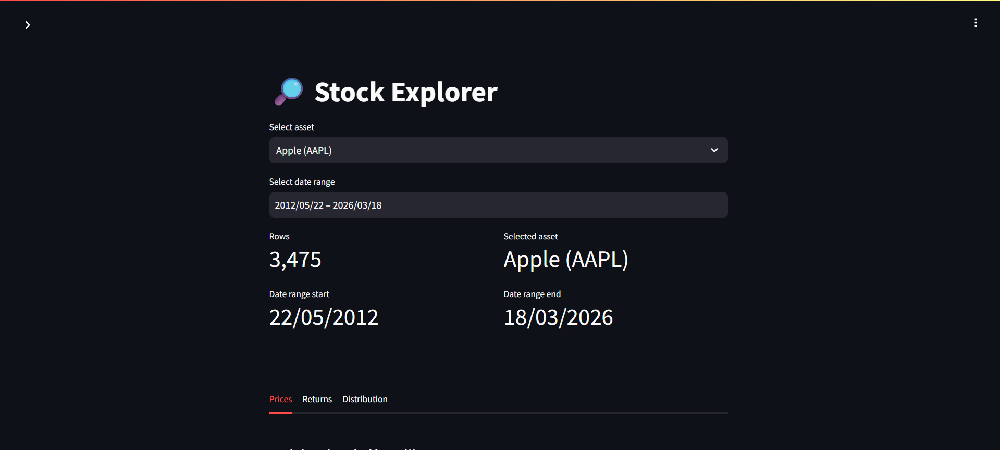

---

### Predictor

**Purpose**

Illustrate potential future outcomes using scenario ranges.

**Features**

- ticker selection
- forecast horizon selection
- trend window selection
- ML next-day estimate
- ML disclaimer and uncertainty messaging
- Monte Carlo scenario simulation
- optimistic / realistic / pessimistic outcomes
- scenario result table
- beginner interpretation guidance
- volatility and drift metrics

**Interpretation**

The Predictor page combines a short-term ML next-day estimate with long-term Monte Carlo scenario projections to help beginners understand both short-term noise and long-term uncertainty ranges. It teaches that long-term investing outcomes are better understood as a range of possibilities rather than a single guaranteed number, while also reinforcing that short-term ML signals remain weak and highly uncertain.

**Business requirement addressed**

- scenario-based forecasting

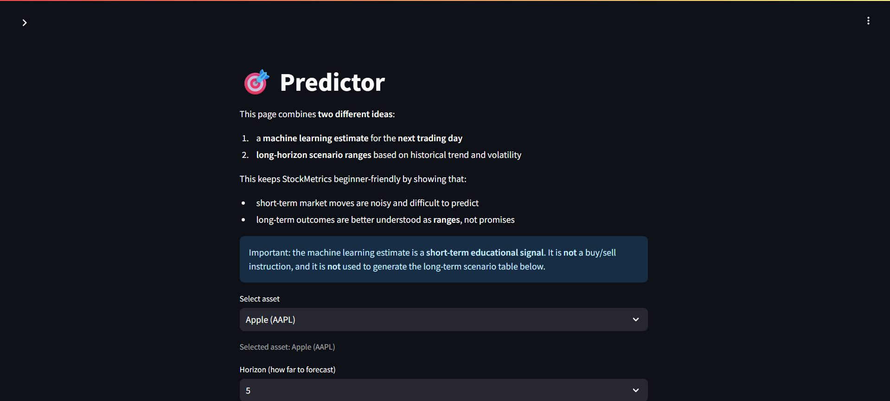

---

### Portfolio Plans

**Purpose**

Allow users to compare different portfolio diversification strategies.

**Features**

- selectable portfolio plans
- beginner-friendly risk explanation
- plan comparison boxes with relative risk labels
- portfolio metrics
- historical growth chart
- allocation breakdown table
- volatility and drawdown comparison
- educational plan disclaimer

**Interpretation**

The Portfolio Plans page helps users compare the trade-off between diversification and concentration. More concentrated plans may produce stronger growth in favourable conditions, but they also tend to show higher volatility and deeper drawdowns. The allocation table and plan comparison boxes make risk differences easy to interpret visually.

**Business requirement addressed**

- portfolio risk comparison

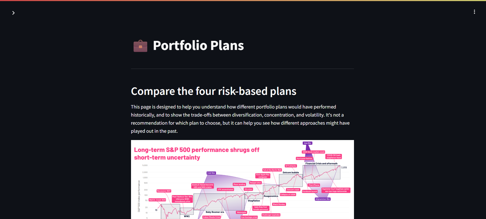

---

### Model Performance

**Purpose**

Provide transparency regarding the machine learning model.

**Features**

- business case success indicator
- regression metrics
- beginner-friendly metric explanations
- actual vs predicted plots
- residual analysis plots
- best hyperparameter display
- feature importance table
- saved evaluation plot display
- model disclaimer

**Interpretation**

The Model Performance page explains whether the predictive model actually met the business case and how much trust should be placed in it. A slightly positive Test R² supports the educational ML task, but the weak magnitude reinforces that short-term market prediction remains highly uncertain. Hyperparameters, residual plots, and feature importance outputs help demonstrate modelling transparency and advanced tuning evidence.

**Business requirement addressed**

- clear communication of model results


---

## Plots

> [!NOTE]  
> These plots were generated during the EDA and evaluation stages and support hypothesis validation and the ML business case.  
> The interactive versions of key insights are presented within the dashboard itself.

This section includes multiple plot types used across exploratory analysis and machine learning evaluation, including **line plots, histograms, box plots, heatmaps, scatter plots, and residual diagnostics**.

These visualisations were generated during the **Data Understanding** and **Evaluation** stages of CRISP-DM and were used to investigate historical market behaviour, compare volatility across assets, validate project hypotheses, and determine whether the regression pipeline met the ML business case success criterion.

---

### Exploratory Data Analysis Plots

The following plots were used to validate the hypotheses around **volatility, diversification, concentration risk, and comparative market behaviour**.

| Plot | Purpose | Key Metric / Evidence | Interpretation / Insight | Business Evidence | Screenshot |
|---|---|---|---|---|---|
| Adjusted Close Time Series | Compare long-term adjusted closing price trends across ETFs and technology stocks. | Multi-year adjusted close growth trajectories; technology equities show materially steeper compounded growth paths than ETFs. | All assets show long-term upward growth overall, but individual technology stocks display steeper appreciation paths and visibly larger regime swings than the ETFs. This supports the conclusion that concentrated equity exposure may offer greater upside potential, but with greater instability and path dependency. | Business Requirement 1, Hypothesis 1 | 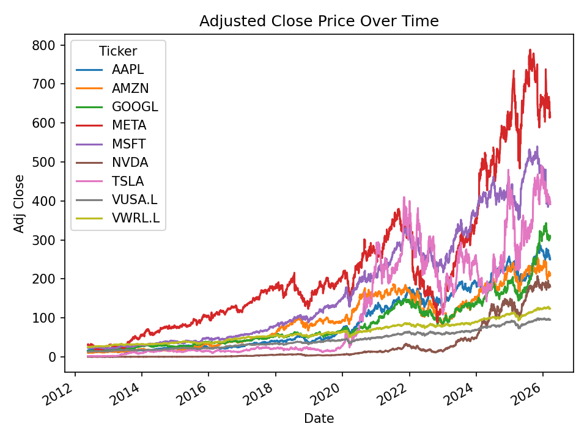 |
| Daily Returns Time Series | Show day-to-day return behaviour for each asset. | Magnitude and frequency of short-term spikes in `return_1d`; TSLA and NVDA exhibit larger absolute swings than VWRL.L and VUSA.L. | The daily return series highlights how noisy short-term market behaviour is. Technology stocks show larger positive and negative spikes, while the ETFs are generally more stable. This provides statistical support that individual technology stocks are more volatile than diversified funds. | Business Requirement 1, Hypothesis 2 | 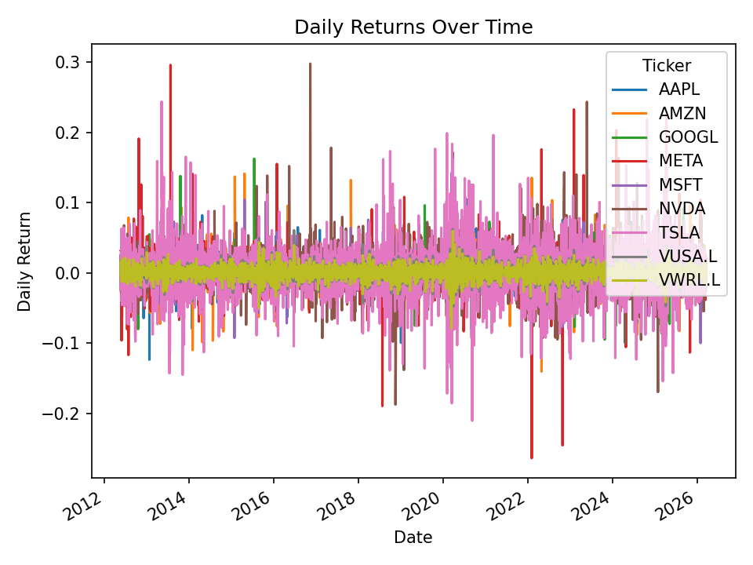 |
| Daily Returns Histogram | Compare the distribution and spread of daily returns across assets. | Wider return distributions and fatter tails for TSLA/NVDA relative to ETF benchmarks. | Stocks such as Tesla and Nvidia show wider return distributions, indicating more frequent extreme daily moves. The ETF distributions are narrower and more concentrated around zero, indicating lower day-to-day volatility. This supports the hypothesis that individual equities exhibit greater dispersion risk. | Business Requirement 1, Hypothesis 2 | 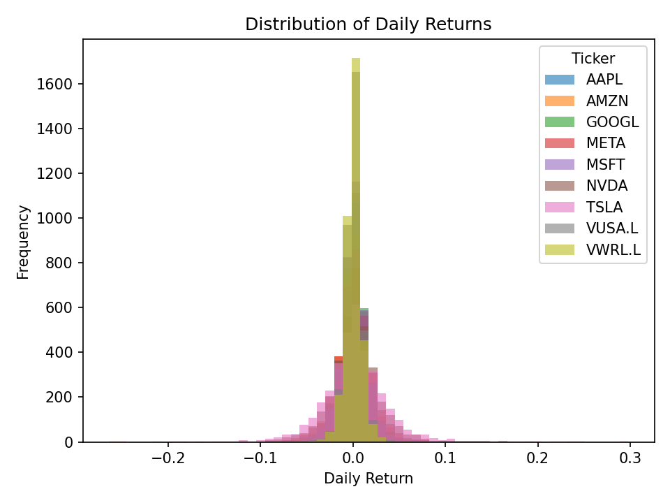 |
| Daily Returns Box Plot | Compare volatility spread and outlier behaviour across assets. | Larger IQR and more extreme outliers in stock return distributions versus ETFs. | The box plot shows that individual stocks have wider interquartile ranges and more extreme outliers than the ETFs. This reinforces the conclusion that concentrated positions carry greater short-term risk and more severe tail-event exposure. | Business Requirement 1, Hypothesis 2 | 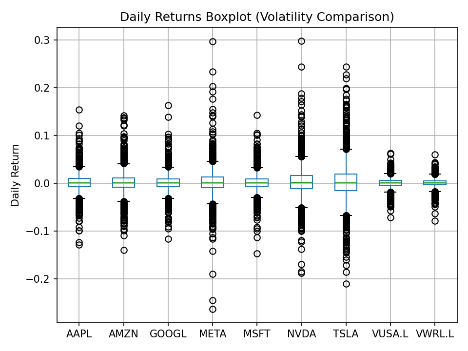 |
| Returns Correlation Heatmap | Show the correlation structure between daily returns of included assets. | Positive but imperfect cross-asset correlations; diversification benefit remains present despite shared market beta. | Most assets are positively related, although the strength of the relationship varies. This suggests that diversification across equities can reduce risk, but not eliminate it entirely, because many assets still move together during broad market events. | Business Requirement 2, Hypothesis 3 | 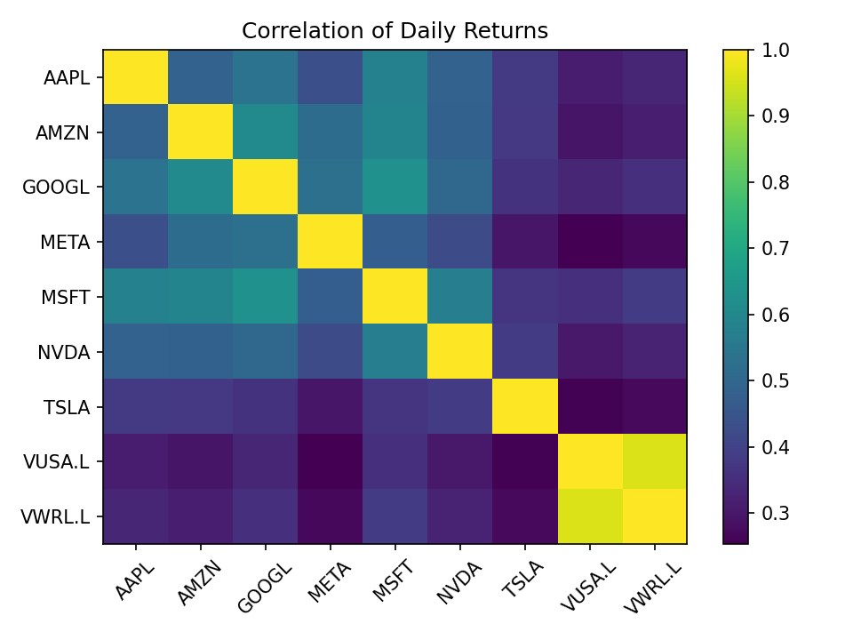 |
| Rolling 30-Day Volatility | Show how short-term volatility changes over time for each asset. | 30-day rolling standard deviation of `return_1d`; TSLA volatility spikes materially above VWRL.L during stress periods. | Volatility changes substantially over time, showing that market risk is not constant. Technology stocks experience sharper volatility spikes than the ETFs, especially during turbulent periods. This provides strong evidence that concentrated portfolios are likely to experience larger swings than diversified ones. | Business Requirement 2, Hypotheses 1 and 2 | 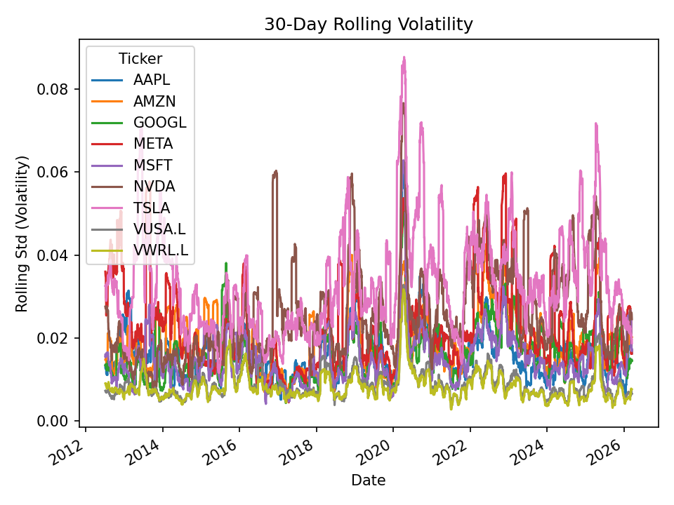 |

---

### Model Evaluation Plots

The following diagnostic plots were used to determine whether the regression pipeline met the **ML business case success criterion of Test R² > 0**.

| Plot | Purpose | Key Metric / Evidence | Interpretation / Insight | Business Evidence | Screenshot |
|---|---|---|---|---|---|
| Actual vs Predicted Train | Compare actual and predicted next-day returns on the training set. | Train R² = **0.035236**; predictions remain tightly clustered around small return values. | The model captures some structure in the training data, but predictions remain tightly clustered around small return values. This suggests limited signal strength even before evaluating generalisation performance. | ML Business Case, Business Requirement 5 | 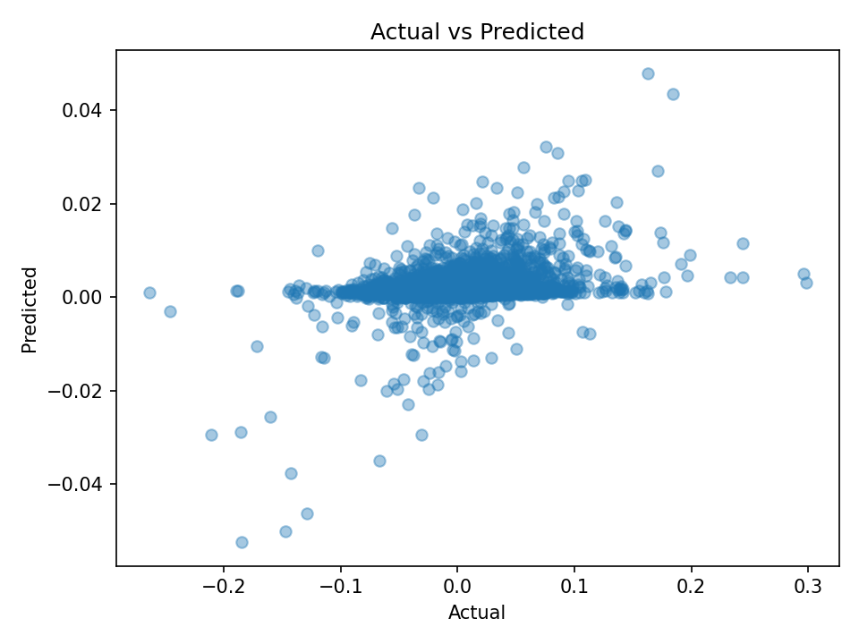 |
| Actual vs Predicted Test | Compare actual and predicted next-day returns on unseen test data. | Test R² = **0.000740**, satisfying the business case threshold of **Test R² > 0**. | The relationship between actual and predicted values is weak, which is fully consistent with the very small positive Test R². This indicates that the model captured **some generalisable signal**, but predictive strength remains extremely limited. This still satisfies the ML business case threshold while reinforcing that next-day market forecasting is inherently difficult. | ML Business Case, Hypothesis 4, Business Requirement 5 | 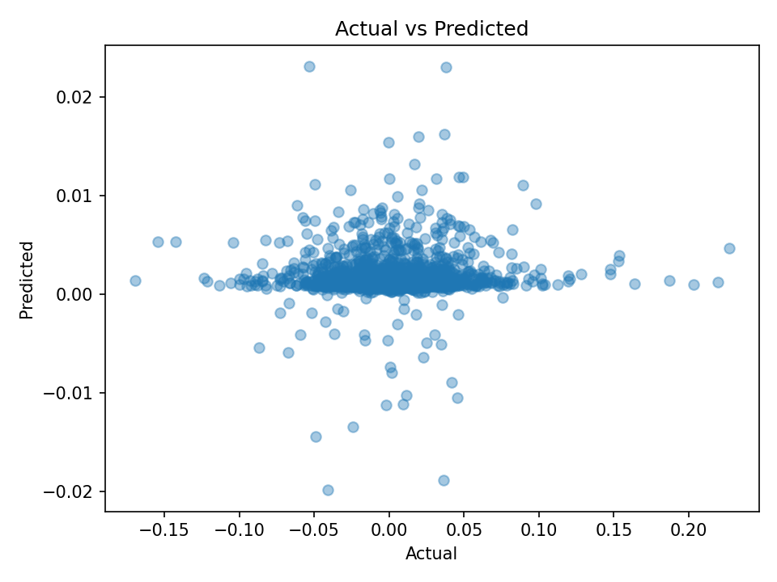 |
| Predicted Time Series Test | Compare predicted and actual returns across the test period. | Predicted values loosely track directional movement but fail to capture larger volatility spikes. | The model follows some short-term directional movement, but it fails to capture many larger spikes and reversals accurately. This reinforces the conclusion that short-horizon market prediction remains highly difficult even when weak positive signal exists. | Hypothesis 4, Business Requirement 5 | 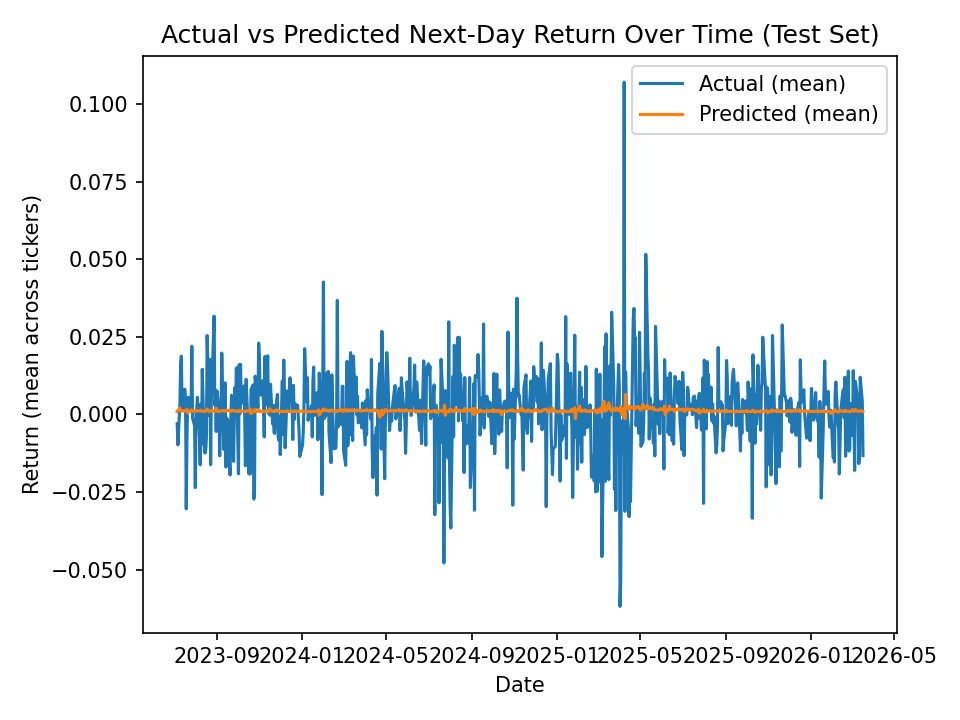 |
| Residuals Histogram Test | Inspect residual distribution on unseen data. | Residuals centred near zero; error spread remains large relative to daily return magnitudes. | The residuals are centred near zero, suggesting the model is not strongly biased in one direction, but the spread of errors remains substantial relative to the tiny size of daily returns. This explains why the model should be treated as an educational tool rather than a dependable forecasting engine. | ML Business Case, Business Requirement 5 | 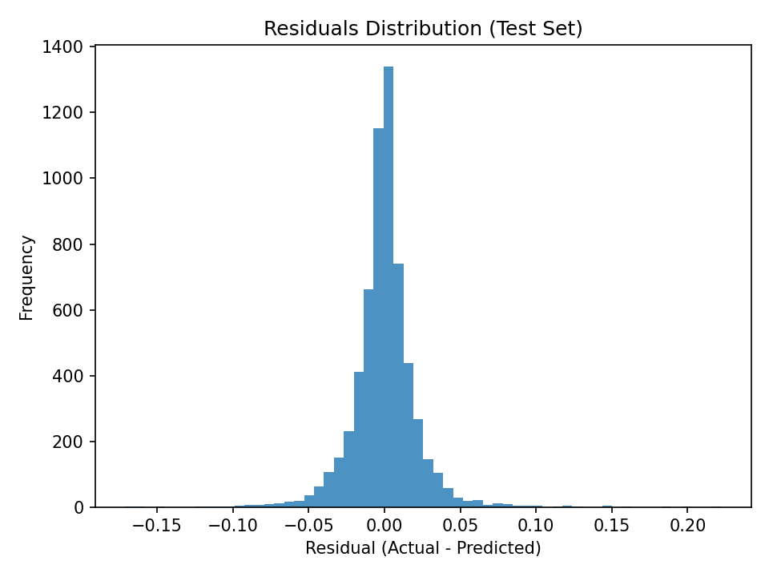 |
| Residuals Time Series Test | Show temporal behaviour of prediction errors. | Error clustering visible across multiple market regimes, indicating instability across conditions. | Residuals fluctuate over time and include periods of clustered larger errors, indicating that model performance is unstable across changing market conditions. This further supports Hypothesis 4 that next-day return prediction remains highly uncertain. | Hypothesis 4, Business Requirement 5 | 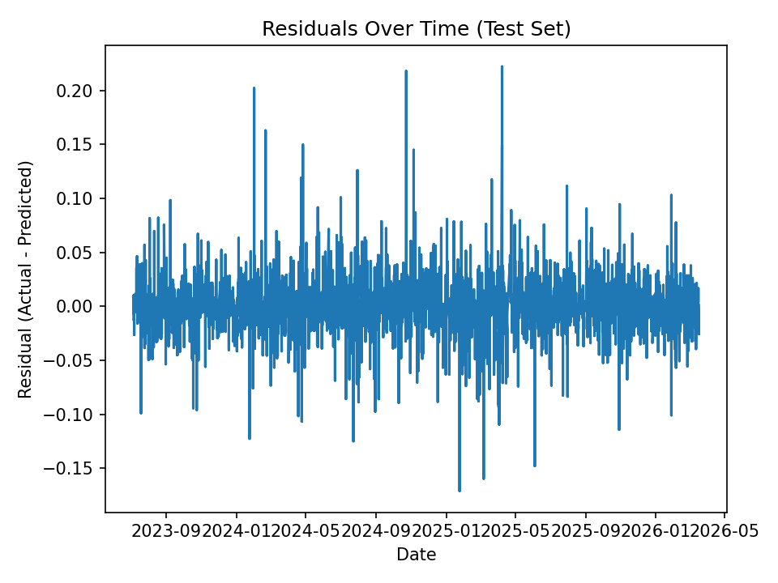 |

---

### Plot Relevance to the Business Case

Together, these visualisations provide evidence-led support for the project’s business requirements by helping to:

- explain historical market behaviour through **price, return, correlation, and volatility analysis**
- compare the relative stability of diversified ETFs and concentrated technology stocks
- justify the validation of hypotheses using **quantitative evidence rather than visual judgement alone**
- demonstrate that the ML pipeline achieved the business case success threshold of **Test R² > 0**
- communicate clearly that short-term return prediction remains highly uncertain even when a small positive predictive signal is present

This section strengthens the project’s **statistical justification, hypothesis validation, and ML business case transparency**, while also evidencing multiple distinct plot types.

---

## Tools and Technologies

The **StockMetrics** project uses the following technologies to collect financial market data, process and analyse time-series datasets, build a machine learning pipeline, and deploy an interactive Streamlit dashboard.

| Tool / Technology | Purpose |
|---|---|
| [](https://git-scm.com) | Version control system (`git add`, `git commit`, `git push`) used to track development history through small, feature-based commits. |
| [](https://github.com) | Remote repository hosting used for source control, project backup, and Agile project tracking with GitHub Projects. |
| [](https://code.visualstudio.com) | Local development environment used to write Python modules, notebooks, and project documentation. |
| [](https://www.python.org) | Primary programming language used for data collection, data processing, machine learning, and dashboard development. |
| [](https://jupyter.org) | Notebook environment used to implement the CRISP-DM workflow, including data collection, cleaning, exploratory analysis, feature engineering, model training, and evaluation. |
| [](https://numpy.org) | Numerical computing library used for return calculations, volatility calculations, simulation logic, and modelling support. |
| [](https://pandas.pydata.org) | Data manipulation library used to clean, transform, aggregate, and analyse historical financial time-series data. |
| [](https://matplotlib.org) | Static plotting library used in the EDA and model evaluation notebooks to generate analysis and diagnostic figures. |
| [](https://plotly.com/python) | Interactive visualisation library used in the Streamlit dashboard for dynamic price charts, returns charts, histograms, and portfolio growth visuals. |
| [](https://scikit-learn.org) | Machine learning framework used to build preprocessing pipelines, perform time-aware cross-validation with `TimeSeriesSplit`, tune hyperparameters using `GridSearchCV` / `HalvingGridSearchCV`, train the `RandomForestRegressor` model, and evaluate predictive performance. |
| [](https://streamlit.io) | Framework used to build the interactive multi-page dashboard for beginner investors. |
| [](https://finance.yahoo.com) | Financial market data source accessed programmatically through the `yfinance` Python library to retrieve historical OHLCV stock and ETF data. |
| [](https://pypi.org/project/yfinance/) | Python library used to download historical stock and ETF data from the Yahoo Finance endpoint during the data collection stage. |
| [](https://render.com) | Cloud hosting platform used to deploy the Streamlit dashboard as a live publicly accessible web application. |
| [](https://chat.openai.com) | Used as a learning aid for planning architecture, debugging code, improving explanations, and drafting documentation during development. |

---

## Agile Development Process

Agile methodology was used throughout the development of **StockMetrics** to ensure structured, iterative progress aligned with the project’s business requirements and CRISP-DM workflow.

Agile was particularly important for this project because it:

- allowed incremental delivery of a complex data science pipeline
- supported iterative experimentation during model development
- ensured clear traceability from business requirements → implementation → dashboard features
- helped prioritise core functionality within a fixed submission deadline

---

### Agile Structure and Workflow

The project followed a structured hierarchy:

- **Epics** → represent major project phases aligned with CRISP-DM stages
- **User Stories** → define specific functional requirements
- **Tasks** → break User Stories into implementable steps

- **Milestones** → represent significant moments in the project's maturity throughout the development process
- **Sprints** → represent periods of time during which tasks are completed to achieve Milestones

Each User Story included:

- a clear user-focused objective  
- defined acceptance criteria  
- linked implementation tasks  

This ensured that all development work could be traced directly back to business requirements.

---

### Mapping to CRISP-DM

Agile Epics were aligned with CRISP-DM stages:

| CRISP-DM Stage | Agile Implementation |
|---|---|
| Business Understanding | Business Requirements, Hypotheses, User Stories |
| Data Collection | Data collection notebook + raw dataset pipeline |
| Data Preparation | Cleaning and feature engineering notebooks |
| Data Understanding | EDA notebook and visual analysis |
| Modelling | Model training and hyperparameter tuning |
| Evaluation | Model evaluation notebook and dashboard outputs |
| Deployment | Streamlit dashboard + Render deployment |

This ensured that the Agile workflow directly supported a structured data science lifecycle.

---

### Issue Structure

Each issue included:

- a clear description  
- acceptance criteria  
- labels (Bug, Epic, etc.)  
- linkage to commits and features  

This provides full traceability:

User Story → Code Implementation → Dashboard Feature

---

### GitHub Issues

[GitHub Issues](https://www.github.com/LouisCE/stockmetrics/issues) were used as a supporting tool to log Epics, User Stories, and Bugs.

To keep the workflow organised, labels were applied within GitHub Issues, including:

* **Bug** - used to identify bugs, defects, and technical issues discovered during development
* **Epic** - used to identify larger Epic-level items that grouped related User Stories under a broader development objective

This helped maintain a clear structure between high-level planning items and smaller actionable tasks throughout the project lifecycle.

Bugs were also documented within **TESTING.md**, allowing all planning, progress tracking, and issue documentation to remain centralised during development.

| Link | Screenshot |
|---|---|
| [](https://www.github.com/LouisCE/stockmetrics/issues?q=is%3Aissue%20is%3Aopen%20-label%3Abug) | 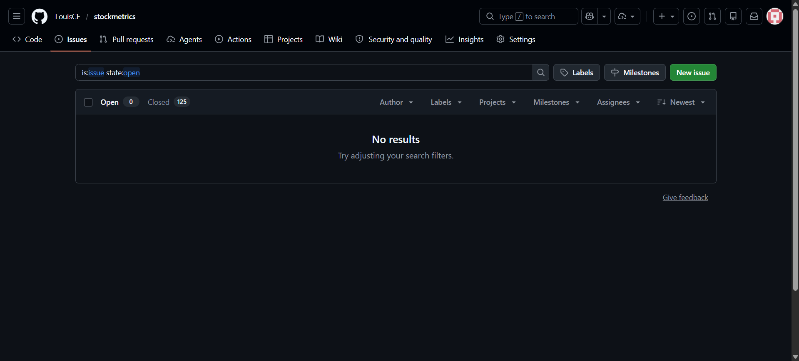 |
| [](https://www.github.com/LouisCE/stockmetrics/issues?q=is%3Aissue%20is%3Aclosed%20-label%3Abug) | 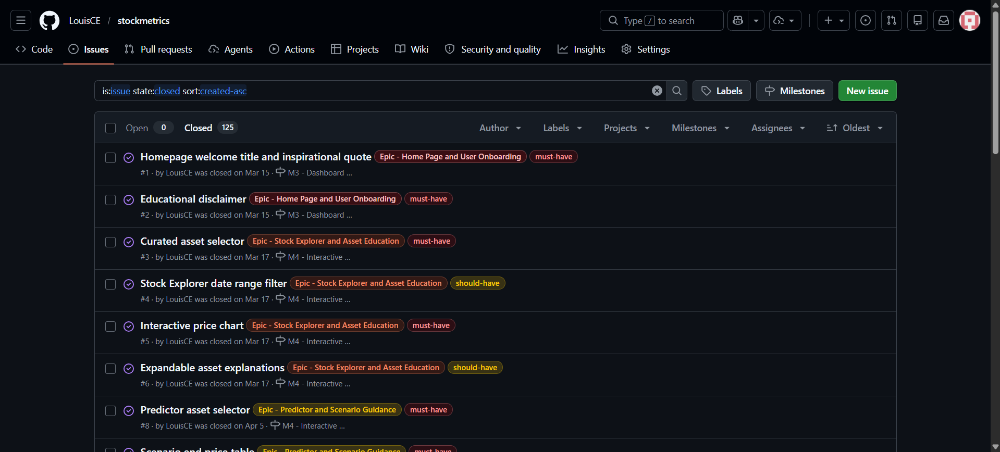 |

---

### GitHub Milestones

[GitHub Milestones](https://www.github.com/LouisCE/stockmetrics/milestones) were used to mark key checkpoints in the project's development lifecycle.

While Epics and User Stories defined the project's functionality, Milestones represented the "Definition of Done" for major phases, ensuring that development remained aligned with the core business case.

Each Milestone bridged multiple **Sprints**, which are flexible one-or-two-week time-boxes used to manage task execution. This structure allowed for iterative development while maintaining a clear path toward final assessment.

A deliberate buffer period was integrated into the final weeks to minimise time trouble and mitigate technical risk, providing extra time for rigorous testing, bug fixing, and final UI/UX polish.

| Milestone | Sprint | Outcome |
| :--- | :--- | :--- |
| M0 - Project Setup Initialised | Sprint 0 | Repository created, early file structure planned, CI template integration, and dataset procurement with `yfinance`. |
| M1 - Data Science Pipeline Ready | Sprints 1 and 2 | Completion of all `jupyter_notebooks` (01-06) covering data collection and cleaning, EDA, feature engineering, and ML model training and evaluation. |
| M2 - Core Logic Modularised | Sprint 3 | Transitioning notebook logic into production-ready `src` modules. |
| M3 - Streamlit Dashboard UI Developed | Sprint 4 and 5 | Implementation of the **Streamlit** frontend, including `app.py` and all functional `app_pages` with a beginner-friendly UI. |
| M4 - Deployment on Render Successful | Sprint 6 | Successful hosting on **Render**, environment configuration, and stability validation. |
| M5 - UX Refinement & README Complete | Sprint 7 and 8 | Dashboard and educational guidance polish and `README.md` completion to explain the project with rationale, business case, and hypotheses. |
| M6 - Validation and TESTING Complete | Sprints 9 and 10 | `TESTING.md` completion to prove the project works with PEP 8 compliance, automated testing suite with Pytest handled in the `tests` files, widget validation, user story testing and comprehensive bug logging. |
| M7 - Project Ready for Assessment | Sprint 11 | Final Agile board alignment in **GitHub Issues**, **GitHub Projects** and **GitHub Milestones**, buffer period, and project submission. |

> **Note on Agility:** Sprints were managed as flexible time targets rather than strict deadlines, allowing adaptation during development while maintaining overall milestone alignment.

| Link | Screenshot |
|---|---|
| [](https://www.github.com/LouisCE/stockmetrics/milestones) | 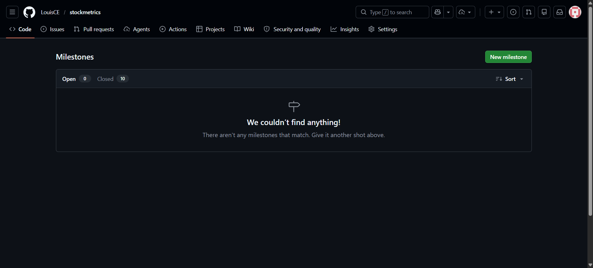 |
| [](https://www.github.com/LouisCE/stockmetrics/milestones?state=closed) | 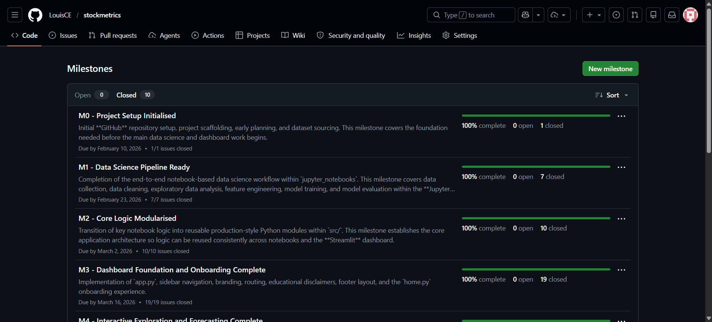 |

---

### GitHub Projects

[GitHub Projects](https://www.github.com/LouisCE/stockmetrics/projects) was used as the primary Agile planning and tracking tool for the **StockMetrics** project.

The GitHub Projects board followed a Kanban-style workflow and was used to:

* Plan and manage Epics, User Stories, and Sprints
* Break down features into manageable development tasks
* Track progress
* Create, prioritise and move Epic and User Story issues through the Kanban workflow from *To Do* through *In Progress* to *Done*
* Record bugs and technical issues discovered during development and move them from *Bugs* to *Fixed Bugs* once resolved

The board was updated regularly throughout the build process to reflect real-time project progress.

| Link | Screenshot |
|---|---|
| [](https://github.com/users/LouisCE/projects/14) | 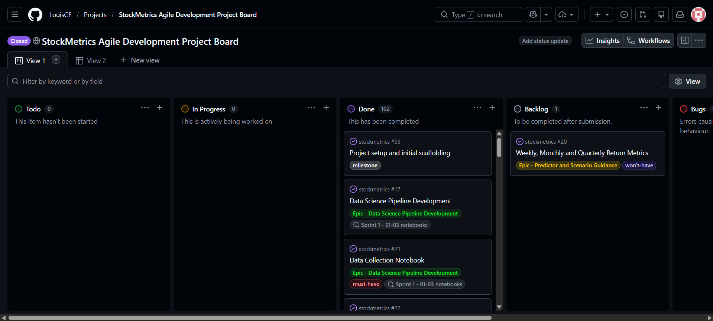 |

---

### MoSCoW Prioritisation

User Stories were prioritised using the **MoSCoW** method to ensure that core functionality was delivered first, while still allowing room for enhancements if time permitted.

Each User Story was labelled accordingly within GitHub Issues:

* **Must Have** - Core features required for the site to function correctly and meet the project’s assessment criteria
* **Should Have** - Important features that significantly improve user experience but are not strictly essential
* **Could Have** - Nice-to-have features that add extra polish if time allows
* **Won’t Have** - Features intentionally deferred to future development beyond the scope of this submission

This prioritisation helped guide development decisions and ensured the project remained achievable within the available timeframe.

---

### Version Control and Incremental Development

Development followed best practices using Git:

- small, incremental commits
- commit messages ≤ 50 characters
- each commit mapped to a specific feature or fix

This provides clear evidence of the development process and avoids large, ambiguous commits.

---

### Summary

The Agile process ensured that:

- development remained aligned with business requirements
- features were delivered incrementally
- the ML pipeline could be iterated effectively
- the final dashboard reflects a structured, traceable development process

---

## Testing

> [!NOTE]  
> For all testing, please refer to the [TESTING.md](TESTING.md) file.

---

## Deployment

The live deployed application can be accessed here:  
[StockMetrics on Render](https://stockmetrics-emhu.onrender.com)

### Render Deployment

The StockMetrics dashboard is deployed using **Render**. The following steps were used to deploy the application.

1. Log in to **Render.com** using a GitHub account.
2. Create a workspace and click **New → Web Service**.
3. Under **Source Code**, select **Git Provider** and connect the GitHub repository.
4. Choose the repository. In my case: `LouisCE/stockmetrics`.
5. Enter a unique service name. In my case: `stockmetrics`.
6. Select **Python 3** as the runtime environment.
7. Select the **main** branch for deployment.
8. Choose the **Frankfurt (EU Central)** region.
9. Leave **Root Directory** empty so the repository root is used.
10. Set the **Build Command** to install project dependencies and configure Streamlit:

```
pip install -r requirements.txt && bash setup.sh
```

11. Set the **Start Command** to run the Streamlit dashboard:

```
streamlit run app.py --server.port $PORT --server.address 0.0.0.0
```

12. Select the **Free** instance type.
13. Leave **Environment Variables** empty as no external secrets are required.
14. In **Advanced Settings**, set the **Health Check Path** to:

```
/
```

15. Disable **Auto-Deploy** initially to allow manual deployment control during development.
16. Click **Deploy Web Service**.

Once the build process completes, Render provides a public URL where the dashboard can be accessed.

Free Render instances spin down after periods of inactivity, so the first request may take several seconds while the service wakes up.

---

## Project Limitations

Financial market modelling contains several inherent limitations that must be acknowledged when interpreting the results produced by StockMetrics.

---

### Market Noise

Daily stock returns contain a large amount of stochastic noise. Short-term price movements are influenced by many unpredictable external factors including:

- news events
- macroeconomic announcements
- geopolitical developments
- investor sentiment

As a result, predicting **next-day returns** is inherently difficult.

---

### Non-Stationary Market Behaviour

Financial markets evolve over time. Relationships that existed historically may change due to:

- economic cycles
- regulatory changes
- technological shifts
- structural changes in financial markets

This means that models trained on historical data may not generalise perfectly to future market conditions.

---

### Limited Asset Universe

StockMetrics intentionally focuses on a **small curated set of assets** consisting of:

- two ETFs (VWRL.L and VUSA.L)
- the Magnificent Seven technology companies

This design improves usability for beginner investors but does not represent the full diversity of the global equity market.

---

### Educational Scope

The machine learning model is designed as an **educational demonstration of predictive analytics** rather than a trading signal generator.

Although the final model achieved a **slightly positive test-set R²**, the predictive signal was weak. This means the model was successful against the project business case, but it is still not strong enough to justify confident short-term trading decisions.

To address these limitations, StockMetrics:

- avoids presenting single deterministic forecasts and instead uses scenario ranges to communicate uncertainty
- avoids compounding the ML predictions meant for the next day to make long-term predictions and instead uses historical trend and volatility for long-horizon forecasting

This approach reinforces the importance of uncertainty when interpreting financial predictions.

---

## Future Features

Several enhancements could be implemented in future iterations of StockMetrics to improve educational depth, diversification coverage, and personalised investor guidance.

---

### Expanded Asset Universe and Sector Coverage

Future versions could expand beyond the current ETF and technology-heavy asset set by incorporating companies and funds from a broader range of sectors, such as:

- **Consumer Staples** — Coca-Cola, PepsiCo
- **Consumer Discretionary** — McDonald's, Walmart
- **Financials** — JPMorgan Chase & Co.
- **Healthcare** — Johnson & Johnson
- **Real Estate / REITs** — Realty Income
- **Communication Services / Media** — Netflix

This would help users compare how different sectors behave across market cycles and improve diversification education beyond the current technology concentration.

---

### Dividend and Income Modelling

A future version could include dividend-aware portfolio analysis to help users understand how shareholder distributions contribute to total return.

Potential additions include:

- dividend yield comparisons
- income-focused portfolio plans
- dividend reinvestment simulations
- total return comparisons (price growth + dividends)

This would improve the educational value for long-term investors interested in passive income and compounding.

---

### Longer-Horizon and Alternative Machine Learning Models

The current ML task focuses on **next-day return prediction**, which naturally contains substantial market noise.

Future iterations could experiment with:

- weekly return prediction
- monthly return prediction
- rolling 3-month trend prediction
- volatility regime classification
- Gradient Boosting models (XGBoost or LightGBM)
- linear models with regularisation
- neural network models for time-series prediction

Longer forecast horizons, alternative modelling approaches, and different machine learning algorithms may all improve signal strength and increase the likelihood of a stronger **R² score**.

These changes would also support clearer model comparison and provide more useful educational insights into medium-term market behaviour.

---

### Recommendation and Robo-Advisor Features

A future roadmap enhancement could introduce a beginner-friendly recommendation engine that suggests a portfolio plan based on user preferences such as:

- investment horizon
- risk tolerance
- diversification preference
- income vs growth preference

This could evolve into a lightweight **robo-advisor style educational assistant**, helping users understand why a specific plan may better align with their goals.

---

### Macroeconomic and Multi-Factor Integration

Additional explanatory variables could be incorporated into the feature engineering pipeline, including:

- interest rates
- inflation indicators
- economic sentiment indexes
- unemployment data
- treasury yield spreads

These variables may improve the explanatory power of predictive models and better reflect real-world drivers of market behaviour.

---

### Portfolio-Level Simulation and Optimisation

Monte Carlo simulations are currently used to generate long-horizon asset-level scenario ranges.

Future versions could extend this by introducing:

- portfolio-level Monte Carlo simulations
- mean-variance optimisation
- risk-parity allocation
- factor-based portfolio construction
- dynamic rebalancing simulations

These additions would allow StockMetrics to evolve from educational comparison toward more advanced portfolio construction analysis.

---

## Credits

This section acknowledges the learning resources, technical references, data sources, and people that supported the research, development, deployment, and documentation of StockMetrics.

---

### General Guidance

The following learning resources were used as reference material and general guidance during development:

- The **Code Institute LMS** was used as the primary learning resource for CRISP-DM workflow, tabular ML techniques, and the overall Predictive Analytics project structure.  
  [Code Institute LMS](https://learn.codeinstitute.net/)

- The **Churnometer walkthrough** was used as a reference for the recommended notebook flow, ML pipeline approach, and Streamlit page structure (`app.py` + `app_pages` + `src`).  
  [Code Institute LMS – Churnometer walkthrough](https://learn.codeinstitute.net/courses/course-v1:CodeInstitute+DDA101+3/courseware/bba260bd5cc14e998b0d7e9b305d50ec/c83c55ea9f6c4e11969591e1b99c6c35/)

- The **PP5 Predictive Analytics Assessment Criteria** were used to shape the scope, workflow, and documentation standards of the project (README and TESTING files, notebooks structure, and dashboard requirements).  
  [PP5 Assessment Criteria (Code Institute)](https://learn.codeinstitute.net/courses/course-v1:CodeInstitute+PA_PAGPPF+2/courseware/bde016cdbd184cdeafd341a73807e138/bd2104eb84de4e48a9df6f685773cbf2/)

- The **Code Institute “Bring Your Own Data” template repository** was used as the initial repository base (tooling, deployment scaffolding, and project layout), then extensively adapted to align with the StockMetrics dataset, business requirements, machine learning workflow, and beginner-focused dashboard design.
  [Code Institute Template - Bring Your Own Data](https://github.com/Code-Institute-Solutions/milestone-project-bring-your-own-data)

---

### Code / Technical References

The following references were used during development to support best practices, library usage, and deployment configuration:

| Source | Notes |
| --- | --- |
| [Chris Beams](https://chris.beams.io/posts/git-commit) | Guidance on writing clear, meaningful Git commit messages. |
| [Python Documentation](https://www.python.org/doc/) | Language reference used for core Python behaviour and standard library usage. |
| [Pandas Documentation](https://pandas.pydata.org/docs/) | Reference for DataFrame manipulation used in data cleaning and feature engineering. |
| [NumPy Documentation](https://numpy.org/doc/) | Reference for numerical operations used across notebooks and modelling utilities. |
| [SciPy Documentation](https://docs.scipy.org/doc/scipy/) | Reference for statistical tests used for hypothesis validation (where applicable). |
| [scikit-learn Documentation](https://scikit-learn.org/stable/) | Reference for pipelines, preprocessing, model selection, and evaluation metrics. |
| [feature-engine Documentation](https://feature-engine.trainindata.com/) | Reference for feature engineering transformers integrated into ML pipelines. |
| [XGBoost Documentation](https://xgboost.readthedocs.io/) | Reference for gradient boosting modelling and tuning options. |
| [Plotly Documentation](https://plotly.com/python/) | Reference for interactive chart creation in the Streamlit dashboard. |
| [Streamlit Documentation](https://docs.streamlit.io/) | Reference for multipage dashboard patterns, widgets, and caching. |
| [Render Documentation](https://render.com/docs) | Reference for deployment configuration, build/start commands, and service management. |
| [ChatGPT](https://chat.openai.com) | Used responsibly as a learning aid while going through the LMS, for planning the file structure, debugging support, improving beginner-friendly explanations, and drafting documentation during development. |

---

### Data Source

| Source | Notes |
|---|---|
| Yahoo Finance API (`yfinance`) | Historical OHLCV financial market data (open, high, low, close, adjusted close, volume) retrieved programmatically through the `yfinance` Python library during the Data Collection stage of the CRISP-DM pipeline. |

---

### Acknowledgements

I would like to acknowledge the following people and organisations for their support throughout the development of this project:

- I would like to thank my PP5 Code Institute mentor, **Mo Shami**, for guidance on structuring the logical project workflow (repository setup → data → cleaning → processing → training → evaluation → dashboard → deployment → documentation) and for feedback throughout development.

- I would like to thank my previous Code Institute mentor, **Tim Nelson**, for guidance on mapping evidence for the full Agile Development process, including use of epics, user stories, sprints and milestones.

- I would like to thank **Code Institute** for the knowledge, experience, and professional development skills I have gained throughout the diploma, and for helping me to discover my passion as a developer.