# Project Testing

> [!NOTE]
> Return to the [README.md](README.md) file.

---

## Code Validation

All custom-written code for the **StockMetrics** project was validated using appropriate tools to help ensure standards compliance, readability, and correctness.

Validation focused on the final project code that supports the deployed dashboard and notebook workflow.

---

### Python Files

All custom Python `.py` files were validated using the **PEP 8 CI Python Linter** to check compliance with **PEP 8** standards and general Python best practices.

- [PEP 8 CI Python Linter](https://pep8ci.herokuapp.com)

---

#### Validation Approach

Each Python file was validated by:

1. Opening the file in the GitHub repository.
2. Selecting the **Raw** view to obtain the direct raw file URL.
3. Appending that raw URL to the PEP 8 CI validator base URL.
4. Running validation against the raw file.

This approach provides a consistent and repeatable way to validate the final committed Python files.

---

#### Excluded Files

The following files and directories were intentionally excluded from PEP 8 validation because they are auto-generated, non-Python, configuration-only, or not part of the custom Python application logic:

- generated artefacts such as saved datasets, model files, and report outputs
- notebook metadata and saved cell outputs within `.ipynb` files
- non-Python project files such as `.gitignore`, `.python-version`, `requirements.txt`, `requirements-dev.txt`, `runtime.txt`, `Procfile`, `setup.sh`, `README.md`, and `TESTING.md`
- image, JSON, and CSV artefacts used for documentation, reporting, or deployment support

Only custom Python files directly maintained as part of the StockMetrics codebase were validated with the PEP 8 CI Python Linter.

---

#### Python Validation Results

| Directory | File | GitHub File | Validator URL | Screenshot | Notes |
| --- | --- | --- | --- | --- | --- |
| - | `app.py` | [View](https://github.com/LouisCE/stockmetrics/blob/main/app.py) | [PEP 8 CI Link](https://pep8ci.herokuapp.com/https://raw.githubusercontent.com/LouisCE/stockmetrics/refs/heads/main/app.py) | 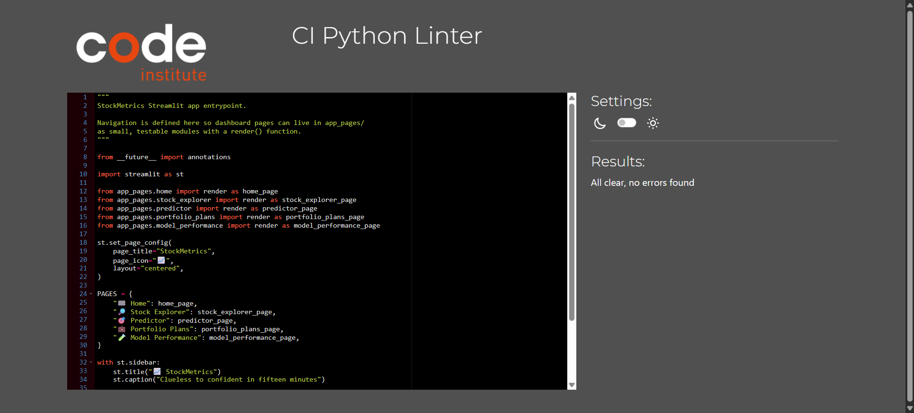 | No issues found |
| `app_pages/` | `__init__.py` | [View](https://github.com/LouisCE/stockmetrics/blob/main/app_pages/__init__.py) | [PEP 8 CI Link](https://pep8ci.herokuapp.com/https://raw.githubusercontent.com/LouisCE/stockmetrics/refs/heads/main/app_pages/__init__.py) | 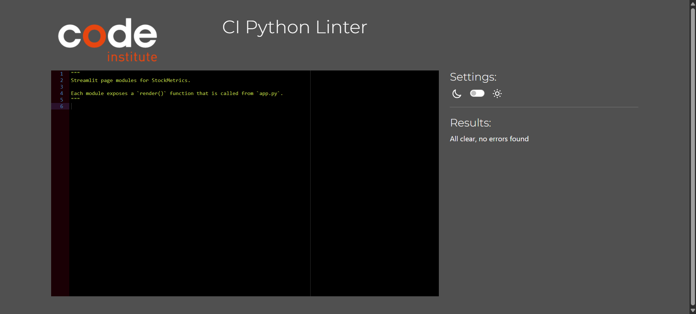 | No issues found |
| `app_pages/` | `home.py` | [View](https://github.com/LouisCE/stockmetrics/blob/main/app_pages/home.py) | [PEP 8 CI Link](https://pep8ci.herokuapp.com/https://raw.githubusercontent.com/LouisCE/stockmetrics/refs/heads/main/app_pages/home.py) | 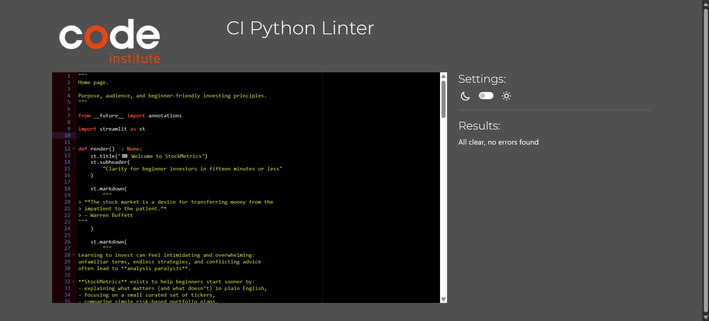 | No issues found |
| `app_pages/` | `stock_explorer.py` | [View](https://github.com/LouisCE/stockmetrics/blob/main/app_pages/stock_explorer.py) | [PEP 8 CI Link](https://pep8ci.herokuapp.com/https://raw.githubusercontent.com/LouisCE/stockmetrics/refs/heads/main/app_pages/stock_explorer.py) | 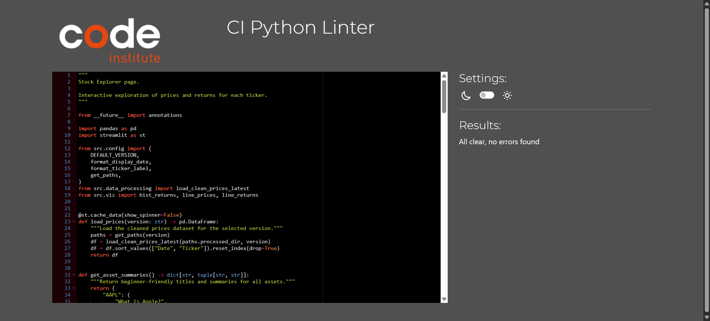 | No issues found |
| `app_pages/` | `predictor.py` | [View](https://github.com/LouisCE/stockmetrics/blob/main/app_pages/predictor.py) | [PEP 8 CI Link](https://pep8ci.herokuapp.com/https://raw.githubusercontent.com/LouisCE/stockmetrics/refs/heads/main/app_pages/predictor.py) | 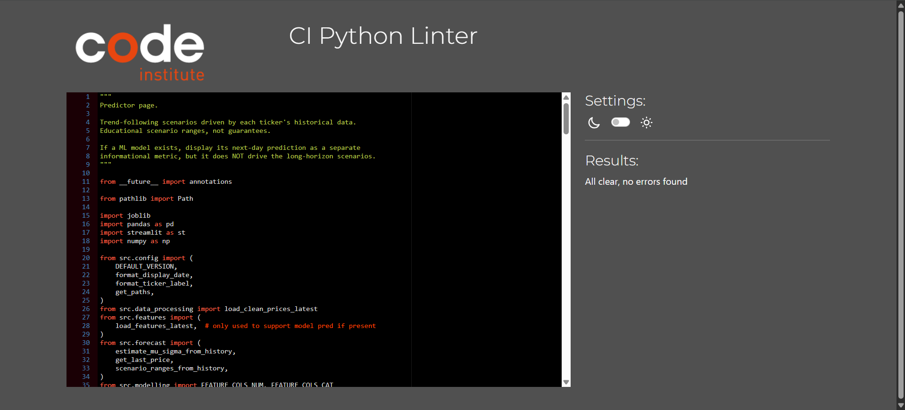 | No issues found |
| `app_pages/` | `portfolio_plans.py` | [View](https://github.com/LouisCE/stockmetrics/blob/main/app_pages/portfolio_plans.py) | [PEP 8 CI Link](https://pep8ci.herokuapp.com/https://raw.githubusercontent.com/LouisCE/stockmetrics/refs/heads/main/app_pages/portfolio_plans.py) | 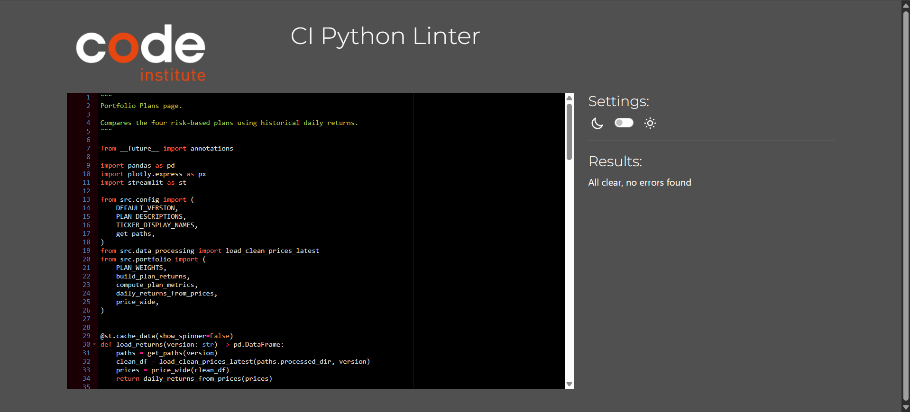 | No issues found |
| `app_pages/` | `model_performance.py` | [View](https://github.com/LouisCE/stockmetrics/blob/main/app_pages/model_performance.py) | [PEP 8 CI Link](https://pep8ci.herokuapp.com/https://raw.githubusercontent.com/LouisCE/stockmetrics/refs/heads/main/app_pages/model_performance.py) | 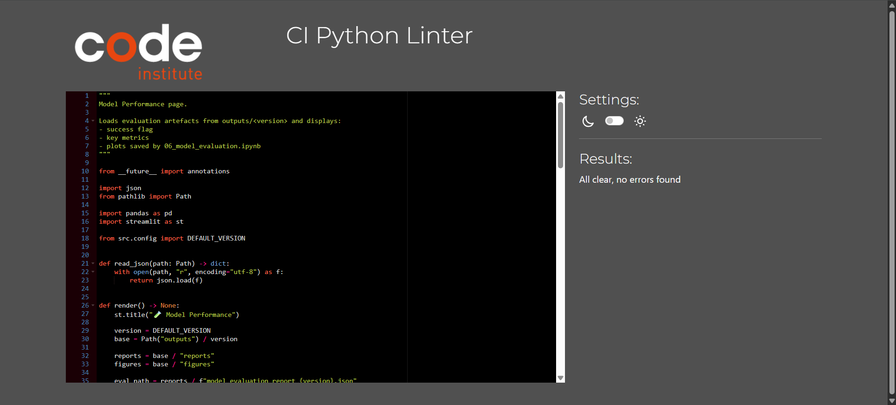 | No issues found |
| `src/` | `__init__.py` | [View](https://github.com/LouisCE/stockmetrics/blob/main/src/__init__.py) | [PEP 8 CI Link](https://pep8ci.herokuapp.com/https://raw.githubusercontent.com/LouisCE/stockmetrics/refs/heads/main/src/__init__.py) | 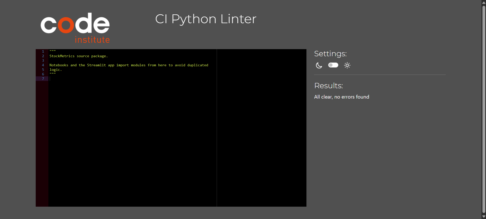 | No issues found |
| `src/` | `config.py` | [View](https://github.com/LouisCE/stockmetrics/blob/main/src/config.py) | [PEP 8 CI Link](https://pep8ci.herokuapp.com/https://raw.githubusercontent.com/LouisCE/stockmetrics/refs/heads/main/src/config.py) | 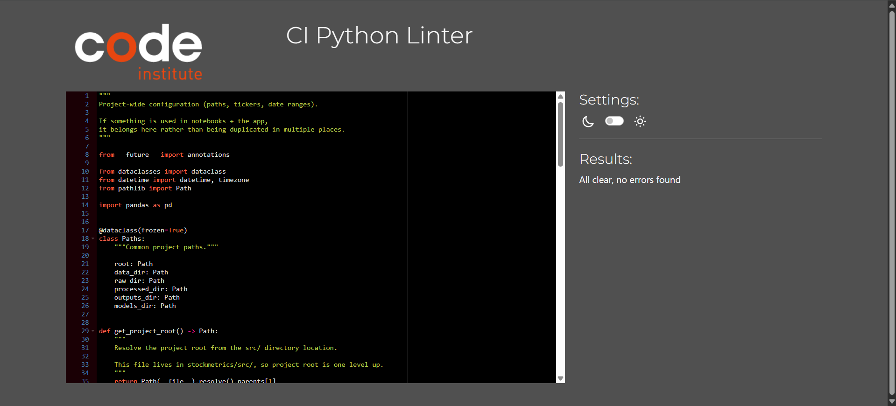 | No issues found |
| `src/` | `data_collection.py` | [View](https://github.com/LouisCE/stockmetrics/blob/main/src/data_collection.py) | [PEP 8 CI Link](https://pep8ci.herokuapp.com/https://raw.githubusercontent.com/LouisCE/stockmetrics/refs/heads/main/src/data_collection.py) | 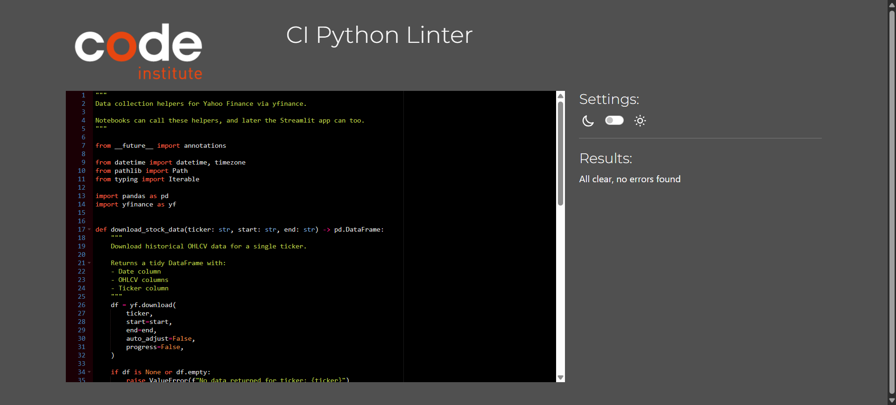 | No issues found |
| `src/` | `data_processing.py` | [View](https://github.com/LouisCE/stockmetrics/blob/main/src/data_processing.py) | [PEP 8 CI Link](https://pep8ci.herokuapp.com/https://raw.githubusercontent.com/LouisCE/stockmetrics/refs/heads/main/src/data_processing.py) | 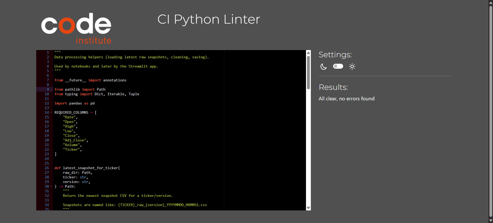 | No issues found |
| `src/` | `evaluation.py` | [View](https://github.com/LouisCE/stockmetrics/blob/main/src/evaluation.py) | [PEP 8 CI Link](https://pep8ci.herokuapp.com/https://raw.githubusercontent.com/LouisCE/stockmetrics/refs/heads/main/src/evaluation.py) | 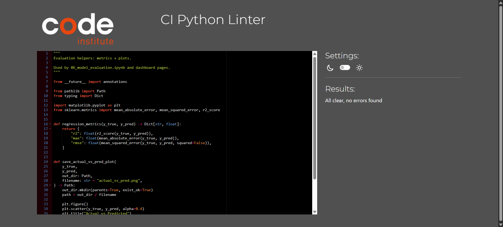 | No issues found |
| `src/` | `features.py` | [View](https://github.com/LouisCE/stockmetrics/blob/main/src/features.py) | [PEP 8 CI Link](https://pep8ci.herokuapp.com/https://raw.githubusercontent.com/LouisCE/stockmetrics/refs/heads/main/src/features.py) | 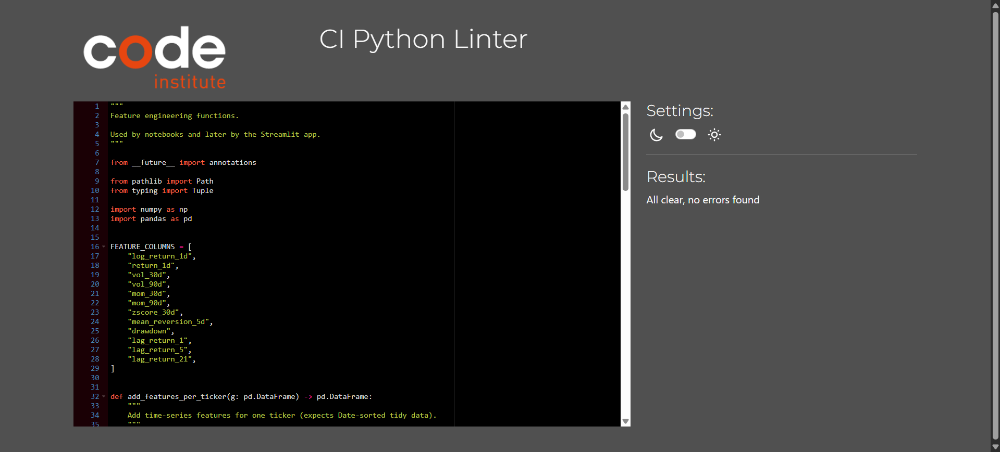 | No issues found |
| `src/` | `forecast.py` | [View](https://github.com/LouisCE/stockmetrics/blob/main/src/forecast.py) | [PEP 8 CI Link](https://pep8ci.herokuapp.com/https://raw.githubusercontent.com/LouisCE/stockmetrics/refs/heads/main/src/forecast.py) | 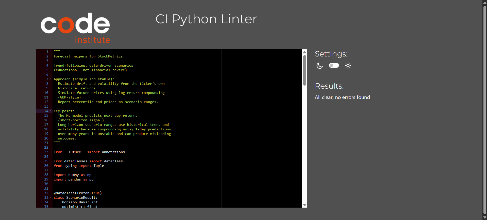 | No issues found |
| `src/` | `modelling.py` | [View](https://github.com/LouisCE/stockmetrics/blob/main/src/modelling.py) | [PEP 8 CI Link](https://pep8ci.herokuapp.com/https://raw.githubusercontent.com/LouisCE/stockmetrics/refs/heads/main/src/modelling.py) | 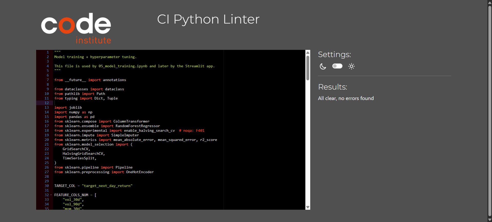 | No issues found |
| `src/` | `portfolio.py` | [View](https://github.com/LouisCE/stockmetrics/blob/main/src/portfolio.py) | [PEP 8 CI Link](https://pep8ci.herokuapp.com/https://raw.githubusercontent.com/LouisCE/stockmetrics/refs/heads/main/src/portfolio.py) | 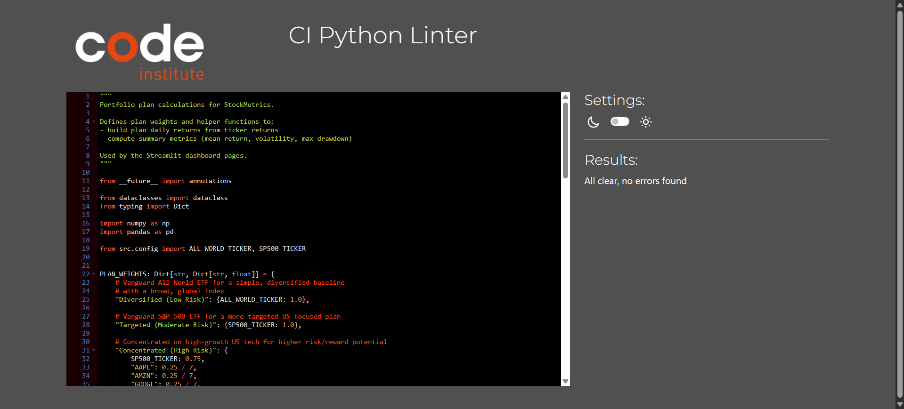 | No issues found |
| `src/` | `viz.py` | [View](https://github.com/LouisCE/stockmetrics/blob/main/src/viz.py) | [PEP 8 CI Link](https://pep8ci.herokuapp.com/https://raw.githubusercontent.com/LouisCE/stockmetrics/refs/heads/main/src/viz.py) | 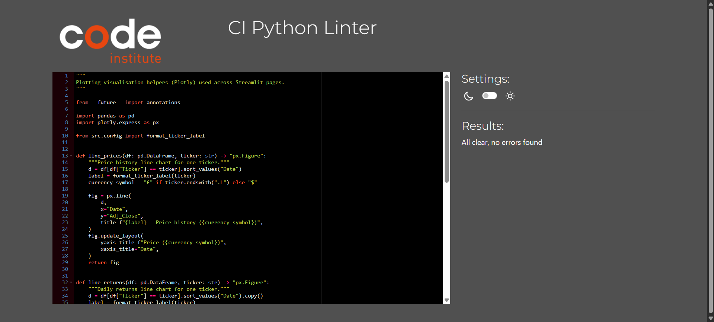 | No issues found |
| `tests/` | `test_config.py` | [View](https://github.com/LouisCE/stockmetrics/blob/main/tests/test_config.py) | [PEP 8 CI Link](https://pep8ci.herokuapp.com/https://raw.githubusercontent.com/LouisCE/stockmetrics/refs/heads/main/tests/test_config.py) | 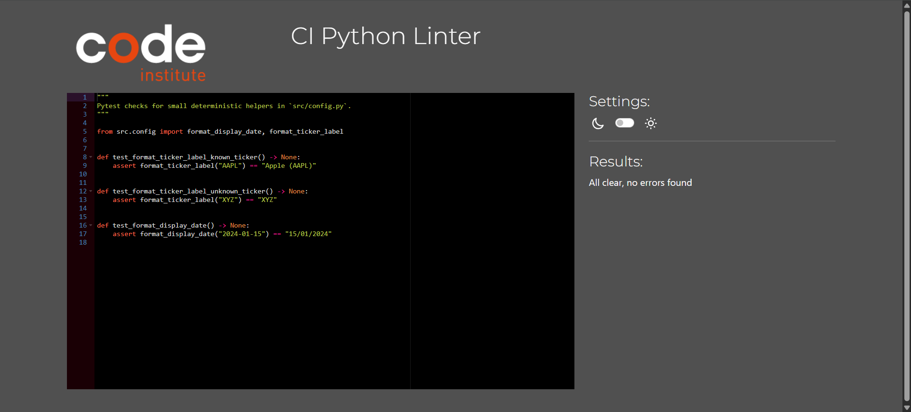 | No issues found |
| `tests/` | `test_data_processing.py` | [View](https://github.com/LouisCE/stockmetrics/blob/main/tests/test_data_processing.py) | [PEP 8 CI Link](https://pep8ci.herokuapp.com/https://raw.githubusercontent.com/LouisCE/stockmetrics/refs/heads/main/tests/test_data_processing.py) | 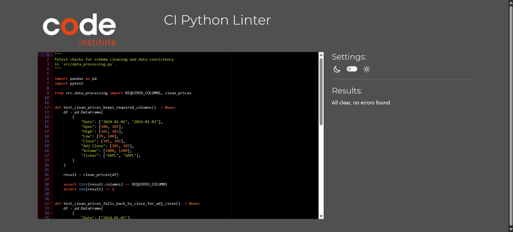 | No issues found |
| `tests/` | `test_features.py` | [View](https://github.com/LouisCE/stockmetrics/blob/main/tests/test_features.py) | [PEP 8 CI Link](https://pep8ci.herokuapp.com/https://raw.githubusercontent.com/LouisCE/stockmetrics/refs/heads/main/tests/test_features.py) | 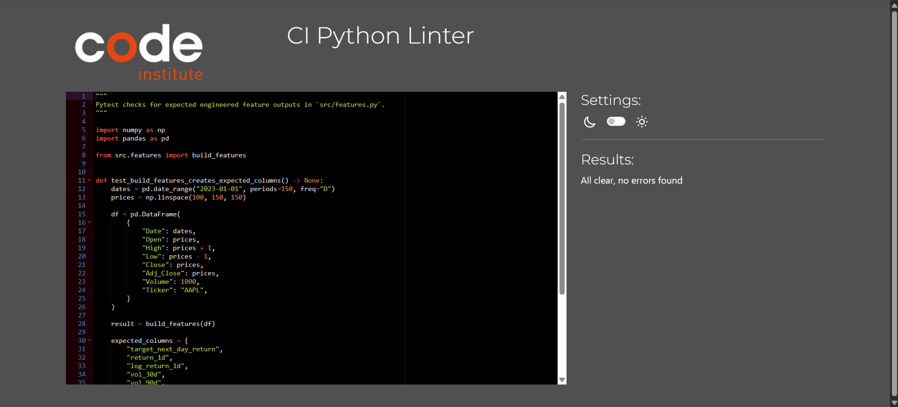 | No issues found |
| `tests/` | `test_forecast.py` | [View](https://github.com/LouisCE/stockmetrics/blob/main/tests/test_forecast.py) | [PEP 8 CI Link](https://pep8ci.herokuapp.com/https://raw.githubusercontent.com/LouisCE/stockmetrics/refs/heads/main/tests/test_forecast.py) | 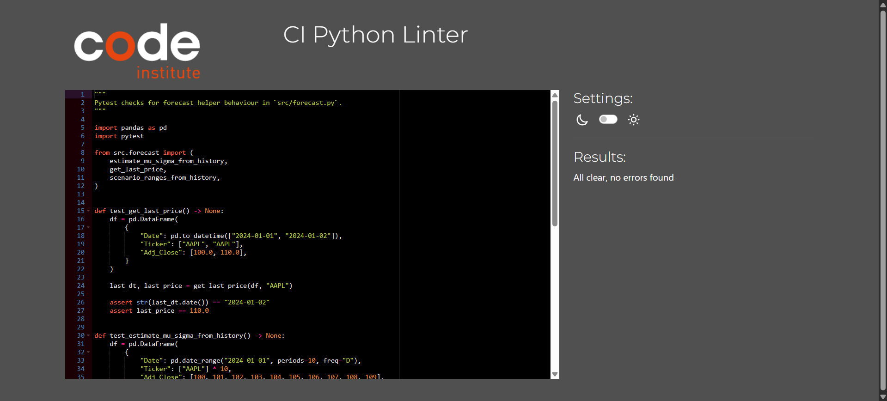 | No issues found |
| `tests/` | `test_modelling.py` | [View](https://github.com/LouisCE/stockmetrics/blob/main/tests/test_modelling.py) | [PEP 8 CI Link](https://pep8ci.herokuapp.com/https://raw.githubusercontent.com/LouisCE/stockmetrics/refs/heads/main/tests/test_modelling.py) | 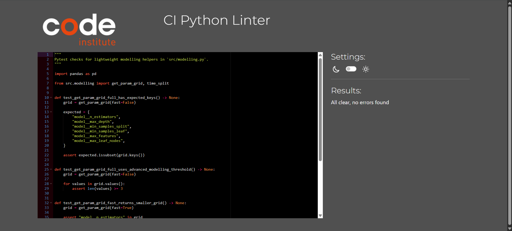 | No issues found |
| `tests/` | `test_portfolio.py` | [View](https://github.com/LouisCE/stockmetrics/blob/main/tests/test_portfolio.py) | [PEP 8 CI Link](https://pep8ci.herokuapp.com/https://raw.githubusercontent.com/LouisCE/stockmetrics/refs/heads/main/tests/test_portfolio.py) | 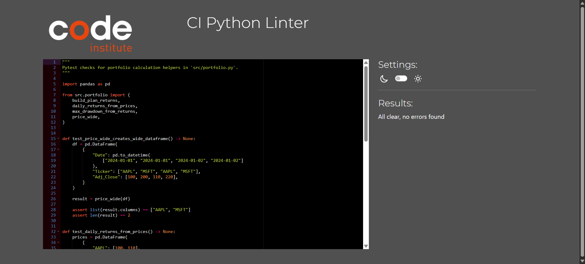 | No issues found |

---

### Jupyter Notebooks

Because Jupyter Notebook (`.ipynb`) files store code, Markdown, metadata, and output in JSON format, they were not validated as raw notebook files like the `.py` files above. Instead, the executable Python code cells were manually copied and pasted into the **PEP 8 CI Python Linter** for validation.

For notebook validation, only the **Python code cells** were checked. Markdown cells and notebook metadata were excluded because they are documentation rather than executable Python code.

---

#### Notebook Validation Approach

Each notebook was reviewed by validating its Python code cells separately. This ensured that the executable notebook code was checked for PEP 8 issues without treating notebook metadata or Markdown content as Python.

For validation purposes, notebook Python code cells were pasted into the PEP 8 CI linter as a single script. A short notebook title comment was included at the top of each pasted validation input only to make the validation screenshots easier to identify; this was not added to the real notebook code cells because each notebook already includes its title in the opening Markdown section.

Where necessary, imports were grouped at the top of the pasted validation input to satisfy linter expectations without changing the actual notebook logic, execution order, or saved outputs.

---

#### Notebook Validation Results

| Directory | File | GitHub File | Screenshot | Notes |
| --- | --- | --- | --- | --- |
| `jupyter_notebooks/` | `01_data_collection.ipynb` | [View](https://github.com/LouisCE/stockmetrics/blob/main/jupyter_notebooks/01_data_collection.ipynb) | 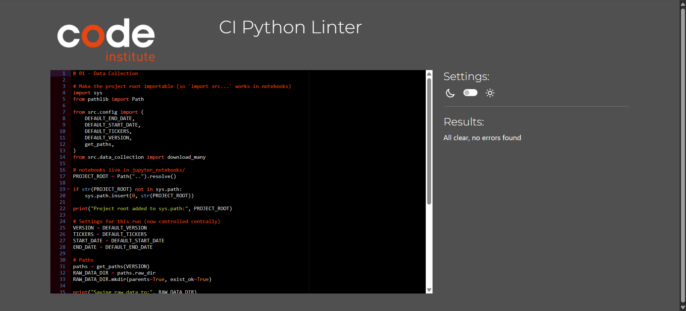 | Python code cells validated |
| `jupyter_notebooks/` | `02_data_cleaning.ipynb` | [View](https://github.com/LouisCE/stockmetrics/blob/main/jupyter_notebooks/02_data_cleaning.ipynb) | 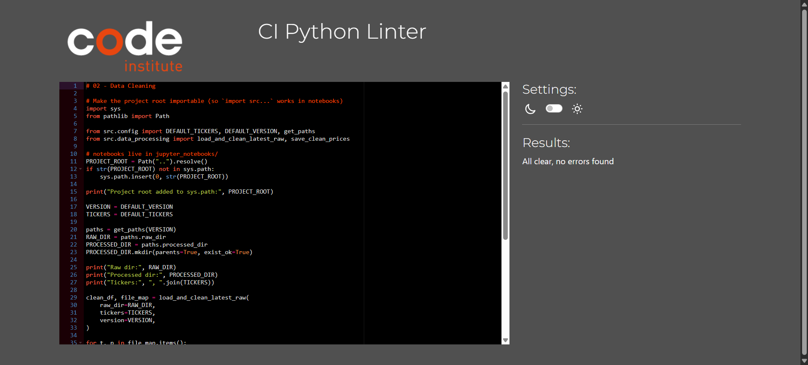 | Python code cells validated |
| `jupyter_notebooks/` | `03_eda.ipynb` | [View](https://github.com/LouisCE/stockmetrics/blob/main/jupyter_notebooks/03_eda.ipynb) | 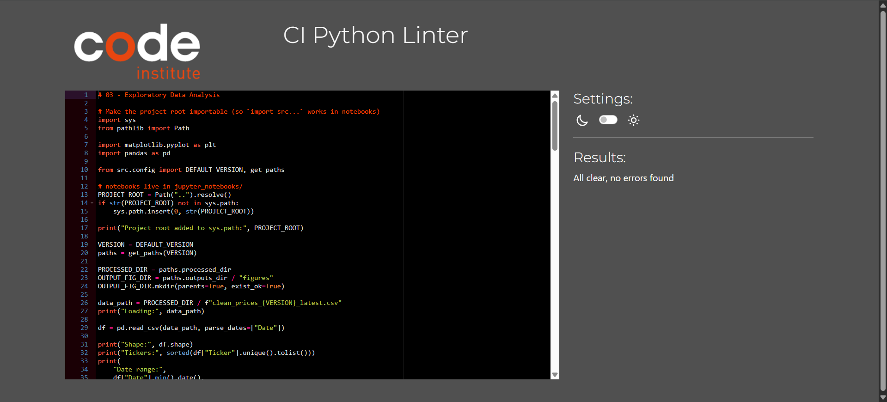 | Python code cells validated |
| `jupyter_notebooks/` | `04_feature_engineering.ipynb` | [View](https://github.com/LouisCE/stockmetrics/blob/main/jupyter_notebooks/04_feature_engineering.ipynb) | 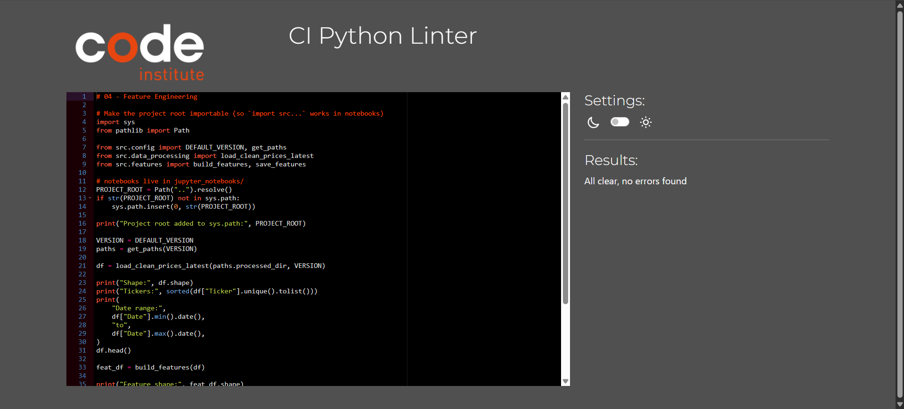 | Python code cells validated |
| `jupyter_notebooks/` | `05_model_training.ipynb` | [View](https://github.com/LouisCE/stockmetrics/blob/main/jupyter_notebooks/05_model_training.ipynb) | 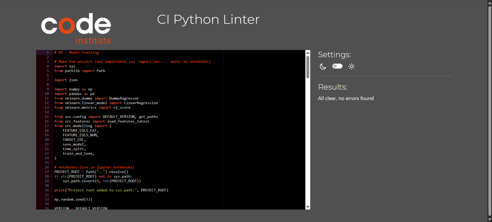 | Python code cells validated |
| `jupyter_notebooks/` | `06_model_evaluation.ipynb` | [View](https://github.com/LouisCE/stockmetrics/blob/main/jupyter_notebooks/06_model_evaluation.ipynb) | 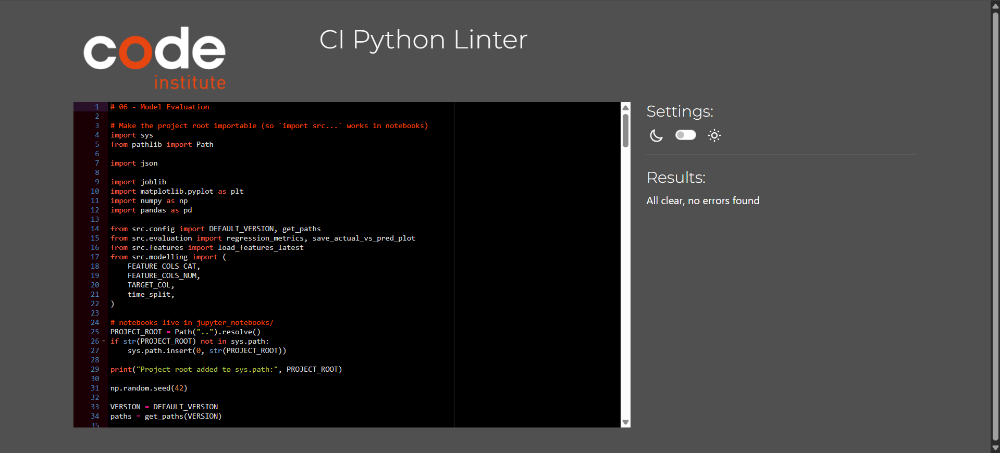 | Python code cells validated |

---

### Code Validation Summary

- All custom `.py` files passed PEP 8 validation.
- Notebook validation was carried out on executable Python code cells only.
- No unresolved linting issues remain in the validated `.py` files or notebook validation inputs.
- Validation confirmed that the custom codebase is clean, readable, and suitable for submission.

---

## Automated Testing

Automated testing was implemented using `pytest` to validate reusable project logic within the `src/` modules.

The automated test suite includes **25 tests** across six test modules. These tests focused on deterministic functions and data-processing helpers where expected outputs could be asserted reliably without depending on Streamlit UI rendering or expensive model-training runs.

This approach complemented manual dashboard testing by adding repeatable checks for backend logic while keeping the test suite lightweight and practical for the project scope.

---

### Automated Test Scope

Automated tests were created for:

- configuration helpers
- data cleaning and schema consistency
- feature engineering outputs
- chronological train/test splitting
- portfolio calculation helpers
- forecasting utility functions

The Streamlit interface itself was tested manually, while backend logic was tested automatically.

---

### Test Execution

| Test Module | Command Used | Result | Screenshot |
| --- | --- | --- | --- |
| config tests | `python -m pytest tests/test_config.py` | 5 Passed in 9.12s | 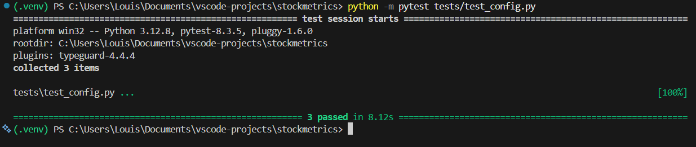 |
| data processing tests | `python -m pytest tests/test_data_processing.py` | 4 Passed 1.61s | 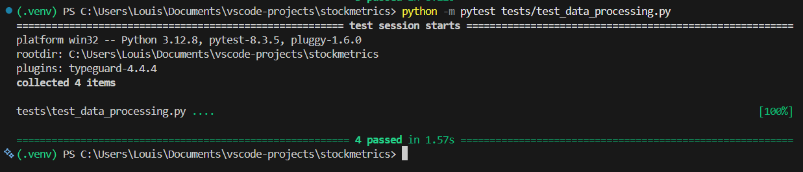 |
| features tests | `python -m pytest tests/test_features.py` | 1 Passed in 1.97s | 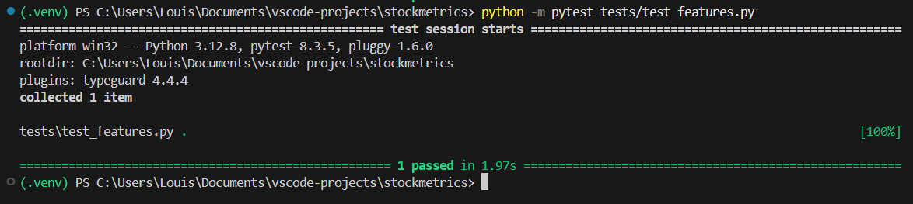 |
| forecast tests | `python -m pytest tests/test_forecast.py` | 5 Passed in 2.24s| 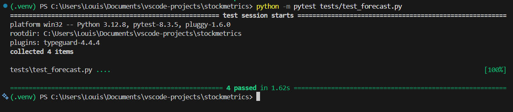 |
| modelling tests | `python -m pytest tests/test_modelling.py` | 4 Passed in 21.31s | 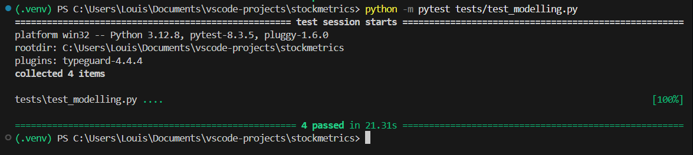 |
| portfolio tests | `python -m pytest tests/test_portfolio.py` | 6 Passed in 1.55s | 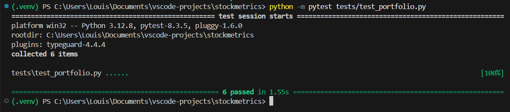 |
| full suite | `python -m pytest` | 25 tests passed in 4.64s | 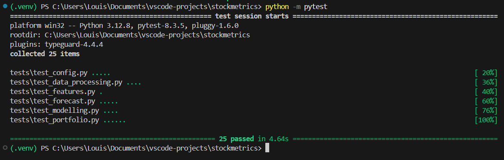 |

**Full test suite result:** All tests passed

---

### Automated Testing Summary

- Core reusable functions were tested in isolation.
- Automated tests increased confidence in data handling, calculations, and scenario logic.
- The Streamlit UI was validated manually, while backend logic was validated automatically.

Automated testing was intentionally focused on reusable backend logic rather than full application coverage.

The following parts of the project were not prioritised for automated unit tests:

- `app.py` and `app_pages/`, because these files mainly handle Streamlit page layout, routing, and UI rendering, which were better validated through manual functional and widget testing
- `jupyter_notebooks/`, because these notebooks were assessed through successful execution, saved outputs, and documented evidence rather than isolated unit tests
- selected `src/` modules such as `data_collection.py`, `viz.py`, and `evaluation.py`, because they either depend on external services, generate visual outputs, or were less suitable for lightweight deterministic unit testing than the core reusable logic covered here

This kept the automated test suite lightweight, relevant, and aligned with the overall project architecture and testing strategy.

---

## End-to-End Pipeline Testing

The full StockMetrics notebook pipeline was tested end-to-end in an isolated Git worktree named `stockmetrics-pipeline-check`.

This separate worktree was created from the committed project state so the notebooks could be rerun without changing or overwriting the working files, outputs, or documentation in the main `stockmetrics` project folder.

The isolated pipeline check was created using:

```bash
git worktree add --detach ../stockmetrics-pipeline-check HEAD
```

This created a separate detached Git worktree named `stockmetrics-pipeline-check` from the current committed project state. This allowed the notebooks to be tested independently without modifying the main `stockmetrics` project folder.

Before running the notebooks, the isolated worktree was refreshed and prepared using:

```bash
git fetch origin
git reset --hard origin/main
git clean -fdx

xcopy ..\stockmetrics\data\raw\v2 data\raw\v2 /E /I /Y

git status
```

The `git fetch origin` and `git reset --hard origin/main` commands ensured that the isolated worktree matched the latest committed version of the project on GitHub. The `git clean -fdx` command removed previously generated files, folders, cached files, and ignored artefacts from earlier validation attempts. The `xcopy` command restored the saved raw data snapshots required for reproducible downstream testing.

The final `git status` check confirmed that the worktree was clean and ready before running the notebook pipeline:

```bash
Not currently on any branch.
nothing to commit, working tree clean
```

This allowed the downstream notebooks to be tested from the saved `data/raw/v2/` snapshots without relying on the live Yahoo Finance endpoint during validation.

> [!NOTE]
> The data collection notebook uses yfinance to collect data from the Yahoo Finance endpoint. Because this is a live third-party service, availability may vary due to temporary endpoint issues, rate limiting, or API response changes.

For reproducibility, raw snapshots collected successfully during development are stored in `data/raw/v2/`. This allows notebooks `02_data_cleaning.ipynb` to `06_model_evaluation.ipynb` to be rerun from saved project data without depending on live endpoint availability.

---

### Pipeline Validation Results

| Directory | File | GitHub File | Screenshot | Notes |
| --- | --- | --- | --- | --- |
| `jupyter_notebooks/` | `01_data_collection.ipynb` | [View](https://github.com/LouisCE/stockmetrics/blob/main/jupyter_notebooks/01_data_collection.ipynb) | 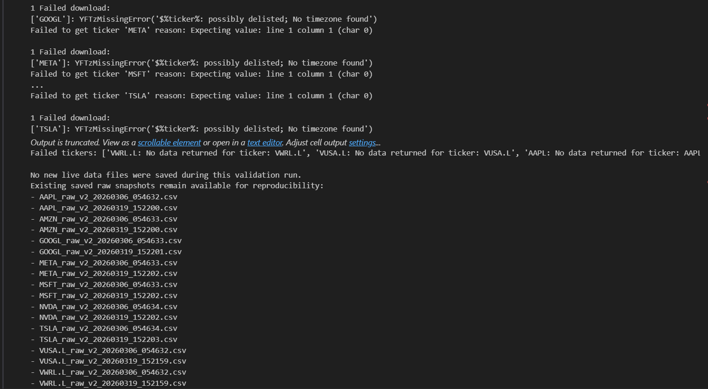 | Endpoint collection mechanism implemented. Raw snapshots are stored in `data/raw/v2/` for reproducibility. |
| `jupyter_notebooks/` | `02_data_cleaning.ipynb` | [View](https://github.com/LouisCE/stockmetrics/blob/main/jupyter_notebooks/02_data_cleaning.ipynb) | 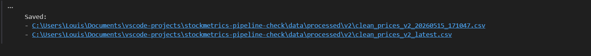 | Validated successfully from saved raw snapshots. |
| `jupyter_notebooks/` | `03_eda.ipynb` | [View](https://github.com/LouisCE/stockmetrics/blob/main/jupyter_notebooks/03_eda.ipynb) | 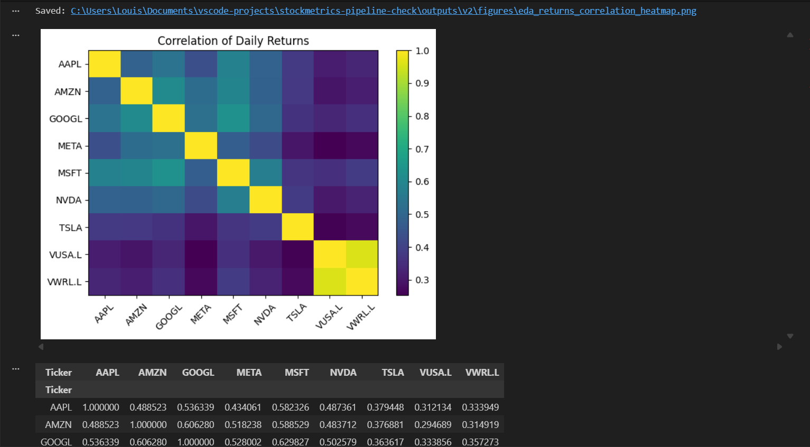  | Validated successfully and generated EDA outputs. |
| `jupyter_notebooks/` | `04_feature_engineering.ipynb` | [View](https://github.com/LouisCE/stockmetrics/blob/main/jupyter_notebooks/04_feature_engineering.ipynb) | 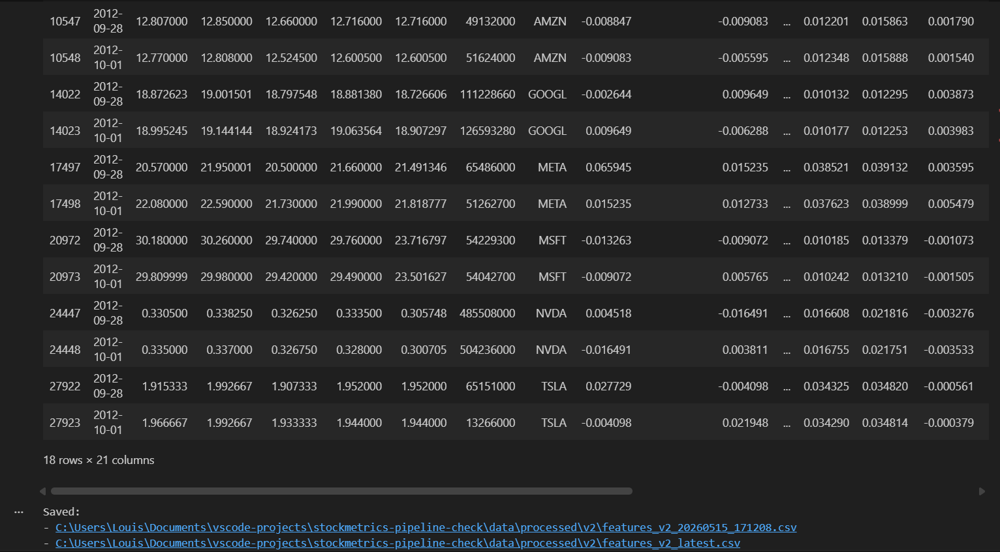 | Validated successfully and generated versioned feature datasets. |
| `jupyter_notebooks/` | `05_model_training.ipynb` | [View](https://github.com/LouisCE/stockmetrics/blob/main/jupyter_notebooks/05_model_training.ipynb) | 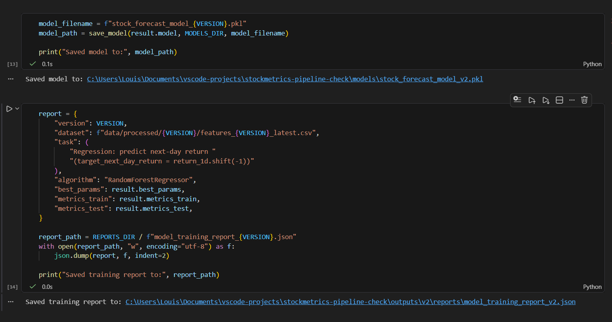  | Validated successfully and saved the trained ML pipeline and training report. |
| `jupyter_notebooks/` | `06_model_evaluation.ipynb` | [View](https://github.com/LouisCE/stockmetrics/blob/main/jupyter_notebooks/06_model_evaluation.ipynb) |  | Validated successfully and saved evaluation reports, predictions, and plots. |

---

### Pipeline Testing Summary

The end-to-end pipeline validation confirmed that the StockMetrics notebook workflow is reproducible from the saved project data.

The isolated `stockmetrics-pipeline-check` worktree was used to protect the main project folder while testing the notebook sequence. This ensured that the validation process did not accidentally overwrite or modify the main project outputs during testing.

The validation confirmed the following:

- The project contains a working endpoint collection notebook.
- Successfully collected raw snapshots are stored under `data/raw/v2/`.
- The data cleaning notebook can load and process the saved raw snapshots.
- The EDA notebook can generate summary statistics and visual outputs.
- The feature engineering notebook can create and save model-ready features.
- The model training notebook can train, tune, and save the ML pipeline.
- The model evaluation notebook can evaluate the saved model and generate reports, predictions, and plots.
- Versioned outputs are stored under dedicated project folders such as `data/processed/v2/`, `outputs/v2/`, and `models/`.

During final validation, the live Yahoo Finance endpoint returned temporary yfinance errors for the data collection notebook. This did not affect the reproducibility of the project because the raw data snapshots had already been collected and stored in the repository.

This supports the project’s reproducibility strategy: live endpoint collection is used to obtain the source data, while saved versioned snapshots allow the remaining CRISP-DM pipeline stages to be rerun consistently.

---

## Defensive Programming

StockMetrics is a Streamlit data dashboard and machine learning project rather than a CRUD application with user accounts, authentication, forms, or database ownership rules. Defensive programming therefore focused on protecting the data science workflow, dashboard inputs, reproducibility, model interpretation, and user understanding.

The main defensive programming and defensive design concerns were:

- handling external endpoint instability
- validating data before analysis and modelling
- preventing time-series leakage
- restricting dashboard inputs to supported options
- avoiding misleading financial or machine learning claims
- keeping the project reproducible from saved artefacts
- handling invalid application routes gracefully

---

### Defensive Programming Testing

| Area | Expected Behaviour | Testing Performed | Result | Screenshot |
| --- | --- | --- | --- | --- |
| Yahoo Finance endpoint handling | The data collection workflow should handle temporary endpoint failures without preventing project reproducibility. | Reviewed the notebook output generated when live Yahoo Finance collection was unavailable. | The notebook displayed a clear endpoint failure message and confirmed that previously saved raw snapshots remained available for reproducibility. | 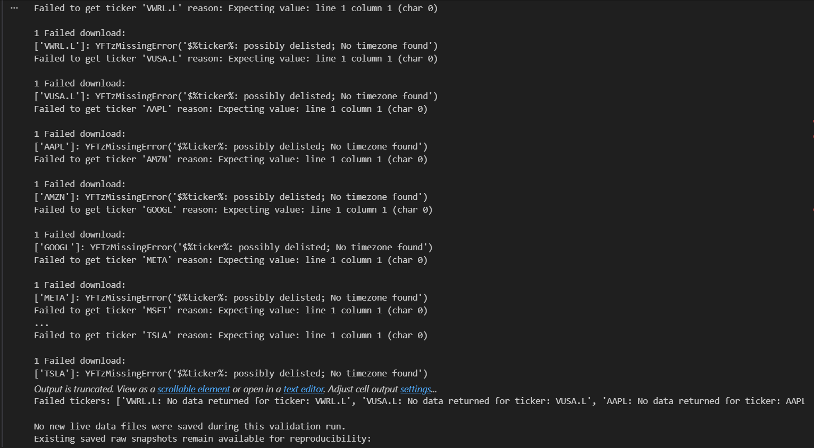 |
| Required dataset columns | EDA should not continue if required market-data columns are missing. | Reviewed the EDA validation logic that checks for required columns before analysis begins. | Missing required columns would trigger a `KeyError`, preventing invalid analysis from continuing. | 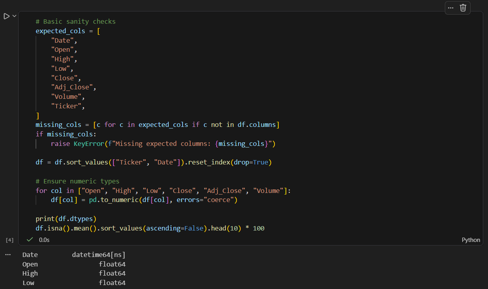 |
| Target column validation | Model training should not continue if the target variable is unavailable. | Reviewed the model training validation checks before model fitting. | Missing target data would trigger a `KeyError`, preventing invalid model training. | 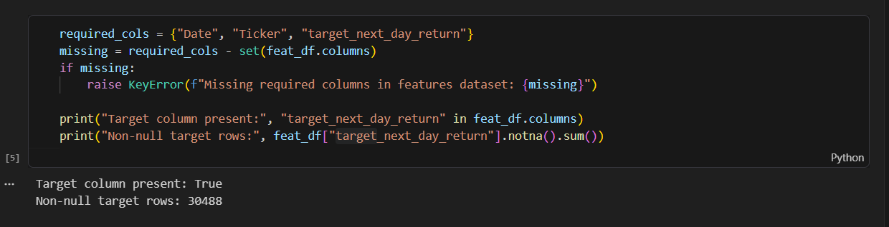 |
| Chronological train/test split | Future observations should not leak into historical training data. | Reviewed the machine learning business case and time-aware evaluation approach used during training. | The project uses chronological train/test splitting and time-aware validation rather than random shuffling, reducing the risk of time-series leakage. | 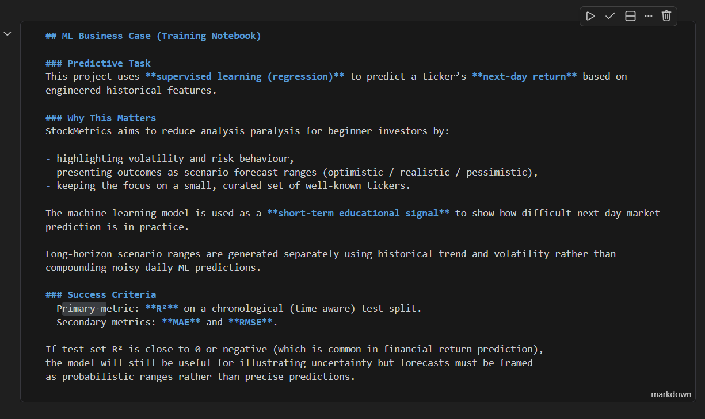 |
| Restricted dashboard inputs | Users should only be able to select supported tickers and date ranges through controlled dashboard widgets. | Tested dashboard controls within the Stock Explorer page. | Streamlit widgets restrict users to supported ticker and date selections. | 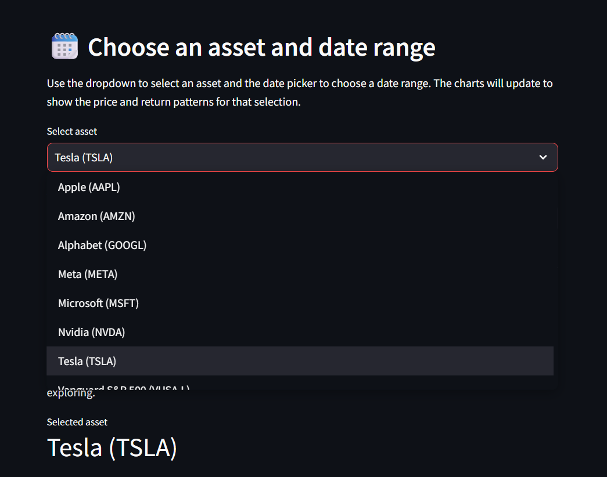 |
| Forecast and ML interpretation warnings | Users should not mistake forecasts or ML estimates for guaranteed outcomes. | Reviewed educational warnings displayed on the Predictor page. | Forecasts are clearly presented as uncertain educational estimates rather than trading signals. | 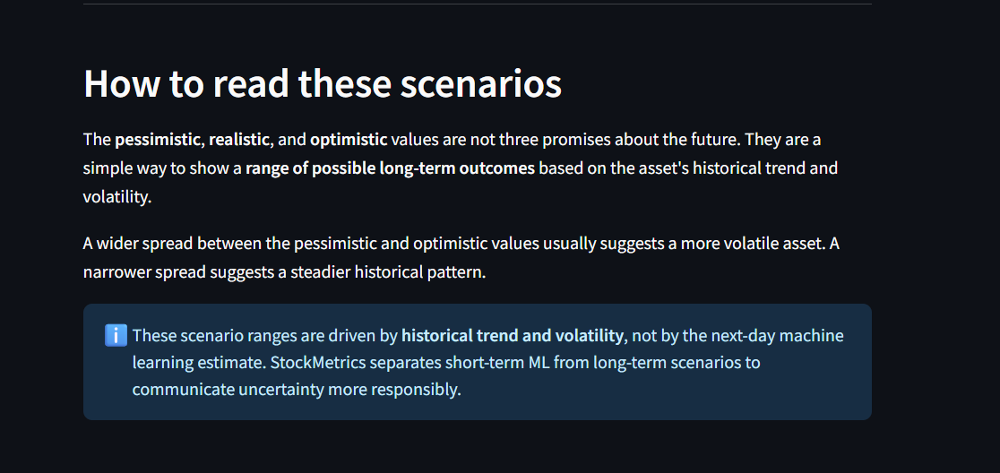 |
| Investment disclaimer | Users should understand that StockMetrics is educational and not financial advice. | Reviewed the global sidebar disclaimer displayed throughout the dashboard. | The dashboard clearly states that StockMetrics is educational only and that capital is at risk. | 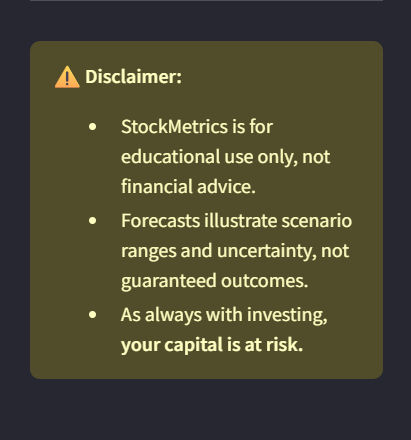 |
| Missing evaluation artefacts | The dashboard should fail safely if required model evaluation artefacts are unavailable. | Reviewed the Model Performance page safeguards and artefact existence checks. | Missing artefacts trigger a clear error message and stop further processing safely. | 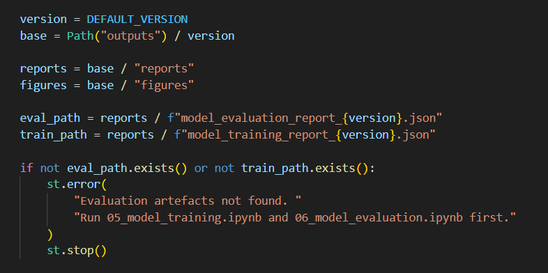 |
| Invalid route handling | Invalid URLs should not cause the deployed application to crash. | Entered an invalid route on the deployed application. | Streamlit displayed its built-in Page Not Found screen while the application continued running normally. | 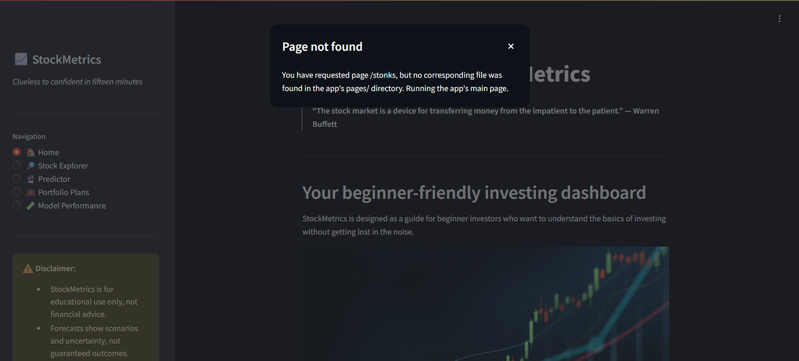 |

---

### Defensive Programming Summary

Defensive programming in StockMetrics focused on stability, reproducibility, and responsible interpretation rather than account-based access control.

The project includes safeguards for:

- temporary external endpoint failures
- reproducibility through saved raw data snapshots
- required dataset column validation
- target variable validation before model training
- chronological train/test splitting to reduce leakage risk
- restricted dashboard input controls
- missing model evaluation artefact checks
- educational financial and machine learning disclaimers
- graceful handling of invalid application routes

These checks help ensure that StockMetrics remains stable, reproducible, and suitable for beginner investors using the deployed dashboard.

---

## Deployment Testing

The deployed Streamlit dashboard was tested on Render after deployment.

The following checks were performed during deployment validation:

- Dashboard pages loaded successfully.
- Sidebar navigation worked correctly.
- Interactive widgets and Plotly visualisations rendered correctly.
- Model predictions and portfolio calculations executed correctly.
- Versioned datasets and saved model artefacts loaded successfully.
- External links opened correctly.
- No deployment-specific issues were encountered during testing.

Deployment testing confirmed that the deployed application behaved consistently with the local development environment and that all major dashboard functionality operated correctly in production.


---

## Responsiveness Testing

The deployed StockMetrics dashboard was manually tested across mobile, tablet, and desktop viewport sizes.

StockMetrics is built with Streamlit, so much of the responsive layout behaviour is handled by the Streamlit framework. Manual testing was still carried out to confirm that the deployed dashboard remained usable, readable, and stable across different screen sizes.

Testing focused on:

- sidebar navigation
- page layout
- educational text
- dashboard widgets
- Plotly charts
- tables and metrics
- footer and disclaimer content
- invalid route handling

---

### Tested Device Sizes

| Device Type | Example Viewport Tested | Width | Height |
| --- | --- | --- | --- |
| Mobile | iPhone SE | 375px | 667px |
| Tablet | iPad Mini | 768px | 1024px |
| Desktop | Nest Hub Max | 1280px | 800px |

---

### Responsiveness Testing Results

| Page | Mobile | Tablet | Desktop | Notes |
| --- | --- | --- | --- | --- |
| Home |  |  |  | Introductory content and educational sections remained readable |
| Stock Explorer |  |  |  | Charts and ticker controls resized correctly |
| Predictor |  |  |  | Forecast widgets and scenario outputs remained usable |
| Portfolio Plans |  |  |  | Portfolio cards, charts, and metrics remained readable |
| Model Performance |  |  |  | Evaluation plots and model explanations displayed correctly |
| Sidebar Navigation |  |  |  | Sidebar navigation remained accessible |

---

### Responsiveness Summary

The deployed dashboard remained functional and readable across the tested viewport sizes.

Streamlit handled the main responsive layout behaviour, while manual testing confirmed that the dashboard content, navigation, widgets, tables, charts, footer, and disclaimers remained usable on mobile, tablet, and desktop devices.

---

## Browser Compatibility Testing

The deployed StockMetrics dashboard was manually tested across three modern desktop browsers available on the test device.

Testing focused on:

- Streamlit page rendering
- sidebar navigation
- widget interaction
- Plotly chart rendering
- responsiveness
- loading dashboard assets
- invalid route handling

---

### Browser Compatibility Results

| Page | Chrome | Edge | Firefox | Notes |
| --- | --- | --- | --- | --- |
| Home |  |  |  | Dashboard rendered and functioned correctly |
| Stock Explorer |  |  |  | Dashboard rendered and functioned correctly |
| Predictor |  |  |  | Dashboard rendered and functioned correctly |
| Portfolio Plans |  |  |  | Dashboard rendered and functioned correctly |
| Model Performance |  |  |  | Dashboard rendered and functioned correctly |

---

### Browser Compatibility Summary

No major browser-specific issues were identified.

The deployed dashboard, Streamlit widgets, sidebar navigation, Plotly charts, and saved visual assets functioned consistently across Chrome, Edge, and Firefox.

---

## User Story Testing

User Story Testing was carried out by manually checking the deployed dashboard against the implemented dashboard User Stories.

This section focuses on dashboard behaviour only. Code validation, notebook validation, automated testing, deployment testing, widget interaction testing, and bug tracking are documented separately in this file.

The following dashboard epics are linked to the relevant implementation milestones documented in README.md.

---

### Epic - Dashboard Structure and Navigation System

This Epic is linked to **Milestone 3**.

This Epic covers the main Streamlit entry point in `app.py`, including branding, navigation, disclaimer messaging, routing, and the persistent footer.

| Target | Expectation | Outcome | Screenshot |
|---|---|---|---|
| As a beginner investor | I want the browser tab to show the StockMetrics name and chart icon | so the dashboard feels branded, professional, and easy to identify. |  |
| As a beginner investor | I want to see the StockMetrics title and tagline | so I immediately understand the dashboard purpose. |  |
| As a beginner investor | I want a clear sidebar navigation menu | so I can move easily between all dashboard pages. |   |
| As a beginner investor | I want each navigation option to load the correct page | so the app feels reliable and consistent. |   |
| As a beginner investor | I want a visible educational disclaimer | so I understand the dashboard is not financial advice. |  |
| As a beginner investor | I want a persistent footer with attribution and GitHub access | so I can identify the project source and repository. |  |

---

### Epic - Home Page and User Onboarding

This Epic is linked to **Milestone 3**.

This Epic covers the `app_pages/home.py` page, which introduces StockMetrics and provides beginner-friendly investing guidance.

| Target | Expectation | Outcome | Screenshot |
|---|---|---|---|
| As a beginner investor | I want a welcoming title and inspirational quote | so I feel motivated to begin my investing journey. |  |
| As a beginner investor | I want a clear Home page introduction and hero image | so I understand that StockMetrics helps explain risk, returns, and uncertainty without overwhelming me. |  |
| As a beginner investor | I want the app purpose and audience explained | so I understand how StockMetrics helps beginners in more detail. |  |
| As a beginner investor | I want a clear dataset summary on the Home page | so I understand which ETFs and technology stocks are used before exploring the dashboard. |  |
| As an assessor | I want a project validation summary on the dashboard | so I can quickly see how business requirements and hypotheses are supported by dashboard evidence. |  |
| As a beginner investor | I want core investing principles displayed | so I can learn the basic ideas of starting early, thinking long-term, and diversifying. |  |
| As a beginner investor | I want a plain-English glossary | so I can understand key investing terms. |  |
| As a beginner investor | I want expandable FAQs | so I can learn answers to common beginner investing questions. |  |
| As a beginner investor | I want a preview of the four risk-based plans | so I understand the available portfolio styles before comparing them. |  |

---

### Epic - Stock Explorer and Asset Education

This Epic is linked to **Milestone 4**.

This Epic covers the `app_pages/stock_explorer.py` page, which allows users to explore selected assets using historical price and return data.

| Target | Expectation | Outcome | Screenshot |
|---|---|---|---|
| As a beginner investor | I want a clear Stock Explorer introduction and hero image | so I understand the purpose of the page. |  |
| As a beginner investor | I want to select an asset from a curated dropdown | so I can explore a specific stock or ETF without being overwhelmed. |  |
| As a beginner investor | I want to select a date range | so I can focus on a specific time period. |  |
| As a beginner investor | I want key metrics for my selected asset and period | so I understand the data scope being shown. |  |
| As a beginner investor | I want an interactive price chart | so I can visualise historical price movement. |  |
| As a beginner investor | I want an interactive daily returns chart | so I can understand short-term movement and volatility. |  |
| As a beginner investor | I want an interactive return distribution chart | so I can see common and extreme daily return outcomes. |  |
| As a beginner investor | I want educational chart captions and messages | so I understand that historical data is for learning, not trading signals. |  |
| As a beginner investor | I want expandable asset explanations | so I understand what each included company or ETF represents. |  |

---

### Epic - Predictor and Scenario Guidance

This Epic is linked to **Milestone 4**.

This Epic covers the `app_pages/predictor.py` page, which separates short-term machine learning output from long-term historical scenario ranges.

| Target | Expectation | Outcome | Screenshot |
|---|---|---|---|
| As a beginner investor | I want a clear Predictor introduction and hero image | so I understand the purpose of the forecasting page. |  |
| As a beginner investor | I want the page to explain short-term ML and long-term scenarios separately | so I understand that they are different types of outputs. |  |
| As a beginner investor | I want to select an asset | so I can generate outputs for the investment I am interested in. |  |
| As a beginner investor | I want to select a forecast horizon | so I can compare different long-term timeframes. |  |
| As a beginner investor | I want to select a trend window | so I can control how much historical data informs the scenario ranges. |  |
| As a beginner investor | I want scenario assumption metrics for the selected asset | so I understand the latest price, date, trend window, and drift used in the scenario calculation. |  |
| As a beginner investor | I want a separate next-day ML estimate with reproducibility context and plain-English interpretation | so I can understand the short-term model output without confusing it with the long-term scenarios. |  |
| As a beginner investor | I want a clear ML risk warning | so I understand the next-day estimate is educational and not a trading instruction. |  |
| As a beginner investor | I want a beginner-friendly explanation of short-term prediction uncertainty | so I understand why long-term thinking and scenario planning are more useful than day-to-day prediction. |  |
| As a beginner investor | I want pessimistic, realistic, and optimistic scenario end prices | so I understand uncertainty instead of relying on one fixed prediction. |  |
| As a beginner investor | I want clear scenario explanations and warnings | so I understand the outputs are educational estimates, not guaranteed outcomes. |  |

---

### Epic - Portfolio Plans and Risk Comparison

This Epic is linked to **Milestone 5**.

This Epic covers the `app_pages/portfolio_plans.py` page, which helps users compare risk-based portfolio plans using historical metrics and visualisations.

| Target | Expectation | Outcome | Screenshot |
|---|---|---|---|
| As a beginner investor | I want a clear Portfolio Plans introduction and hero image | so I understand the purpose of the page. |  |
| As a beginner investor | I want the relative risk labels explained | so I understand that the plans differ by concentration and volatility. |  |
| As a beginner investor | I want to select a portfolio plan | so I can explore a specific risk style. |  |
| As a beginner investor | I want the selected plan highlighted | so I know which plan I am currently viewing. |  |
| As a beginner investor | I want the four plans displayed visually | so I can compare the plan styles quickly. |  |
| As a beginner investor | I want historical performance and risk metrics | so I can compare return, volatility, and drawdown. |  |
| As a beginner investor | I want an explanation linking the chart to investing principles | so I understand compounding, staying invested, and diversification. |  |
| As a beginner investor | I want a growth of £1 chart | so I can visualise how the selected plan performed historically. |  |
| As a beginner investor | I want a selected plan allocation table with weight explanations and educational guidance | so I can understand the assets, percentages, and non-recommendation context for the selected plan. |  |
| As a beginner investor | I want simple decision guidance if I still feel unsure | so I have a beginner-friendly fallback explanation without receiving personal financial advice. |  |
| As a beginner investor | I want an encouraging final message | so I feel confident that I have taken a positive first step in understanding investing. |  |

---

### Epic - Model Performance and Transparency

This Epic is linked to **Milestone 5**.

This Epic covers the `app_pages/model_performance.py` page, which presents model performance, evaluation evidence, hyperparameters, plots, feature importance, and educational interpretation.

| Target | Expectation | Outcome | Screenshot |
|---|---|---|---|
| As a technical reviewer | I want a clear Model Performance introduction and hero image | so I understand the purpose of the page. |  |
| As a technical reviewer | I want the next-day prediction task explained | so I understand what the model is trying to predict. |  |
| As a technical reviewer | I want the business case result displayed clearly | so I can see whether the model met its success rule. |  |
| As a technical reviewer | I want a clear ML pipeline overview | so I can understand how the project moves from data collection through training, evaluation, and dashboard deployment. |  |
| As a technical reviewer | I want model reproducibility explained | so I understand the displayed result reflects the saved dataset and model artefacts for this project version. |  |
| As a technical reviewer | I want train and test evaluation metrics displayed | so I can assess model performance. |  |
| As a technical reviewer | I want plain-English explanations of R², MAE, and RMSE | so the metrics are understandable in context. |  |
| As a technical reviewer | I want the R² success rule explained | so I understand why a small positive signal can still support the business case. |  |
| As a technical reviewer | I want the model limitations explained | so I understand why short-term prediction is difficult. |  |
| As a technical reviewer | I want the best hyperparameters displayed | so I can inspect the tuned model settings. |  |
| As a technical reviewer | I want the full hyperparameter search space displayed | so I can verify that the final model tuning used six hyperparameters with three values each. |  |
| As a technical reviewer | I want a model evaluation and data foundation evidence section | so I can see how CRISP-DM evaluation outputs and EDA evidence are brought together in the dashboard. |  |
| As a technical reviewer | I want ML evaluation plots grouped in their own tab | so I can inspect actual-vs-predicted plots, residual plots, and prediction time-series evidence. |  |
| As a technical reviewer | I want EDA plots grouped in their own tab | so I can connect volatility, diversification, correlation, and concentration-risk evidence to the project hypotheses. |  |
| As a technical reviewer | I want feature importance displayed | so I can see which features influenced the model most. |  |
| As a technical reviewer | I want a final ML model summary | so I can understand the overall model conclusion. |  |
| As a technical reviewer | I want a project conclusion on the Model Performance page | so I can understand the overall findings from the model evaluation, EDA evidence, hypotheses, and business requirements. |  |

---

### Epic - Deployment and Application Availability

This Epic is linked to **Milestone 6**.

This Epic covers deployment configuration, hosted availability, and the steps required to make the finished dashboard publicly accessible on Render.

| Target | Expectation | Outcome | Screenshot |
|---|---|---|---|
| As a user | I want the StockMetrics dashboard deployed online | so I can access the application from a live public URL. |  |
| As a developer | I want the application deployed using Render | so the dashboard can be reliably hosted and accessed by users. |  |

---

### User Story Testing Summary

All dashboard User Stories were manually tested against the deployed Streamlit application.

Each User Story maps directly to a visible dashboard feature, with evidence captured through screenshots. Navigation behaved consistently, interactive widgets updated outputs correctly, visualisations rendered without error, and all educational guidance was displayed as intended.

This provides clear traceability from User Story → Implementation → Validation, satisfying Agile and assessment requirements.

---

## Widget Interaction Testing

Widget interaction testing was carried out by manually checking that each interactive Streamlit widget behaved correctly and updated the dashboard as expected.

This testing focused specifically on user-interactive widgets, including sidebar navigation, link buttons, selectboxes, date inputs, tabs, and expanders.

---

### Widget Interaction Testing Results

| Widget | Expectation | Outcome | Screenshot |
| --- | --- | --- | --- |
| Sidebar navigation radio | Selecting each sidebar page option should load the correct dashboard page | Each page loaded correctly from the sidebar navigation without errors, including Home, Stock Explorer, Predictor, Portfolio Plans, and Model Performance |  |
| Footer GitHub link button | Clicking the footer button should provide access to the project repository | The footer button displayed consistently and linked users to the StockMetrics GitHub repository |  |
| Home page FAQ expanders | Expanding and collapsing FAQ sections should reveal the correct beginner-friendly guidance | FAQ expanders opened and displayed the expected explanations for investing basics, buying and selling, investment frequency, S&P 500, FTSE All-World, Magnificent Seven, Tesla, scenario ranges, Trading 212, and additional assets |  |
| Stock Explorer asset selectbox | Selecting a different asset should update the selected asset label, metrics, charts, and asset-specific outputs | Asset-specific metrics and visualisations updated correctly when switching between included ETFs and Magnificent Seven stocks |  |
| Stock Explorer date range input | Changing the start and end dates should filter the displayed data to the selected period | Row count, date range metrics, price chart, returns chart, and distribution chart updated correctly to match the selected date range |  |
| Stock Explorer chart tabs | Selecting each chart tab should display the correct chart and supporting guidance | The Prices, Returns, and Distribution tabs displayed the expected Plotly charts with relevant educational guidance |  |
| Stock Explorer asset guide expanders | Expanding an asset guide item should reveal the correct plain-English company or fund explanation | Asset guide expanders opened correctly for the included stocks and ETFs and displayed the expected beginner-friendly descriptions |  |
| Predictor asset selectbox | Selecting a different asset should update the latest price, latest date, drift, volatility, ML estimate, and scenario table | Predictor outputs refreshed correctly for each selected asset using the relevant historical data and ticker-specific currency formatting |  |
| Predictor forecast horizon selectbox | Changing the forecast horizon should update the long-term scenario output table | Scenario end-price outputs updated correctly when switching between 1, 2, 5, and 10 year horizons |  |
| Predictor trend window selectbox | Changing the trend window should update the historical assumptions used for the scenario ranges | Trend window used, estimated daily drift, estimated volatility context, and scenario values updated correctly when switching between 1, 2, 5, and 10 year windows |  |
| Portfolio Plans selectbox | Selecting a different portfolio plan should update all plan-specific outputs | The selected plan, highlighted plan box, performance metrics, growth chart, and allocation table all updated correctly for each plan |  |
| Model Performance evidence tabs | Selecting the ML evaluation and EDA evidence tabs should display the correct plot group and supporting guidance | The ML evaluation evidence tab displayed actual-vs-predicted, residual, and prediction time-series plots, while the EDA evidence tab displayed market behaviour plots for prices, returns, distributions, correlation, and rolling volatility |  |

---

### Widget Interaction Testing Summary

All interactive Streamlit widgets were manually tested and behaved as expected.

Sidebar navigation loaded the correct pages, the footer GitHub link button opened the project repository, FAQ and asset guide expanders displayed the correct content, selectboxes updated dashboard outputs appropriately, date inputs filtered data correctly, and tabs displayed the expected chart views.

No widget-related issues were identified during testing.

---

## Bugs

Below is a summary of the most significant bugs I encountered during the project. Bugs were labelled as `Bug` within GitHub Issues and given the `Fixed Bug` label once fixed.

---

### Fixed Bugs

[](https://www.github.com/LouisCE/stockmetrics/issues?q=is%3Aissue+is%3Aclosed+label%3Abug)

[GitHub Issues](https://www.github.com/LouisCE/stockmetrics/issues) were used to track and manage bugs and issues during the development stages of the project.

All previously closed/fixed bugs can be tracked [here](https://www.github.com/LouisCE/stockmetrics/issues?q=is%3Aissue+is%3Aclosed+label%3Abug).


The following are the most significant bugs that were identified and resolved during development.

---

#### Setup and Notebook Bugs

1. `ppscore==1.1.0` installation failure on Windows / Python 3.12

**Issue:**
Installing `ppscore==1.1.0` failed during environment setup on Windows using Python 3.12.

**Cause:**
`ppscore` did not install cleanly in the local Windows / Python 3.12 environment, resulting in dependency and environment setup issues.

**Fix:**
The package was commented out and ultimately excluded from the environment because it was not critical to the StockMetrics analysis pipeline. Correlation analysis and feature importance were used instead to investigate relationships between variables.

---

2. Markdown added to a Python code cell

**Issue:**
A notebook cell failed to run (syntax/indent errors) because Markdown headings and bullet points were pasted into a Python cell instead of a Markdown cell.

**Cause:**
While building the early notebooks, I pasted the “Objective / Inputs / Outputs” template into the wrong cell type in VS Code/Jupyter.

**Fix:**
Converted the cell to a Markdown cell and kept code-only content in Python cells. After fixing, the notebook ran cleanly and the documentation remained visible at the top of the notebook.

---

3. Full Hyperparameter Search Caused Excessive Runtime

**Issue:**
The model training cell (`GridSearchCV` + `RandomForestRegressor`) ran for an extremely long time and sometimes caused VS Code/Jupyter to become unresponsive. Interrupting the cell did not reliably stop the process.

**Cause:**
The full model training run took an extremely long time and, in earlier attempts, caused the notebook kernel to crash or become unresponsive.

The full hyperparameter grid with time-series cross-validation created a very high number of model fits (all parameter combinations across time-series splits), which placed too much strain on local hardware during training. In addition, using parallel execution (`n_jobs=-1`) could saturate CPU resources, making the laptop slow or appear frozen.

**Temporary Fix:**
Reduced training load during development by:
- limiting parallelism (`n_jobs=1`) in both `RandomForestRegressor` and `GridSearchCV`, and
- adding a `fast=True` option to run a smaller grid for validation while iterating.

This allowed the notebook to run reliably on local hardware. A full-grid run (`fast=False`) is reserved for final evidence generation once the pipeline is confirmed working.

**Fix:**
The modelling workflow was revised to use a more efficient search strategy for the full optimisation run with `HalvingGridSearchCV`. This reduced the likelihood of crashes while still allowing the project to demonstrate advanced hyperparameter tuning.

This was the most significant technical challenge encountered during the project.

---

4. `.gitignore` Not Ignoring Tracked Model Artefact

**Issue:**
The file `models/stock_forecast_model_v1.pkl` continued to appear in Git even though the intention was to ignore generated model artefacts and only track `models/model_card_v1.md`.

**Cause:**
The `.pkl` file had already been tracked by Git before the ignore rules were finalised. Because of this, updating `.gitignore` alone did not stop the file from appearing in version control.

**Fix:**
The `.gitignore` file was updated to ignore files in `models/` while explicitly allowing `models/model_card_v1.md` to remain tracked. The repository history was then corrected so the model card remained version-controlled and the generated `.pkl` artefact was excluded going forward.

---

#### Dashboard and App Bugs

5. Sidebar Navigation Not Working in Early Streamlit App Structure

**Issue:**
In an early version of the Streamlit app, the sidebar did not provide working navigation between dashboard pages, which made the multi-page structure unclear and limited usability.

**Cause:**
The initial `app.py` displayed sidebar instructions telling the user to use Streamlit’s page menu, but the project pages were being organised under a custom `app_pages/` structure. At this stage, the application was not yet fully wired to use explicit sidebar-driven routing between page modules.

**Fix:**
Refactored `app.py` to import each page from `app_pages/`, define a `PAGES` dictionary, and use a sidebar `st.radio()` control to switch between page `render()` functions directly. This made the sidebar the main navigation method and resolved the issue.

---

6. Streamlit Dashboard Layout Too Wide

**Issue:**
The dashboard initially used the `wide` layout in Streamlit, which caused the interface to feel overly stretched and visually unbalanced on large displays.

**Cause:**
Using `layout="wide"` in `st.set_page_config()` made content expand across the full browser width, making charts and text blocks harder to read and less visually organised.

**Fix:**
The layout was changed to a **centered layout** with `layout="centered"`, improving readability and maintaining a clearer visual hierarchy for charts, tables, and explanatory text.

---

7. Predictor page not loading correctly in Streamlit

**Issue:**
The Predictor page did not load correctly in Streamlit.

**Cause:**
The page structure was inconsistent with the app’s chosen navigation and rendering approach, so the page logic was not being executed as expected.

**Fix:**
The page was refactored to match the app’s final `render()`-based navigation structure so that prediction logic, model loading, and page content executed correctly.

---

8. Predictor produced unrealistic long-horizon scenario outputs

**Issue:**
Early versions of the Predictor page produced unrealistic long-horizon scenario outputs, including extreme growth, sharp collapses, and near-zero end prices.

**Cause:**
The forecasting logic relied too heavily on compounding short-horizon machine learning next-day return predictions across long periods. Because next-day returns are noisy and unstable, this produced unrealistic long-range scenario paths.

**Fix:**
The forecasting approach was redesigned so that long-horizon scenario generation uses historical trend and volatility rather than compounding noisy next-day ML predictions. This produced more stable and realistic scenario ranges while preserving the ML model as a short-horizon educational component.

---

9. Model Performance page was tied to a fixed artefact version

**Issue:**
The Model Performance page was initially tied to a fixed artefact version, which reduced flexibility when newer project versions were generated.

**Cause:**
The page used a hard-coded version path rather than reading from the project configuration.

**Fix:**
The page was updated to use the configured project version so that reports, plots, and feature importance files could be loaded consistently from the correct versioned output folder.

---

10. Streamlit Server Freezing / Terminal Hanging After `streamlit run app.py`

**Issue:**
Running `streamlit run app.py` caused the terminal to freeze, preventing the application from launching or responding to interrupts such as `Ctrl + C`.

**Cause:**
A stuck `python.exe` process, likely related to Streamlit’s file watcher on Windows, prevented new Streamlit instances from starting cleanly.

**Fix:**
Restarting the system cleared the hung process. During development, Streamlit could then be launched as normal with

`streamlit run app.py`

Streamlit could also be launched using:

`streamlit run app.py --server.port 8502 --server.fileWatcherType none`

Disabling the file watcher prevents similar hangs from occurring during development on Windows systems.

---

11. ImportError after adding Portfolio Plans metadata

**Issue:**
The Streamlit app failed to start after updating the Portfolio Plans page, raising an `ImportError` stating that `PLAN_DESCRIPTIONS` could not be imported from `src.config`.

**Cause:**
After updating `app_pages/portfolio_plans.py` to import new constants (`PLAN_DESCRIPTIONS` and `TICKER_DISPLAY_NAMES`) from `src.config`, the corresponding changes in `src/config.py` had not yet been saved before rerunning the app.

**Fix:**
Added the missing `TICKER_DISPLAY_NAMES` and `PLAN_DESCRIPTIONS` dictionaries to `src/config.py`, saved the file, and reran the Streamlit app. After the constants existed in the config module, the import resolved correctly and the Portfolio Plans page loaded as expected.

---

#### Modelling and Feature Engineering Bugs

12. Feature engineering and modelling column mismatch (`zscore_30d` KeyError)

**Issue:**
Model training failed with `KeyError: ['zscore_30d']` when running `train_and_tune(smoke_df, test_size=0.2, fast=True)` in `05_model_training.ipynb`.

**Cause:**
A new engineered feature, `zscore_30d`, was added to the feature pipeline and modelling configuration, but the updated `src/features.py` file had not been saved before rerunning the notebooks. As a result, the regenerated features dataset did not yet contain the expected column.

**Fix:**
The changes to `src/features.py` were saved, then `04_feature_engineering.ipynb` was rerun to rebuild the latest features dataset. After that, `05_model_training.ipynb` was rerun so the training data was recreated from the corrected feature set.

---

13. Model initially unsuccessful against business case due to weak feature set

**Issue:**  
The trained model initially remained unsuccessful against the project business case because test-set R² stayed slightly below zero on unseen data.

**Cause:**  
The original feature set did not provide enough useful short-horizon signal for the model to achieve a positive test-set R², even though the overall pipeline and evaluation logic were functioning correctly.

**Fix:**  
Additional lightweight mean-reversion features were incorporated into the feature engineering pipeline, specifically `zscore_30d` and `mean_reversion_5d`. The feature dataset was regenerated, and the model was retrained and reevaluated using the updated inputs. This improved the final test-set R² to **0.000740**, allowing the model to satisfy the project business case success criterion of **Test R² > 0** without materially increasing runtime or changing the overall project approach.

---

#### Deployment Bugs

14. Incorrect Streamlit start command for Render deployment

**Issue:**
The initial start command suggested by Render was configured for a Django application (`gunicorn your_application.wsgi`) rather than a Streamlit dashboard. If left unchanged, the deployment would fail because the project does not contain a Django WSGI application.

**Cause:**
Render automatically detects Python projects and pre-populates a default start command intended for common frameworks such as Django or Flask. Since StockMetrics uses Streamlit, this command was not compatible with the application architecture.

**Fix:**
Replaced the default command with the correct Streamlit startup command:

```
streamlit run app.py --server.port $PORT --server.address 0.0.0.0
```

This ensures the Streamlit server binds to Render's dynamically assigned port and allows external access to the deployed dashboard.

---

15. Incorrect deployment instructions from external example (environment variables)

**Issue:**
An external deployment example recommended manually setting the following environment variables:

```
PORT=8501
PYTHON_VERSION=3.12.1
```

Using those variables could have caused deployment conflicts or unnecessary configuration complexity.

**Cause:**
Some hosting platforms require manual port configuration for Streamlit applications. However, Render automatically injects the `PORT` environment variable and handles Python runtime configuration internally.

**Fix:**
Left the **Environment Variables** section empty during deployment. Render automatically supplies the required port value, and the application correctly reads it via the `$PORT` variable in the start command.

---

16. Health check endpoint misconfiguration

**Issue:**
The default Render configuration set the Health Check Path to:

```
/healthz
```

The Streamlit dashboard does not provide a `/healthz` endpoint, which could cause Render to incorrectly report the service as unhealthy even when the application is running.

**Cause:**  
Render applies a generic health check path that is commonly used in API services or containerised applications but is not present in a standard Streamlit deployment.

**Fix:**  
Updated the Health Check Path to:

```
/
```

This allows Render to verify that the root page of the dashboard is accessible.

---

17. Deployment started from an outdated remote repository state

**Issue:**
Local project changes had not yet been committed or pushed to GitHub when deployment began. This meant the deployed version would not reflect the latest modifications and local development state.

**Cause:**
Render deploys directly from the remote GitHub repository rather than the local machine. Any uncommitted changes remain unavailable to the deployment process.

**Fix:**
The deployment proceeded using the latest commit available on GitHub to confirm the deployment pipeline worked correctly. Subsequent project updates could then be deployed correctly after pushing new commits and triggering a manual deployment.

---

18. Predictor ML estimate unavailable on the deployed app

**Issue:**
The deployed StockMetrics app showed **"Estimated next-day return: Not available"** on the Predictor page, even though the ML next-day prediction worked correctly in the local development environment.

**Cause:**
The deployed environment did not include the required ML artefacts because they were excluded by `.gitignore`. Specifically, the trained model file (`models/stock_forecast_model_v2.pkl`) and the engineered features dataset (`data/processed/v2/features_v2_latest.csv`) were not being tracked in the repository, so the live app could not load them.

**Fix:**
Updated `.gitignore` to allow the required deployment artefacts, then force-added and committed the missing files to the repository. After redeployment, the live Predictor page was able to load the model and features dataset correctly and display the ML next-day estimate as expected.

---

#### External Service Bug

19. GitHub Issues and Project board failed to load

**Issue:**
GitHub Issues and the Projects board became inaccessible, displaying error messages:

- **"Stale cache warning: Failed to fetch data"**
- **"This project failed to load."**

Attempts to refresh the page or restart the local system did not resolve the connection failure.

**Cause:**
A major infrastructure disruption on GitHub’s end. Official status reports confirmed degraded performance across **Issues, Pull Requests, Actions, and Packages** starting at 16:31 UTC on 27 April 2026.

The failure was caused by a backend search infrastructure issue that prevented project data from being retrieved or rendered in the web interface.

**Fix:**
No local fix was required. I monitored the GitHub Status page until the "Issues" and "Actions" services were restored to "normal" status. Once GitHub deployed their infrastructure mitigation, the project board and issue tracking functionality returned to full operation.

---

### Known Issues

1. Render free instance cold start behaviour

**Issue:**
After deployment, Render displays a warning that free-tier services spin down after periods of inactivity. When the service restarts, the first request may take up to ~50 seconds.

**Cause:**
Render automatically suspends idle services on the free tier to conserve resources.

**Fix / Mitigation:**
No technical fix is required for development or assessment purposes. This behaviour is documented in the README deployment section so users understand the potential delay on the first request after inactivity.

---

2. Yahoo Finance / `yfinance` endpoint availability

**Issue:**
During final pipeline validation, the live Yahoo Finance endpoint occasionally returned `yfinance` download errors, including `YFTzMissingError` and empty responses for valid tickers.

**Cause:**
The data collection notebook depends on a live third-party endpoint. Temporary service issues, rate limiting, or API response changes can prevent `yfinance` from returning data, even when ticker symbols are valid.

**Fix / Mitigation:**
The data collection notebook was updated to handle live endpoint failure gracefully by reporting the issue and listing the existing saved raw snapshots available for reproducibility. No downstream pipeline logic was changed. The remaining notebooks (`02_data_cleaning.ipynb` to `06_model_evaluation.ipynb`) continue to run from the saved `data/raw/v2/` snapshots.

This is documented as an external service limitation rather than an application bug. The issue reinforced the importance of the project's versioned data strategy, because the downstream CRISP-DM workflow remains reproducible even when the live endpoint is unavailable.

---

3. Lighthouse Performance Score

**Issue:**
The Lighthouse audit returned a low Performance score for the deployed Home page.

**Cause:**
StockMetrics is built with Streamlit, which handles much of the frontend rendering, JavaScript bundling, and server communication internally. Because Streamlit handles all rendering via a single-page JavaScript architecture, it naturally introduces layout shifts and asset bloat that tools like Google Lighthouse penalise. This limits direct control over some Lighthouse performance recommendations compared with a custom static frontend. 

**Fix / Mitigation:**
No functional fix was required because the issue did not prevent users from accessing or using the dashboard. Manual responsiveness testing, browser compatibility testing, widget testing, and deployment testing confirmed that the dashboard remained usable and stable.

This is documented as a known performance limitation of the chosen dashboard framework rather than a functional application bug. For this prototype, I prioritised rapid UI deployment and interactive ML visualisation over absolute web performance. In a commercial production environment, I would decouple the frontend using a framework like React and serve the ML model via a fast API like FastAPI.

---

> [!NOTE]
> Due to the constantly evolving nature of the project, some screenshots may be slightly outdated. However, they still capture the essence of the live features.

---

### Unfixed Bugs

There are no remaining known bugs at the time of submission. However, despite extensive testing, it is not possible to guarantee that every issue has been identified. Additional edge cases may exist that were not encountered during development or testing.

[](https://www.github.com/LouisCE/stockmetrics/issues?q=is%3Aissue+is%3Aopen+label%3Abug)

Any remaining open issues can be tracked [here](https://www.github.com/LouisCE/stockmetrics/issues?q=is%3Aissue+is%3Aopen+label%3Abug).


---

## Testing Summary

The StockMetrics testing strategy combined code validation, notebook validation, automated testing, manual dashboard testing, deployment validation, and reproducibility testing to provide evidence across both the machine learning workflow and the deployed Streamlit application.

The project was validated through:

- PEP 8 validation of all custom Python files
- PEP 8 validation of executable Jupyter Notebook code cells
- Automated testing using `pytest` across six test modules and 25 tests
- End-to-end pipeline validation using an isolated Git worktree
- Defensive programming and defensive design testing
- Deployment testing on Render
- Responsiveness testing across mobile, tablet, and desktop viewport sizes
- Browser compatibility testing across Chrome, Edge, and Firefox
- User Story Testing linked to implemented dashboard features
- Widget interaction testing for Streamlit controls and navigation
- Bug tracking, bug resolution, and known issue documentation

Together, these testing activities provide confidence that:

- the CRISP-DM notebook workflow is reproducible
- the machine learning pipeline operates correctly from data preparation through evaluation
- dashboard features behave as expected
- interactive widgets update outputs correctly
- deployment is stable and accessible
- educational guidance and defensive safeguards function as intended
- versioned datasets, reports, and model artefacts can be reproduced consistently

Testing confirmed that the implemented dashboard features, machine learning workflow, deployment process, visualisations, and supporting documentation successfully support the project's business requirements, hypotheses, and educational objectives while remaining consistent with the deployed application.